# Le langage SQL
## Les bases du langage SQL
### Créer une table
Pour créer une base, on aura besoin de connaître son schéma relationnel. Ici nous allons créer la base de données **scolarité** cotenant les tables **Etudiants** et **Notes** dont le schéma relationnel est donné ci-dessous :
<div id="center">
	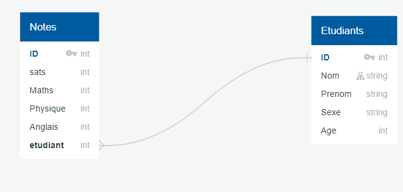
</div>

On crée une nouvelle base de données appelée scolarite.db. Puis on lance la création des tables Etudiants :
```SQL
CREATE TABLE Etudiants(
	id INTEGER PRIMARY KEY,
	Nom VARCHAR,
	Prenom VARCHAR,
	Sexe VARCHAR,
	Age INTEGER);
```
Puis Notes : 
```SQL
CREATE TABLE Notes ( 
    id           INTEGER PRIMARY KEY, 
    etudiant INTEGER,
    stats    INTEGER,
    Maths INTEGER,
    Physique INTEGER,
    Anglais INTEGER, 
    description  TEXT,
    FOREIGN KEY (etudiant) REFERENCES Etudiants(id)
);

```
!!! remarque "Clé étrangère"
	A noter que avec SQLite vous ne pourrez pas créer la clé étrangère après création de la table, il est donc indispensable de le faire au moment de la création de celle-ci.

### **Bloc de sélection**
Nous allons illustrer les exemples en partant d'une table Etudiants déjà complétée (nous verrons plus loin comment insérer des éléments dans la table) :
<div id="center">
	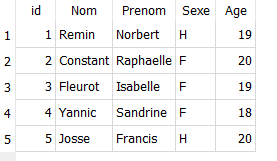
</div>  

Pour sélectionner des informations dans une base de données, on utilise le bloc suivant. Les instructions SELECT et FROM sont indispensables et permettent de dire ce que l'on veut affciher (* si on veut tout afficher) et dans quelle table on travaille.  

Par exemple :

```SQL
SELECT * FROM Etudiants;
```

Permet d'afficher la table en entier.

Si on ne veut que les noms et les prénoms :    

```SQL
SELECT Nom,Prenom
     FROM Etudiants;
```
On peut ajouter le mot clé DISTINCT à la suite de SELECT pour éviter les doublons.  
<div id="center">
	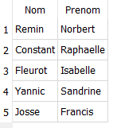
</div>

### **Utilisation des filtres et des tris**
On veut afficher les noms et prénoms des étudiants dont l'age est inférieur à 19 ans.     

```SQL
SELECT Nom,Prenom
    FROM Etudiants
    WHERE age<19;
```     
<div id="center">
	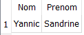
</div>

On veut afficher les noms et prénoms des étudiants dont l'age est supérieur à 19 ans dans l'ordre alphabétique des noms  
```SQL
SELECT Nom,Prenom
     FROM Etudiants
     WHERE age>19
     ORDER BY nom;
```    

<div id="center">
	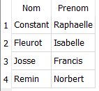
  
</div>
*On ajoutera le mot clé `desc` à la fin de la dernière ligne de la requête pour l'ordre inverse.*   

### **Compter les occurrences**
La commande `count` permet de compter le nombre de valeurs non nulles présentes dans la table pour un attribut donné. Cette commande renvoie 2.  
```SQL 
SELECT count(id) 
     FROM Etudiants
     WHERE age=19 ;
```  

### **Modification de la table : INSERT, UPDATE, DELETE**
Pour **ajouter** une entrée dans la base de données :
````SQL
INSERT INTO Etudiants(id, nom, prenom, sexe, age)
VALUES 
	(6,'Einstein','Albert','H',142),
	(7,'De Beauvoir','Simone','F',113);
````
<div id="center">
	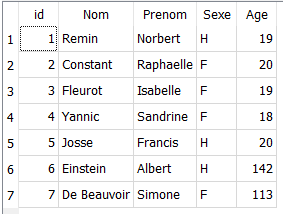
  
</div>

Pour **supprimer** une entrée : 

```SQL
DELETE FROM Etudiants
WHERE nom='Einstein';
```  
<div id="center">
	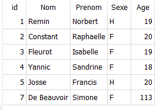
  
</div>

**Modifier** une donnée :
```SQL
UPDATE Etudiants 
   SET age=23 
   WHERE nom='De Beauvoir';

```

<div id="center">
	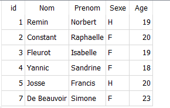
  
</div>

###**Calculs simples**
Nous avons créé la table Notes pour référencer les notes des étudiants aux examens :
<div id="center">
	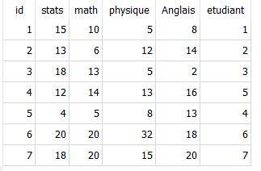
</div>

Les étudiants ayant suivi une partie de leur enseignement de stats à distance, l'université a décidé d'augmenter la note de 2points. On affiche le numéro de l'étudiant ainsi que se nouvelle note de stats :  

```SQL
SELECT etudiant, (stats+2) as nvstat
    FROM Notes;
```

<div id="center">
	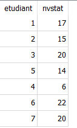
</div>

Puis on affiche la moyenne de l'examen pour les maths :  
```SQL
SELECT AVG(math)
    FROM Notes;
```  
Ou par étudiant :  
```SQl
SELECT etudiant, ((stats+math+physique+anglais)/4) as moyenne
    FROM Notes;
```  

<div id="center">
	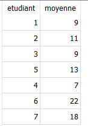
</div>


##Jointures : fusion de tables
###**Jointure interne**
La jointure interne lié les données d'une table à l'autre. On précise l'ordre dans lequel on veut voir apparaître les tables (étudiants à gauche et notes à droite)
<div id="center">
	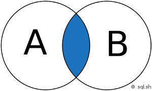
</div>

```SQL
SELECT * FROM Etudiants
    INNER JOIN Notes
	  ON Etudiants.id=Notes.etudiant;
```  

 
!!! caution "Remarque"
	On remarque que un étudiant n'a pas de notes donc ne figure pas dans la jointure.
  

<div id="center">
	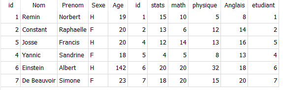
</div>

###**Jointure externe**
Pour palier à ce problème on utilise la jointure externe. il y a plusieurs possibilités :  

<div id="center">
	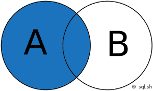
</div>

On veut toute la table de droite même si elle n'a pas de correspondance avec la table de gauche (right outer join)


<div id="center">
	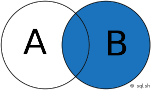
</div>

On veut la totalité des deux tables même les lignes sans correspondance (full outer join)


<div id="center">
	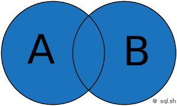
</div>
<div id="center">
	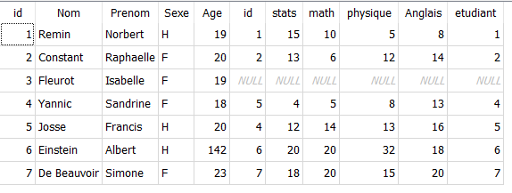
</div>
Seule la jointure gauche est tolérée par DB Browser mais d'autres logiciels permettent de faire une RIGHT OUTER JOIN et une FULL OUTER JOIN

```SQL
SELECT * FROM Etudiants
    LEFT OUTER JOIN Notes
	  ON Etudiants.id=Notes.etudiant;

```

!!! caution "Attention"
	Seule la jointure gauche est tolérée par DB Browser mais d'autres logiciels permettent de faire une RIGHT OUTER JOIN et une FULL OUTER JOIN


---
<p style="text-align: center; color:gray; font-size: 10px;">
Création MB. tilisation libre mais non commerciale CC-BY-NC 2021
</p>