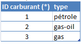

# Modèle relationnel
Ce modèle d'utilisation des bases de données a été créé par Edgar Frank « Ted » Codd das les années 1960 et 1970.
## Vocabulaire
Nous allons nous baser sur la table suivante pour définir le vocabulaire nécessaire :  

	

 

> **Relation**
>Dans le modèle relationnel, les données sont stockées dans des tables, aussi appelées relations.
>!!! Example 'exemple' :
		La relation présentée ci-dessus est appelée `voiture`. 

>**Attribut**
>Le nom d'une colonne d'une relation est appelé *attribut*.
>La relation voiture possède trois attributs: `marque`, `couleur` et `plaque`.
>Un enregistrement (ligne) d'une relation est appelé n-uplet.

>**Attribut**
>ID voiture, marque de la table voiture.
>ID carburant, type de la table carburant.

	

 

**Domaine**
>Le domaine d'un attribut est l'ensemble des valeurs qui peuvent être prises par cet attribut.  
>Une base de donnée sqlite il n'y a que cinq domaines de valeurs possibles:  
>NULL. La valeur est une valeur NULL.  
>INTEGER. La valeur est un entier signé, stocké dans 1, 2, 3, 4, 6 ou 8 octets en fonction de l'amplitude de la valeur.  
>REAL. La valeur est une valeur à virgule flottante, stockée sous forme de nombre à virgule flottante IEEE de 8 octets.  
>TEXT. La valeur est une chaîne de texte, stockée à l'aide du codage de la base de données (UTF-8, UTF-16BE ou UTF-16LE).  
>BLOB. La valeur est une donnée binaire brute, stocké exactement comme elle a été entrée.  
>En PhpMyAdmin il y a beaucoup plus de types avec notamment des formats pour les dates (voir projet).  

Ce tableau récapitule le lien entre le vocabulaire rigoureux en modèle relationnel et les termes utilisés lors du traitement des tables.  

	

 

##Clés primaires et secondaires
Chaque ligne de la table doit comporter un attribut qui l'identifie de façon unique, on l'appelle la **clé primaire**.

!!! Example "Exemple"
	- Dans la table voiture l'attribut plaque pourrait constituer la clé primaire.
	- En s'inscrivant sur un site, on vous impose d'utiliser un identifiant unique pour créer votre ligne dans la base de données.
	- L'email d'un utilisateur peut servir de clé primaire, mais ce n'est pas conseillé.

!!! Caution "Attention"
	Il est préférable d'utiliser une clé primaire indépendante des données de la table pour ne pas perdre d’information lors d'une éventuelle mise à jour.

Une **clé secondaire** ou **clé étrangère** est une clé utilisée dans une table pour faire référence à un enregistrement d'une autre table.

	

 

##Représentaion des relations

On peut représenter le lien entre plusieurs tables de données ainsi :

	

 

Ce schéma est appelé **schéma relationnel**. Il fait apparaître le lien entre les tables, les clés primaires et étrangères et les domaines de chaque attribut.  
On peut aussi le noter plus simplement sous la forme du nom de la relation suivi de la liste de ses attributs.  

	

 
Dans cette notation, les clés primaires apparaissent soulignées, les clés étrangères précédées (ou suivies) d'un # .
On peut également préciser les domaines des différents attributs :

	

 

##Contraintes
Pour éviter au maximum les erreurs on s'assurera que:  

- la clé primaire est unique et non nulle.  
- Si une table fait référence à une information d'une autre table, cette dernière doit exister de façon certaine.  
- On évitera les informations concernant deux objets différents, on préférera multiplier les tables.  

Dans l'exemple ci-dessous, on préfère mettre deux tables en relation plutôt que de mettre les informations concernant les ventes et les informations concernant les produits dans la même table :   

	

 

##Anomalies
On peut relever différents types d'anomalies qui seront source d'erreur. On fera donc en sorte de les éviter au maximum.

	

- **Anomalie de redondance** : On retrouve plusieurs fois la même information (ici les infos liées à un réalisateur). *Par exemple la date de naissance et le nom de Alfred Hitchcock.*
Il aurait mieux valut une relation séparée concernant les réalisateurs, et que la relation des films fasse référence à la clé primaire des réalisateurs.
- **Anomalie d'insertion** : L'absence de clé primaire permet d'insérer plusieurs fois le même film avec des descripteurs différents. La question est de savoir ce qui est unique dans cette description. Le titre peut être utilisé pour deux films différents, un réalisateur peut avoir fait plusieurs films, et même deux réalisateurs avoir le même nom et même année de naissance.
- **Anomalie de suppression** : La suppression de l'unique film d'un réalisateur supprime automatiquement les informations du réalisateur.  
- **Anomalie de mise à jour** : La modification de l'année de naissance d'un réalisateur oblige à faire la mise à jour sur plusieurs lignes.  

##Un petit résumé vidéo :   
<iframe width="560" height="315" src="https://www.youtube.com/embed/bhtzximjwk8" title="YouTube video player" frameborder="0" allow="accelerometer; autoplay; clipboard-write; encrypted-media; gyroscope; picture-in-picture" allowfullscreen></iframe>

---

Création MB. tilisation libre mais non commerciale CC-BY-NC 2021

