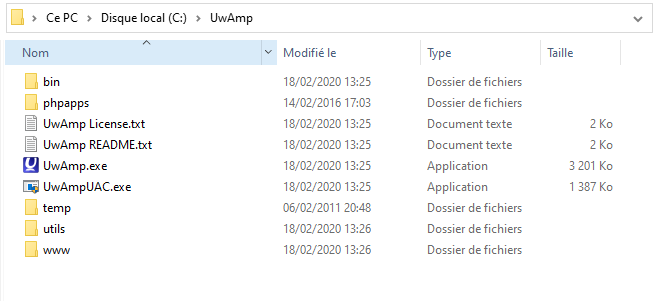
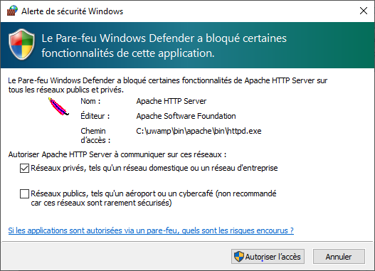
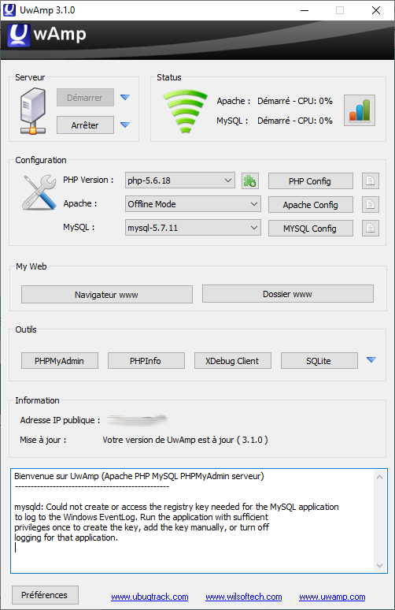
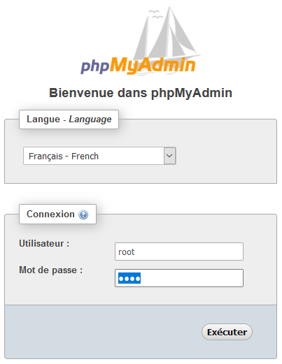
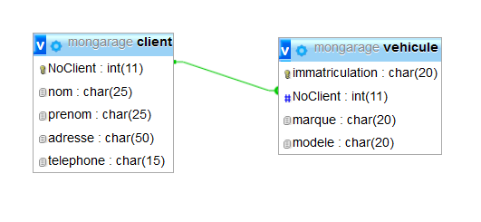
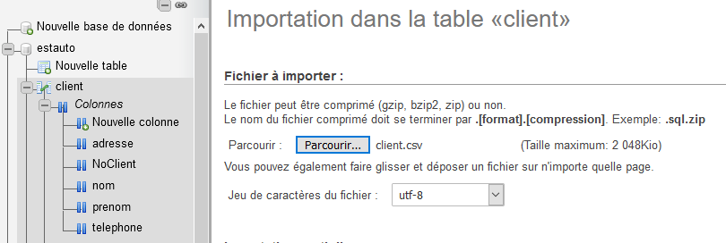
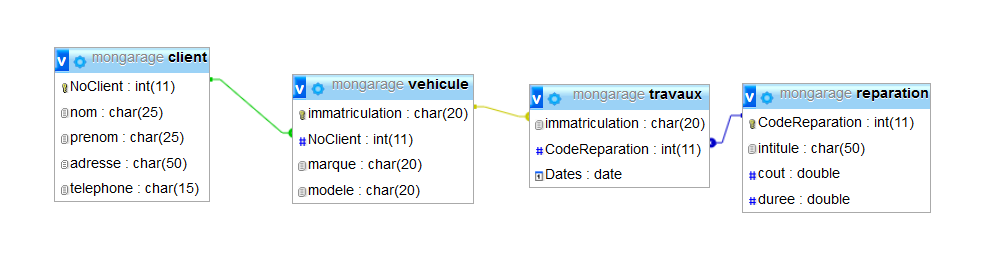
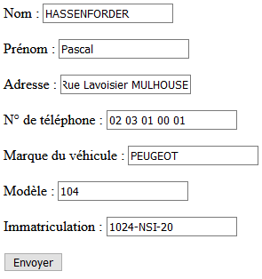

#Projet SQL
Ce projet sur SQL va vous apprendre à administrer une base de données en utilisant une page php. Il va donc nous falloir un serveur. Uwamp à télécharger [ici](https://www.uwamp.com/fr/).

**le logiciel ne mémorise pas les requêtes. Certaines seront exigeables pour le rendu du projet, pensez donc à les copier puis les coller dans un ficher .txt ou doc**
##**Installer Uwamp**
Décompressez-le sur votre clé USB.
<div id="center">
	
</div>

Exécuter UwAmp.exe et autorisez à communiquer sur les réseaux privés  
<div id="center">
	
</div>
Si tout va bien vous devriez voir cette fenêtre :  
<div id="center">
	
</div>
Cliquez sur PhpMyAdmin  
<div id="center">
	
</div>
Entrer l'utilisateur : root et le mot de passe : root puis exécuter.  
Créer une base de données appelée `mongarage`, soit en cliquant sur l'onglet SQL et en tapant la requête soit en cliquant sur 'Nouvelle base de données'.  

##**Compléments SQL avec phpmyadmin**
Le langage SQL utilisé dans phpmyadmin est un peu plus complet que celui de DB Browser. On pourra faire des jointure externe droite par exemple et la manière de définir les formats de données.

!!! Example "Formats"
	- petit texte : CHAR(nombre de caractères max) ou VARCHAR en utilisant la création sans requêtes.
	- entier : INT(nombre de chiffres max)
	- long texte : TEXT
	- date : DATE ou DATETIME si on veut aussi l'heure.

##**La base de données**
Nous allons créer les tables de façon à obtenir le modèle suivant :
<div id="center">
	
</div>

On pourra utiliser comme exemple la commande suivante :
```SQL
CREATE TABLE client 
(NoClient INT NOT NULL AUTO_INCREMENT PRIMARY KEY,
	nom CHAR(25),prenom CHAR(25),
	adresse CHAR(50),
	telephone CHAR(15)) 
CHARSET=utf8;
```  
Informations sur les commandes :

- CHARSET=utf8 permet de définir l'encodage du texte (important lorsque l'on traite des noms en français)
- AUTO_INCREMENT : permet de définir que cette valeur sera automatiquement incrémentée à la création de la ligne (inutile de le renseigner lors de la requête INSERT on le remplacera pas `NULL`.
- PRIMARY KEY : définit la clé primaire de la table  

Création de la clé secondaire entre la table client et la table véhicule :
```SQL
ALTER TABLE vehicule ADD FOREIGN KEY (NoClient) REFERENCES client(NoClient);
```

Pour vérifier la création de vos table et des liens cliquer sur l'onglet PLUS puis concepteur.
Vous avez aussi la possibilité de créer vos tables et vos liens en direct sur l'interface mais il faudra faire quelques recherches préalables.  

###**Ajouter des données**
En utilisant les requêtes (que vous copierez dans un fichier texte) créer un client :

- nom : FERRARI
- prenom : Piero
- adresse : 20 rue de Milan MODENE
- telephone : 01 02 03 04 05

Puis nous lui ajouterons deux véhicules : une Ferrari F8Spider immatriculée FE-123-RR et une Ferrari Monza SP1 immatriculée AR-321-RI.

###**Importer des données**
Télécharger les tables [client.csv](res/client.csv) et [vehicule.csv](res/vehicule.csv).
Importer les informations dans les tables et vérifier en ouvrant le fichier .csv et e cliquant sur l'onglet AFFICHER :
<div id="center">
	
</div>


Compléter la base de données avec les tables permettant d'obtenir ceci:  
<div id="center">
	
</div>

*on commencera par créer la table reparation avant celle de travaux.*  
Télécharger les fichiers [reparation.csv](res/reparation.csv) et [travaux.csv](res/travaux.csv) et importer les données.

###**Exercice 1 : Les requêtes**
Créer la requête SQl permettant : 
**Faire une copie d'écran des résultats en plus de la copie des requêtes.**

1. d'afficher les informations client de Penelope CRUZ.
2. d'afficher à la fois les informations client de Omar SY et les informations liées à son ou ses véhicules.
3. une liste des imatriculations des véhicules ayant fait l'objet de travaux le '2020/03/20'.
4. Trouver le numéro de téléphone du propriétaire de la voiture immatriculée EE-111-FF.
5. Donner la liste des immatriculations, le cout et la durée dont le prix des travaux (cout x duree) est supérieur à 50€.


###**Exercice 2 : Exploitation de la base de données en php.**
Créer un dossier mongarage dans le dossier www du serveur Wamp.

Créer un fichier r_client.php dans le dossier `mongarage` en collant le code ci-dessous dans le fichier, permettant d'interroger de la base de données et d'afficher les coordonnées complètes du client :

```php
<!doctype html>
	<head>
		<meta charset="utf-8">
		<title>Client</title>
	</head>
	<body>
	<br>
		<form action="r_client.php" method="get">
				<label>Entrer le nom de client</label> : 
				<input type="text" name="nom" />			
				<input type="submit" value="Envoyer" />
		</form>
		<br>
		
		<?php 
		$servername = "localhost";
		$username = "root";
		$password = "root";
		$dbname = "mongarage";
		$html = '';
		if (empty($_GET['nom'])==False)
		{
		$nom = $_GET['nom'];
		// Etablir la connexion à la base de donnée
		$conn = new mysqli($servername, $username, $password, $dbname);
		// Vérification de la connexion
			if ($conn->connect_error) {
			die("Echec de connexion : " . $conn->connect_error);
			} 
		// Création de la requête
		$sql = 'SELECT * FROM Client WHERE nom="'.$nom.'";';
		$result = $conn->query($sql);
		if ($result->num_rows > 0) {
			// affiche chaque client du même nom dans une table 
			$html="<table style: border='1'><tr><th>Nom</th><th>prénom</th><th>adresse</th><th>n° Téléphone</th></tr>";
			while($row = $result->fetch_assoc()) {
				$html = $html."<tr><td>".$row["nom"]. "</td><td>".$row["prenom"]."</td><td>".$row["adresse"]."</td><td>".$row["telephone"]."</td></tr>";			
				}
			$html= $html."</table><br>";
			} 
		else {
			$html= "<p>Aucun résultat</p>";
			}
		$conn->close();	//clos la connexion avec la base de données
		echo $html;
		}
		?>  
	</body>
</html>
```
La variable `$row` est un tableau indexé pour lequel `$row['nom']` contient le nom du résultat de la requête de la ligne courante. On fait une boucle pour pacourir ligne par ligne le résultat de la requête. La variable `$row` change alors de contenu à chaque ligne de résultat.  

Tester le code.

**Partie 1**
Créer un fichier r-immat.php permettant d'afficher les coordonnées du client par une recherche de plaque d'immatriculation.  
On notera que pour réutiliser le contenu d'une variable php dans une requête SQL on l'entoure de points, de simple quote puis de guillemets comme lors de la reqûete du fichier précédent. La requête elle-même est entouré de quote et rangée dans une variable. Attention aux points virgule.
```php
$sql='SELECT * FROM Client WHERE nom="'.$nom.'";';
```

**Partie 2:**
Créer un fichier e_repare.php permettant de faire un état de toutes les réparations effectuées sur un véhicule.

Deux requêtes sont nécessaires :

    Une première reprend le code php précédent pour afficher le propriétaire,
    Une deuxième sur les tables travaux et Reparation pour faire un état indiquant les réparations faites sur cette voiture (en bonus facultatif: la somme totale des réparations.)
<div id="center">
	
</div>

**Partie 3**
Compléter le code de la page n_client.php ci-dessous permettant de créer un nouveau client dans la base.  

Résultat :
<div id="center">
	
</div>

```php
<!doctype html>
	<head>
		<meta  charset="utf-8" />
		<title>Client</title>
	</head>
	<body>
	
		<form action="n_client.php" method="get">
				<br><label>Nom</label> : <input type="text" name="nom" /><br>			
				<br><label>Prénom</label> : <input type="text" name="prenom" /><br>
				<br><label>Adresse</label> : <input type="text" name="adresse" /><br>
				<br><label>No de téléphone</label> : <input type="text" name="tel" /><br>
				<br><label>Marque du véhicule</label> : <input type="text" name="marque" /><br>
				<br><label>Modèle</label> : <input type="text" name="modele" /><br>
				<br><label>Immatriculation</label> : <input type="text" name="immat" /><br>
				<br><input type="submit" value="Envoyer" />
		</form>
		<br>
		
		<?php 
		$servername = "localhost";
		$username = "root";
		$password = "root";
		$dbname = "mongarage";
		$html='';

		if (empty($_GET['nom'])==False && empty($_GET['prenom'])==False && empty($_GET['adresse'])==False && empty($_GET['tel'])==False
		&& empty($_GET['marque'])==False && empty($_GET['modele'])==False && empty($_GET['immat'])==False)
		{
			$nom= $_GET['nom'];
			$prenom= $_GET['prenom'];
			$adresse= $_GET['adresse'];
			$tel= $_GET['tel'];
			$marque=$_GET['marque'];
			$modele=$_GET['modele'];
			$immat=$_GET['immat'];
			
			// Etablir la connexion à la base de donnée
			$conn = new mysqli($servername, $username, $password, $dbname);

			// Création de la commande SQL permettant d'ajouter le nouvel client   
			$sql=...
			$result=$conn->query($sql);
			
			if ($result==True) {
				// affiche le message de réussite de l'ajout de données dans la base 
				$html="<p>Nouveau client enregistré</p>";
			}
			else {
				$html="<p>Erreur dans la requête client</p>";
			}
			
			// Création de la requête SQL permettant de récupérer le numéro du client créée précedemment par l'auto incrémentation
 			$sql=...
			
			$result=$conn->query($sql);
			if ($result->num_rows > 0) {
				// mémorise le NoClient 
				$row = $result->fetch_assoc();
				
			}
			// Création de la commande SQL permettant d'ajouter le nouveau véhicule dans la table vehicule				
			$sql=...
			$result=$conn->query($sql);
			if ($result==True) {
				// affiche le message de réussite 
				$html="<p>Nouveau véhicule enregistré</p>";
			}
			else {
				$html="<p>Erreur dans la requête véhicule</p>";
			}		
		}
		else {
			$html= "<p>Merci de remplir tous les champs</p>";
		}	
		echo $html;	
		?>  
	</body>
</html>

```  

Enregistrez vos fichiers dans le dossier www. Zippez ce dossier et le rendre au professeur en temps voulu.


---
<p style="text-align: center; color:gray; font-size: 10px;">
Création MB. tilisation libre mais non commerciale CC-BY-NC 2021
</p>