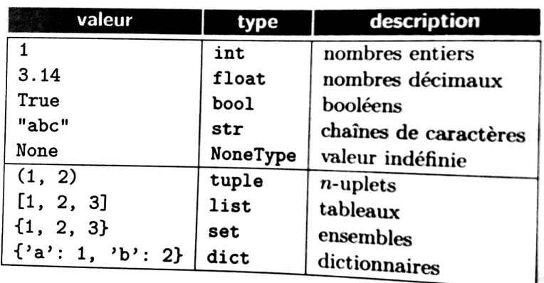
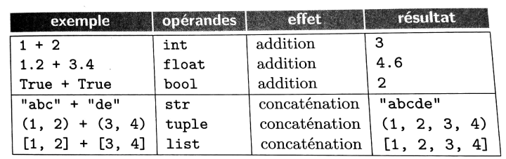

# Gestion des Bugs
Un **Bug** das un programme informatique est un comportement non désiré par le programmeur.  
A l'origine de ce terme, on trouve un insecte :
<iframe width="560" height="315" src="https://www.youtube.com/embed/qE0QFxNiQLI" title="YouTube video player" frameborder="0" allow="accelerometer; autoplay; clipboard-write; encrypted-media; gyroscope; picture-in-picture" allowfullscreen></iframe>

Pour éviter les comportements inaprorpiés, nous allons voir un certains nombre d'éléments que nous allons pouvoir mettre en place.  
## Typage
le type des variables en python est dynamique, c'est à dire que c'est seulement au moment de l'éxecution du programme que le compilateur vérifie qu'il peut faire l'opération demandée avec le type de données fournie. Beaucoup de langage de programmation necessitent de préciser le type au moment de la déclaration de la variable.

Les types de données en python sont :   
{width=50%}

Selon le type de données, une opération peut avoir des comportements différents:   
{width=50%}

Pour permettre à l'utilisateur de savoir quel type de données il doit utiliser, on peut préciser lors de la création des fonctions, les types d'entrées et de sortie : 
```python
def est_pair(n: int) -> bool:
    "Indique si un nombre est pair ou non"
    if n % 2 == 0:
        return True
    else:
        return False
```

!!! note "Remarque"
	Certains éditeurs afficheront une remarque mais le non respect des types de données d'engendrera pas une erreur du programme.

## Variants et invariants
### Variant
Un **variant de boucle** est une donnée dans une boucle qui varie de façon à ce que l'on soit sûr que le programme pourra sortir de la boucle. 

Un variant de boucle est une expression :

- entière
- positive
- qui décroît strictement à chaque itération

```python
a = int(input("a : "))
b = int(input("b : "))
m = 0
while b > 0:
   m += a
   b -= 1
print("a*b = ", m)
```
Ici b est le variant de boucle, il décroit jusqu'à atteindre 0.

```python
a = int(input("a : "))
b = int(input("b : "))
i = 0
m = 0
while i < b:
   m += a
   i += 1
print("a*b = ", m)
```
Ici le variant sera b-i.

### Invariant de structure
Un invariant de structure est une propriété qui est toujours vérifiée lors du programme et qui peut détecter la présence d'erreur.
On reprend les exemples ci-dessus :
```python
a = int(input("a : "))
b = int(input("b : "))
m = 0
c=b
while b > 0:
    m += a
    b -= 1
print("a*b = ", m)
```
Si on déroule la boucle étape par étape : 

| a   | b        | c      | m      |  
| :-: |:--------:| :-----:| :-----:|  
| a   |   c      |  c     | 0      |  
| a   | c-1      |   c    | a      |  
| a   | c-2      |    c   | 2a     |  
| a   | c-i      |    c   | ixa    |  

On constate ici une donnée commune dans l'évolution des variables (i) : en remplaçant i par m/a dans l'expression de b, on trouve b=c-m/a. Cette propriété est valable à chauqe boucle, elle constitue un invariant. On pourra ajouter l'assertion ci-dessous dans la boucle.  
```python
    assert (b==c-m/a)
```
## Pré et postconditions
### préconditions


!!! example "exemple"

	=== "code"
		On étudie une fonction qui prend un entier en paramètre et renvoie le chiffre des unités.
		```python
		def get_unite(n: int) -> int:
			"""
			renvoie le chiffre des unités d'un entier n
			"""
			while n>=10 : 		# répétition tant que n est supérieur ou égal à 10
				n = n-10
			return n
		```

	=== "sortie"
		```python
		>>> get_unite(4567)
		7
		>>> get_unite(45.67)
		5.670000000000002
		>>> get_unite(-6)
		-6
		```

On peut voir que la fonction ne respecte pas la documentation puisqu'elle s'exécute même avec un flottant. Avant même l'éxécution du code, nous allons donc ajouter des assertions permettant de fixer les conditions suivantes : n doit être un entier, n doit être positif ou nul.
```python
def get_unite(n: int) -> int:
	"""
	renvoie le chiffre des unités d'un entier n
	"""
	assert type(n)==int, "vous devez entrer un nombre entier."  		# "Précondition 1"
	assert n>=0, "le nombre étudié doit être positif ou nul."			# "Précondition 2"
	while n>=10 : 		# répétition tant que n est supérieur ou égal à 10
		n = n-10
	return n
```

### Postconditions
Avant de renvoyer le résutat on vérifie sa validité avec une postcondition : le résultat retourné doit être strictement inférieur à 10 et supérieur à 0.
```python
def get_unite(n: int) -> int:
	"""
	renvoie le chiffre des unités d'un entier n
	"""
	assert type(n)==int, "vous devez entrer un nombre entier."  		# "Précondition 1"
	assert n>=0, "le nombre étudié doit être positif ou nul."			# "Précondition 2"
	while n>=10 : 		# répétition tant que n est supérieur ou égal à 10
		n = n-10
	assert n<10, "le nombre renvoyé doit être inférieur à 10."  # Postcondition 1
	assert n>=0, "le nombre renvoyé doit être positif."  # Postcondition 2
	return n
```

## Tests
On envisagera de réaliser des tests lors de l'exécution d'une fonction, qui prendra en compte des cas usuels mais surtout les cas limites.
Par exemple lors de la création de la recherche du maximum dans un tableau :
```python
def maximum(tab : list):
	'''Renvoie l'index de la valeur maximale du tableau'''
	maxi=0
	sortie=0
	for elt in tab:
		if elt>maxi:
			sortie=tab.index(elt)
			maxi=elt
	return sortie
```
Cette fonction peut être testée ainsi :
```python
assert maximum([2,5,4])==2
```
Mais que se passe-t-il avec :
```python
print(maximum([2,'toto',4]))
print(maximum([2,4,4]))
print(maximum([])
```
Ce sont ce que l'on appelle des cas limites, qui peuvent provoquer des effets de bords (effets non désirés). Il faudra donc dans le codage de la fonction envisager tous ces cas.

```python
def maximum(tab : list):
	'''Renvoie LE PREMIER l'index de la valeur maximale du tableau'''
	if len(tab)==0:
		return None
	else :
		maxi=0
		sortie=0
		for elt in tab:
			if type(elt)==int and elt>maxi:
				sortie=tab.index(elt)
				maxi=elt
		return sortie
```
Les tests peuvent être intégérés aux fonctions sous forme de préconditions ou postconditions ou dans une autre fonction, voire même dans un autre programme.

!!! example "Exemple"

	=== "main.py"
		```python
		def maximum(tab : list):
			'''Renvoie LE PREMIER l'index de la valeur maximale du tableau'''
			if len(tab)==0:
				return None
			else :
				maxi=0
				sortie=0
				for elt in tab:
					if type(elt)==int and elt>maxi:
						sortie=tab.index(elt)
						maxi=elt
				return sortie
		```

	=== "test.py"
		```python
		from main import *
		assert maximum([2,5,4]) == 1
		assert maximum([2,'toto',4]) == 2
		assert maximum([2,4,4])==1
		assert maximum([]) == none
		``` 

## Les commentaires
Le meilleur moyen d'être clair sur les données que l'on veut uiliser et les erreurs à ne pas commettre est de spécifier sa fonction (ajouter une docstring contenant une description de la fonction ainsi que le typage) et des commentaires réguliers dans le corps de la fonction (par exemple à chaque boucle en expliquant ce qu'elle fait). Ajouter ensuite des assertions régulières dans la fonction et un jeu de tests sans oublier les conditions limites.  

## Aller plus loin ...
Malgré tous vos efforts, des bugs apparaissent dans votre projet. Vous allez donc devoir les gérer. Voici quelques conseils et outils pour vous y aider.

 - utilisez un outil de suivi des bugs. Ce n'est pas nécessairement quelque chose de compliqué : parfois un simple fichier texte, éventuellement partagé avec vos collaborateurs suffit.
 - faîtes des archives (fichiers zip) régulières de votre travail afin de pouvoir revenir en arrière en cas de soucis. Il se peut que votre programme fonctionnait à un moment données et qu'une amélioration conduise à un problème. Pouvoir revenir à une version antérieure qui marchait peut s'avérer utile...
 - n'ignorez jamais un problème potentiel sous prétexte qu'il ne peut normalement pas se produire : rendez votre code robuste par ce qu'on appelle la programmation défensive. Imaginez qu'une fonction prenne en paramètre un indice de tableau, vérifiez que cet indice est bien compris entre 0 et la longueur du tableau-1 afin d'éviter un plantage en cas de valeur en entrée erronée.
