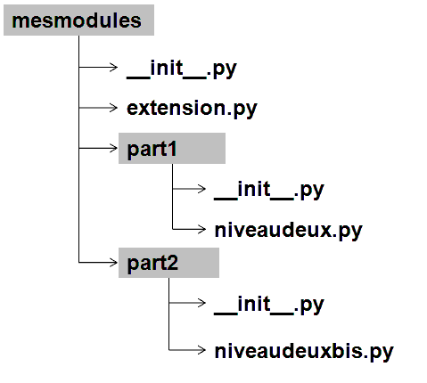

#Modularité
##Rappels

###**Utilisation d'un module**
 Vous avez déjà utilisé les modules `math`et `random`par exemple. Nous rappelons que l'on peut appeler un module ainsi :
```python
# import du module
import statistics
# affiche l'aide
help(statistics)
```  

**Utilisation du module**    
```python
import statistics
notes = [11, 14, 18, 5, 12, 13, 15]
print("Moyenne:", statistics.mean(notes))
print("Écart-type:", statistics.stdev(notes))
```

On peut aussi utiliser un alias :    

```python
import statistics as stat
notes = [11, 14, 18, 5, 12, 13, 15]
print("Moyenne:", stat.mean(notes))
print("Écart-type:", stat.stdev(notes))
```

Ou encore sans avoir à écrire de préfixe :

```python
form statistics import mean,stdev
notes = [11, 14, 18, 5, 12, 13, 15]
print("Moyenne:", mean(notes))
print("Écart-type:", stdev(notes))
```
!!! caution "Attention"
	Cette dernière méthode est priviligiée car elle permet d'importer uniqument les fonctions nécessaires et donc de gagner en temps d'éxecution si on utilise un module important. En remplaçant la liste des fonctions par `*` on importe tout le module.  

**Aide d'un module**
On peut invoquer l'aide sur un module c'est-à-dire sa description, la liste de ses fonctions et l'aide sur chacune des fonctions. Il faut que le module soit importé :  
```python
>>> import module
>>> help(module)
```  

###**Assertions**
Pour tester les fonctions, on peut ajouter des tests en cours de code, sans que celui-ci ne soit pris en compte Ce sont des lignes que l'on peut supprimer sans changer la structure du code.  
Elles permettent de tester les conditions critiques et permettent de stopper le programme si l'une d'elle se produit (ce qui ne doit pas arriver si le programme est correctement implémenté).
``` python
	def avg(notes):
    	assert len(notes) > 0, 'une note minimum requise'
     	return sum(notes) / len(notes)
```
Si on teste ceci, tout va bien :
```python
notes =[8, 9, 10]
print(avg(notes))
```
En revanche, ceci fait stopper le programme :
```python
notes =[]
print(avg(notes))
```

###**Bloc `try ... except...`**
On peut anticiper les problèmes que posent l'utilisation des modules comme par exemple un argument de fonction qui ne serait pas du bon type de donnée.
Pour cela on utilise des tests qui permettent de revenir au début de la fonction tout en signanlant à l'utilisateur l'ereur commise.  
Par exemple :
```python
    try:
        x = int(input("Please enter a number: "))
        break
    except ValueError:
        print("Oops!  That was no valid number.  Try again...")

```
Ce code permet de tester que l'entrée de l'utilisateur est bien un entier. Si l'on veut que le programme repète la demande jusqu'à ce que l'entrée soit correcte, on peut placer une boucle infinie.
```python
while True:
    try:
        x = int(input("Please enter a number: "))
        break
    except ValueError:
        print("Oops!  That was no valid number.  Try again...")

```

!!! note "Quelques exemples d'erreurs détectables"
	`NameError` : accès à une variable inexistante  
	`IndexError` : accès à un indice non valide  
	`KeyError`: accès à une clé de dictionnaire non valide  
	`ZeroDivisionError` : division par zéro  
	`TypeError` : opération appliqué à des valeurs incompatibles  


!!! example "un exemple complet"
	```python
		try:
	    	numerateur = int(input("Entrez un numérateur : "))
	    	denominateur = int(input("Entrez un dénominateur : "))
	    	resultat = numerateur / denominateur
	    	print("Le resultat de la division est", resultat)
		except ValueError:
			print("Désolé, les valeurs saisies ne sont pas des nombres.")
		except ZeroDivisionError:
	    	print("Désolé, la division par zéro n'est pas permise.")
	
	```

## Créer son propore module
### Strucutre de base d'un module

!!! important "Important"
    
    Pour obtenir cette structure on réera un dossier `mesmodules` contenant les diférents fichiers `.py` du module. On créera un fichier vide `__init__.py` dans ce dossier et on appelera les différentes parties du module dans le fichier comme ci-dessous :.
    Appel des modules :
    ```python
    import mesmodules.extension

    Ou 
    from mesmodules.part.niveaudeux import une_fonction
    ```


Un module est un dossier comprenant une ou plusieurs bibliothèques (ou library) qui sont en fait des fichiers `.py`.  Par exemple le module `matplotlib` contient entre autre, le fichier `pylab.py`et `pyplot.py`.  

### **La Documentation du module**
Il faudra documenter le module de façon **explicite**. Chaque fonction devra comporter des `docstrings` qui expliquent clairement le type d'arguments attendus et le type de données retournées.  
Les noms de fonctions et des variables doivent être explicites pour la meilleure compréhension de tous.   
Vous pouvez créer une documentation à part (de préférence en anglais) pour détailler encore plus les recommandations.  
Voici un exemple de module créé sur les suites de fibonacci (voir reproduction des lapins au chapitre *Récursivité*).  
Pour afficher cette description, on utilisera la fonction `help()`.  

```python
""" Module fibo relatif à la création de nombres de Fibionacci

Pour rappel, la suite de Fibonacci est une suite d'entiers dans laquelle chaque terme est la somme 
des deux termes qui le précèdent.(voir: https://fr.wikipedia.org/wiki/Suite_de_Fibonacci)

Ce module présente deux fonctions:

- fib_print: affiche les nombres de Fibionacii
- fib_to_array: renvoie la liste des nombres de Fibionacci

"""

def fib_print(n):
    """Affiche les nombres de Fibionacii

    Arguments
    ---------
    n: int
        dernier rang de la suite de Fibonacci affiché
    """
    a, b = 0, 1
    while a < n:
        print(a, end=' ')
        a, b = b, a+b
    print()

def fib_to_array(n):
    """Renvoie la liste des nombres de Fibionacii

    Arguments
    ---------
    n: int
        dernier rang de la suite de Fibonacci renvoyé dans la liste
    
    Returns
    -------
    list
        La liste des nombres de Fibionnaci jusqu'au rang n
    """
    result = []
    a, b = 0, 1
    while a < n:
        result.append(a)
        a, b = b, a+b
    return result

```
### **Les fonctions**  

Les fonctions doivent contenir des tests de façon à ce que lorsqu'une erreur est détectée, elle fasse afficher un message d'erreur compréhensible par l'utilisateur.  
Elles doivent être documentées précisement.

!!! important "Fonctions privées"
    On peut avoir besoin dans le module de créer des fonctions privées, c'est-à-dire qu'elle ne sera pas forcément accessible de l'extérieur mais ne sera utilisée que à l'intérieur du module : 

```python
    #module
    def __mafontion(mon_paramètre):
        return un truc
    #programme principal
    __mafonction(mavariable)#renvoie une erreur

```  
### **Finir le fichier**
Lors de l'exécution d'un programme, python crée une variable appelée `__name__`. Lorsque le fichier principal est exécuté, cette variable pour ce fichier prend la valeur `"__main__"`. Le code ci-dessous permet de détecter si le fichier dans lequel il apparait est le programme exécuté directement ou un programme appelé par le prorgramme principal.  
Tout ce qui se trouve dans la boucle ne sera exécuté que si **CE** programme est exécuté et pas s'il est appelé par un autre 
```python
if __name__ == "__main__":
    print ("Executé si le programme est invoqué directement")

```  
Votre module devra donc se finir ainsi si vous ajoutez des tests devant s'afficher.


## Projet
Un petit tour par [ici](projet_modularite.html) pour voir le travail à faire.

---
<p style="text-align: center; color:gray; font-size: 10px;">
Création MB. (ré)utilisation et modification libre mais non commerciale CC-BY-NC
</p>