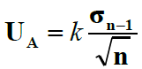
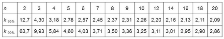

# Projet : Module incertitude
L'objectif est de créer un module `incertitude ` permettant à nos amis physicien de faire les calculs nécessaires à l'évaluation des erreurs de mesures. On ne s'interessera ici qu'aux incertitudes de type A c'est-à-dire issue d'une série de mesure.  
En bonus, on pourra traiter les différentes incertitudes de type B, issue d'un mesure unique.  

## Principe des incertitudes de type A
Lorsque l'on fait une mesure en physique, il y a toujours une incertitude liée à l'appareil utilisé ou à la précision de la manipulation de l'opérateur. Il existe aussi une ineritude aléatoire, qui fait que si on repète la mesure un grand nombre de fois, on ne trouve pas toujours exactement la même valeur.
Les incertitudes de types A sont ces dernières. On peut dire à l'aide d'une série de mesures que la aleur *vraie* est comprise dans un intervalle que l'on détermine grâce à des calculs sur la série de mesures.  

**Incertitude**
{align=left}
Pour calculer l'incertitude, il faut déjà calculer l'écart type, le multiplier par un coeficient d'élargissement et diviser par la racine carré du nombre de mesures.  

**Coefficient d'élargissement**
Un intervalle de confiance à 95% signifie que l'intervalle que l'on va calculer, contiendra à coup sûr 95% des mesures.  
Ce coefficient k, dépend du nombre de mesures et de l'intervalle de confiance.
{align=right}
Par exemple, pour un intervalle de confiance de 95% (le plus couramment utilisé) avec 9 mesures réalisées, k vaudra 2,31. 

**Intervalle**
L'incertitude U trouvée par le calcul nous permet de dire que 95% des mesures se situent dans l'intervalle [moyenne-U ; moyenne+U].
L'objectif de ce projet est de créer un module permettant de calculer cet intervalle à partir d'une série de mesures.

## Fonctions contenues dans le module.
Dans une bibliothèque nommée `typeA.py` contenu dans le dossier `ìncertitude` on devra trouver les fonctions suivantes :    

**fonction `moyenne()`**  
Cette fonction prend une liste de mesures en paramètre et retourne la moyenne des valeurs. 

!!! error "DIY"
	Ne pas importer de modules de calcul de moyenne ou autre, vous devez l'implémenter vous-même.  
	La seule tolérance sera pour la fonction `sqrt` mais qui peut être remplacé par une puissance 0,5.


**fonction `_ecart_type()`**  


La formule de l'écart type est donnée ci-contre. Cette fonction doit prendre en paramètre une liste de mesures et renvoyer la valeur de l'écart type.  


**fonction `_nb_mesures()`**  

Cette fonction prend en paramètre une liste de mesures et renvoie le nombre de mesures dans la liste. 

**fonction `_valeur_plus_proche(valeur,Tableau):`**  
Lorsque l'on regarde le tableau des coefficients d'élargissement, on peut voir que toutes les quantités de mesures n'y figurent pas. il y a trop peu de différence avec les valeurs données pour que cela soit significatif. On cherchera donc le nombre de mesures le plus proche que celui qu'on possède.
Cette fonction prend en paramètre une valeur et un tableau, et renvoie la valeur du tableau la plus proche de la valeur `valeur`.   

**fonction `incertitude()`**  
Cette fonction utilisera les autres pour calculer l'incertitude telle qu'elle est expliqué plus haut. Elle prend en paramètre la liste de mesures et un booléen `confiance` qui par défaut vaudra False ce qui signifie que l'on se place dans un intervalle de confiance de 95%. Si on exécute la fonction avec `confiance=True` on aura un intervalle de confiance de 98%.
Cette fonction devra retourner la valeur de l'incertitude calculée.

!!! help "Quelques aides précieuses"
	valeurs de k (1ere ligne contient le nombre de mesures, les deuxième et troisième lignes les valeurs de k pour 95% et 98%) :  
	```python
	#Tableau regroupant les valeurs de k
	coeff_elargissement=[[2,3,4,5,6,7,8,9,10,12,14,16,18,20],
	                          [12.7,4.3,3.18,2.78,2.57,2.45,2.37,2.31,2.26,2.20,2.16,2.13,2.11,2.09],
	                          [63.7,9.93,5.84,4.60,4.03,3.71,3.50,3.36,3.25,3.11,3.01,2.95,2.90,2.86]]

	```
	Comment fixer une valeur de paramètre par défaut :
	```python
	def incertitude (Liste, confiance=False):
		pass
	# si on exécute la fonction sans préciser la valeur de confiance elle vaudra False;
	incertitude(L)
	#ou si on ne veut pas de la valeur par défaut
	incertitude(L,True)
	```
## Fichier de test
Pour ne pas dénaturer votre code, vous pouvez créer un fichier `tests.py` qui contiendra tous les tests que vous avez fait pour tester toutes les situations de vos fonctions.  
Cela permet de s'y retrouver plus facilement et d'organiser son travail. Cela permet aussi à la personne qui utilise (ndlr : corrige) votre travail de gagner du temps et de la lisibilité

##Bonus : calcul des incertitudes de type B  

Les incertitudes de type B sont des incertitudes issues d'une mesure unique. Elles sont calculées d'une manière particulière en fonction de la situation.

**Cas de la lecture double graduation**  
Lorsqu'on lit une graduation à l'aide d'une règle l'erreur peut venir de la lecture de la graduation mais aussi du positionnement du zéro. On a donc plus de chance de faire une mesure imprécise.
L'incertitude se calcule ainsi :  

$$U= \dfrac{2 \times UnitéDeGraduation}{\sqrt{6}}$$


**Cas de la lecture simple graduation**  
Une lecture à simple graduation serait celle d'un baromètre à aiguille ou d'un thermomètre analogique. L'utilisation d'une burette en est aussi un bon exemple. Voici comment se calcule l'incertitude :  

$$U= \dfrac{2 \times UnitéDeGraduation}{\sqrt{12}}$$

**Cas d'un appareil numérique**  
Le constructeur d'un appareil donne au minimum la tolérance de la mesure. C'est le pourcentage d'erreur sur la mesure. Un appareil numérique possède également une incertitude liée au dernier chiffre. On l'appelle le digit.
Pour une mesure donnant 4,586V le dernier digit sera la plus petite unité mesurée soit 0,001V.  
Le pourcentage de la mesure correspondant à celui de la tolérance donnée. Par exemple une mesure de 4,6V avec une tolérence de 5%, le pourcentage sera de 5% de 4,6 soit 0,23.  

$$U= \dfrac{2 \times PourcentageDeLaMesure + 2 \times digit}{\sqrt{3}}$$

**Cas d'un appareil quelconque**  
On calculera l'incertitude par la formule :  

$$U= \dfrac{PourcentageDeLaMesure}{\sqrt{3}}$$


Vous devez créer le fichier `typeB.py` contenant les fonctions `double_lecture(graduation, mesure)`, `simple_lecture(graduation, mesure)`, `tolerance_donnee(tolerance,mesure)` et `appareil_numerique(digit,tolerance,mesure)` .
Il est important que les paramètres `digit` et `graduation` soient renseignés dans la même unité que la mesure. Cette information pourra être donnée à l'utilsation de la fonciton et/ou dans la documentation.

Vous créerez ensuite le module `incertitudes` contenant les fichiers `typeA.py` et `typeB.py` qui pourront être utilisés comme un module.

---
<p style="text-align: center; color:gray; font-size: 10px;">
Création MB. tilisation libre mais non commerciale CC-BY-NC 2021
</p>