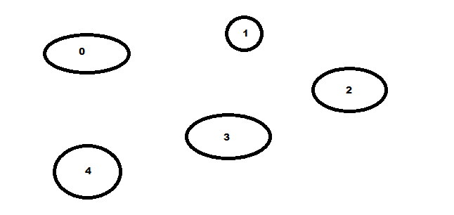
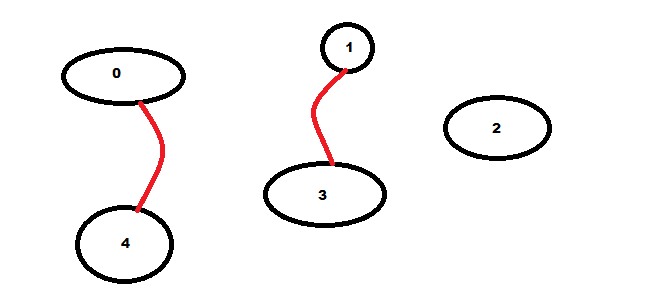
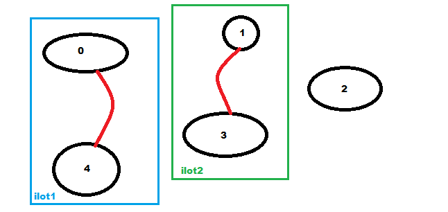
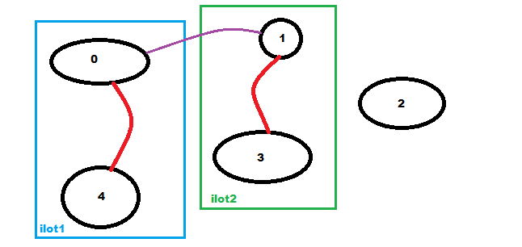
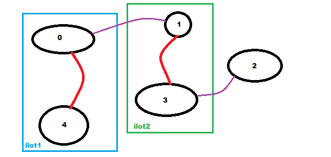

# Projet : construire un archipel à moindre coût.

## Le problème
### La situation
Un certain nombre d'îles isolées souhaient construire des ponts pour relier toutes les îles par voie terrestre. L'objectif est de pouvoir passer d'une île à l'autre sans prendre le bateau. Nous allons donc étudier le cout minimal de liaison des îles. Les 5 iles de l'archipel sont numérotées de 0 à 4 et les coûts de construction des ponts sont les suivants :

|     |__ile 0__|__ile 1__|__ile 2__|__ile 3__|__ile 4__|
|:---:|:---:|:---:|:---:|:---:|:---:|
|__ile 0__|inf  |10   |40   |11   |18   |
|__ile 1__|10   |inf  |12   |15   |inf  |
|__ile 2__|40   |12   |inf  |14   |20   |
|__ile 3__|11   |15   |14   |inf  |15   |
|__ile 4__|18   |inf  |20   |15   |inf  |

La notation `inf` est utilisée lorsque qla construction du pont n'est pas possible.



Nous allons donc créer des ilôts au fur et à mesure en reliant tout d'abord deux iles ensemble, puis un ilôt à une autre île et ainsi de suite en se posant la question du coût le plus faible à chauqe étape.  


Une fois des ponts construits nous obtenons des îlots : 

Dans la situation ci-dessus par exemple, il y a 4 possibilités de relier les ilots 1 et 2. On peut créer un pont entre 0 et 1, entre 0 et 3, entre 3 et 4 ou entre 1 et 4. Si on regarde le tableau des co^ts, c'est le pont entre  0 et 1 qui sera choisi.


Et ainsi de suite jusqu'à ce que toutes les îles soient reliées :


### Les règles de l'implémentaion
Les îles seront représentées par des listes contenant le numéro de l'île. Par exemple au départ, lorsque les îles sont isolées :
```python
>>> [[0], [1], [2], [3], [4]]
```
Puis, si l'on suit l'évolution des exemples donnés, la liste évolue : 
```python
>>> [[0, 4], [1, 3], [2]]
>>> [[0, 1, 3, 4], [2]]
>>> [[0, 1, 2, 3, 4]]
```
jusqu'à ce que la liste des îlots isolés **ne contienne plus qu'un seul élément**.

les ponts seront représentés par une liste de tuples représentant les iles à relier :
```python
>>>  [(0, 1), (0, 4), (1, 3), (2, 3)]
```

!!! note "Remarque"
	Les ponts utlisés dans l'exemple ne sont pas ceux de la solution optimale.

## Programmation fonctionnelle
On se rappellera ici que les fonctions ne doivent pas modifier de variables globales, ce qui necessitera de passer un peu plus d'arguments.
Nous nous autoriserons cependant l'utilisation de boucles.

### La fonction `construire_un_pont(ilot_1,ilot_2,liste_ilots,ile1,ile2,ponts)`
Cette fonction prend en paramètre deux îlots et deux îles entre lesquelles on doit construire le pont. Il n'est pas question ici de choisir les îles cela aura été fait en amont. `ile1` appartient à l'`ilot_1` et `ile2` appartient à `ilot_2`. ces îles ont été choisie car c'est le pont le moins cher pour relié les deux îlots d'après le tableaux `couts`.  
Cette fonction aura donc pour but de modifier la liste `liste_ilots`pour fusionner les `ilot_1` et `ilot_2`et ajouter le tuple `(ile1,ile2)` dans la liste des ponts.  
Elle retourne la `liste_ilots` et `ponts`.  
Par exemple : 
```python
construire_un_pont([2,3,4],[1],[[2,3,4], [1], [0]],3,1,[(2,3),(3,4)])
#la liste des îlots devient
[[1,2,3,4], [0]]
#la liste des ponts devient
[(2,3),(3,4),(3,1)]
```

```python
def construire_pont(ilot_1,ilot_2,liste_ilots,ile1,ile2,ponts):
	...
    return (liste_ilots,ponts)
```

### La fonction `trouver_pont(liste_ilots,couts,ponts)`
Cette fonction a pour but de trouver le pont idéal entre deux îlots. Elle doit parcourir tous els îlots afin de trouver le pont le moins cher entre deux îots. Imaginons qu'on ait les îlots `[0,1], [2,3] et [4]`. Le but est de trouver le pont le moins cher pour relier deux îlots quelqu'ils soient. Il faudra donc **pour chaque ile** de **chaque ilot** comparer les coûts et sélectionner les deux îles entre lesquelles on décidera de construire le pont.  
Ici, nous allons donc comparer les coûts des ponts `(0,2),(0,3),(1,2),(1,3),(0,4),(1,4),(2,4) et (3,4)`. Le pont le moins cher est le pont `(0,3)` on exécute donc la fonction `contruire_pont` entre les îles 0 et 3 ce qui aura pour effet de relier le premier et le deuxieme îlot (mais ça c'est le job de la fonction `construire_pont`).    

```python
def trouver_pont(liste_ilots,couts,ponts):
    """
    ENTREES : liste_ilots (type list) est la liste des îles ou îlots encore isolés.
    au début liste_ilots=[[0], [1], [2], [3], [4]] et à la fin liste_ilots=[[0, 1, 2, 3, 4]]
    couts est un tableau des côuts des ponts entre les îles.
    ponts est une liste de tuples contenant les ponts déjà construits.
    SORTIE : Execution de la fonction qui CONSTRUIT le pont entre les îles sélectionnées
    cette fonction cherche le pont le moins cher pour relier  ilot_1 et ilot_2 en fonction des îles dont
    ils sont composés."""
    ...
    return construire_pont(ilot_1,ilot_2,liste_ilots,ile1_min,ile2_min,ponts)
```

### La fonction `equiper_archipel(n,couts)`

Cette fonction crée l'archipel (ici on créera une liste de 5 îles) et initialiser la liste des ponts. Elle va se charger de parourir les îlots et de créer les ponts jusqu'à ce que l'archipel ne contienne plus qu'un seul bloc.
Elle renvoie la liste des ponts à construire.
```python

def equiper_archipel(n,couts):
    liste_ilots=[[i] for i in range(n)]
    ponts=[]
    ...
    return ponts
```

### Le programme
Il faudra malgré tout ici avoir une variable globale, celle des coûts. on pourrait initialiser le tout dans une fonction main() qui serait la seule à être exécutée mais comme nous ne somme qu'à la moitié du projet, on va simplifier.  
```python
if __name__=='__main__':
    inf = float('inf')
    couts = [[inf, 10, 40, 11, 18],
        [10, inf, 12, 15, inf],
        [40, 12, inf, 14, 20],
        [11, 15, 14, inf, 15],
        [18, inf, 20, 15, inf]]

    print(equiper_archipel(5,couts))
```
Ces quelques lignes doivent permettre d'éxécuter le programme.  

## Programmation Orientée Objet
Nous allons créer deux classes. Une classe `ile` et une classe `construireArchipel`. 
### La classe `ile`
La classe `ile` permettra de créer les îles et les îlots une fois modifiés, et la la classe `construireArchipel` contiendra la liste des îles et îlots, des ponts et se chargera de trouver le pont idéal, de le construire et ce jusqu'à ce que toutes les îles soient reliées.  
Au départ, une île ne sera composée que d'une île (par exemple [1] est un îlot ne contenant que l'île 1), mais au fur et à mesure des fusions des îlots, l'attribut `ile` de la classe `ile` peut en conenir plusieurs.  

```python
class ile:
    def __init__(self,numero):
        self.ile=...

    def get_ile(self):
        ...
    def __repr__(self):
    	...
```
On créera une fonction pour récupérer la liste des îles composant l'îlot et une fonction `__repr__(self)` afin de visualier la liste des îles composant les îlots pou débogger le code.  

### La classe `construireArchipel`
Les fonctions de cette classe font la même chose que leurs homologies dans la partie programmation fonctionnelle. Cela dit, si la structure peut etre similaire, le fait de changer de paradigme vous obligera à en modifie les paramètres, les variables et les retours de fonctions. **Soyez vigilants sur les copier-coller.**
```python
class construireArchipel:
    def __init__(self,n):
    	#n est le nombre d'îles que l'on veut créer au départ
        self.ilots=...
        self.ponts=...
        
    def relier_2_ilots(self,ilot1,ilot2,ile1,ile2):
        """ilot1 et ilot2 sont des objets de la classe ile. cette fonction doit permettre de fusionner l'ilot2 sur l'ilot1 
        (et donc de supprimer le 2 puis de créer le pont entre l'ile1 et l'ile2 (tuple (ile1,ile2) dans les ponts."""
        pass
       

    
    def trouver_pont(self,couts):
        #trouve le pont le moins cher parmis les ponts possibles entre les ilots existants
        pass
    
    def equiper_archipel(self,couts):
        #recherche les ponts les moins chers pour construire l'archipel
        pass

    
    def get_ilots(self):
        pass
    
    def get_ponts(self):
        pass
   
   def __repr__(self):
   		#permet d'utiliser un print pour visualiser les ilots et les ponts
        res = []
        for li in self.ilots:
            res.append((li.get_ile()))
        res.append(self.get_ponts())
        return str(res)
```

### Le code principal

```python
if __name__=='__main__':
    inf = float('inf')
    couts = [[inf, 10, 40, 11, 18],
        [10, inf, 12, 15, inf],
        [40, 12, inf, 14, 20],
        [11, 15, 14, inf, 15],
        [18, inf, 20, 15, inf]]
    archipel=construireArchipel(5)
    archipel.equiper_archipel(couts)
    print(archipel)
```

## A rendre
Vous devez rendre deux fichiers commentés dont le résultat de la situation doit être identique.