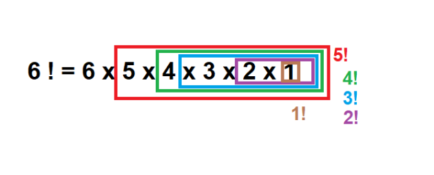

#La récursivité

##Qu'est ce que la récursivité?  
<div id="center">
	
  
</div>
Indispensable en informatique, la récursivité permet de simplifier beaucoup de fonctions.  

>**Définition**
>Une fonction récursive est une fonction qui s'appelle elle-même.


##Calcul de factoriel n!
La fonction factorielle en mathématiques permet de calculer le produit de tous les entiers précédant le nombre courant.  
n ! = n x (n-1)x(n-2) x .. x 2 x 1.  
!!! example "Par exemple"
	3 ! = 3 x 2 x 1 = 6
	8 ! = 8 x 7 x 6 x 5 x 4 x 3 x 2 x 1 = 40320  
  
!!! caution "Par convention"
	On prendra 0! = 1 


##Créer la fonction factorielle 
Pour tester les codes, on peut utiliser un *bac à sable*. c'est une interface où l'on peut faire des tests rapides sans sauvegarder. Cela évite la multiplication des fichiers `test.py` ou `tests.py` sur votre machine.  
Vous pouvez utiliser celle-ci par exemple : 
Tester ceci :  
[Console Basthon](https://console.basthon.fr/){ .md-button .md-button--primary }  
mais aussi :  
[Python tutor](http://pythontutor.com/visualize.html#mode=edit){ .md-button .md-button--primary }   
qui a le gros avantage de détailler ligne par ligne l'évolutionn du code et ainsi compendre ce qu'il se passe.  

Tester ceci :   
```python
def factorielle(n):
    i=n
    res=1
    while i!=0:
        res=res*i
        i=i-1
    return res

print(factorielle(1))
print(factorielle(8))
```  
On peut en réalité découper la fonction factorielle :

<div id="center">
	
  
</div>

n ! = n x (n-1) ! et ce quelque soit la valeur de n. Je peux donc calculer (n-1) ! en faisant (n-1) x (n-2) !  

Nous allons donc faire appel à la fonction `factorielle` pour exécuter la fonction `factorielle`.  
Tester ceci : 
```python
def factorielle_recursif(n):
    if n==0:
      return 1 #condition d'arrêt pour éviter la boucle infinie
    else:
      return n*factorielle_recursif(n-1)

print(factorielle_recursif(1))
print(factorielle_recursif(8))
```
!!! danger "Condition d'arrêt"
	Il est impératif d'avoir une condition d'arrêt de la boucle, pour éviter la boucle infinie. Ici il s'agit de remonter les entiers jusqu'à ce que l'on arrive à 0 dont on connaît la valeur de la fonction factorielle.  
	Toutes fonction récursive doit posséder une condition d'arrêt.  

!!! caution "Oubli du `return`"
	Il est fréquent lorsqu'on débute avec cette pratique d'exécuter la fonction en omettant le mot clé `return`. La fonction ne renverra rien sans forcément donner un message d'erreur. Alors si cela ne "marche pas" c'est la première chose à vérifier.

!!! question "Application"
	Ouvrir une console basthon.
	Ecrire une fonction qui prend une liste d'entiers en paramètre et en retourne la somme en utilisant la récursivité.
	
!!! question "Que fait-elle"
	```pseudocode
		fonction fonction(n)
			SI n=0 ALORS
				retourne
			FINSI
			fonction(n//2)
			Ecrire(n%2)
	```
	Coder cette fonction en python et dire ce qu'elle fait.
	


---
<p style="text-align: center; color:gray; font-size: 10px;">
Création MB. tilisation libre mais non commerciale CC-BY-NC 2021
</p>