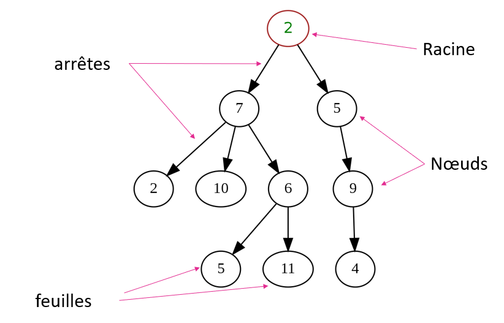
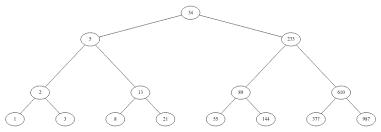
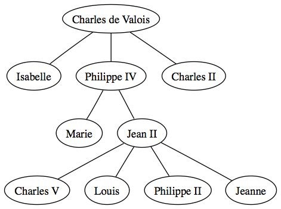

#Les arbres binaires

##Vocabulaire

Un arbre est une structure permettant de réprésenter des relations en informatique.  

Chaue élément de l'arbre est appélé un **noeud**. Une **feuille** est un neoud n'ayant pas de descendant.  
la **racine** est le noeud de départ, qui n'a pas d'acsendant. 

Nœuds **descendants** (ou fils) : nœuds liés à un nœud ascendant en s'éloignant de la racine.

##Les propriétés d'un arbre
La **Hauteur** de l'arbre est le nombre d'arrêtes maximale entre la racine et les feuilles.  
La **taille** de l'arbre : nombre de nœuds.  
La **profondeur** d'un nœud est le nombre d'arrêtes entre le nœud et la racine.

!!! example "exemple"
	Dans l'exemple ci-dessus, la taille de l'arbre est de 10, la hauteur est de 3 et la profondeur du noeud 10 est 2.
	La racine est le noeud 2 en haut, 2, 10, 1, 11 et 4 sont des feuilles.

##Arbre binaire
Un arbre est généralement orienté de la racine aux feuilles. Il est considéré comme **binaire** lorsqu'un neud ne peut pas avoir plus de deux descendants.

##Exemples

   

  

!!! note "arbre binaire"
	Seul le deuxième est un arbre binaire