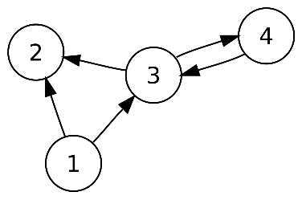
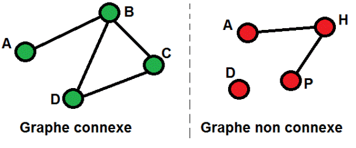
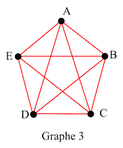
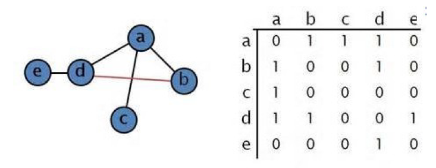
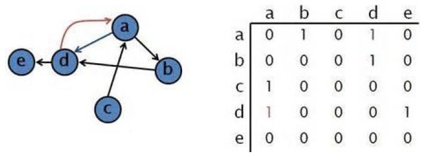
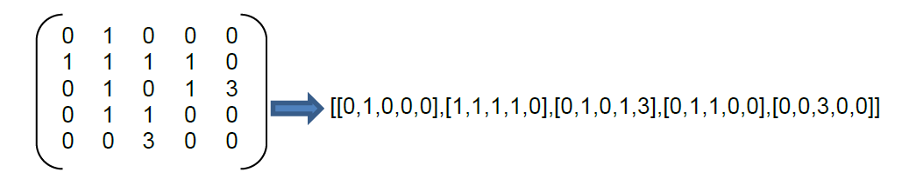
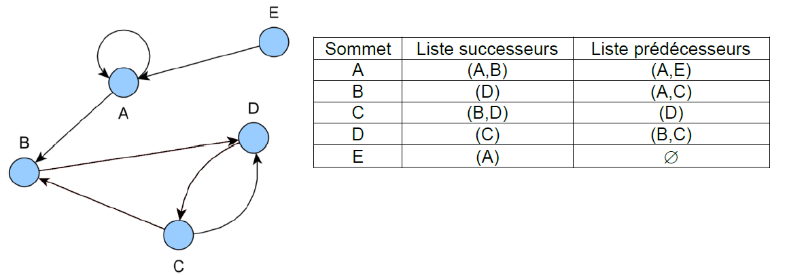

#Les graphes
##Activité de présentation
  
<embed src=res/activite_intro_graphes.pdf width=800 height=500 type='application/pdf'/>
##Bilan 
###Défintion
Un graphe est la représentation théorique d'une situation réelle mais abstraite.   

!!! example "Exemples"
    Plan de métro  
	réseau routier  
	réseau d'amis ou d'influence sur les réseaux sociaux  
	...

###**Vocabulaire**
{width:50% align=left}
Les noeuds sont appelés **sommets**, reliés par des **arêtes**. Les arêtes sont aussi appelées **arcs** si elles sont orientées.

**Graphe non-orienté** : les arêtes sont parcourues dans les deux sens.  
{width:50% align=right}
**graphe orienté** : les arcs ne peuvent être parcourus que dans un sens.     

**Graphe connexe** : un graphe est connexe si on peut aller d'un sommet à l'autre quel que soit le chemin emprunté.   

	

**Graphe complet**  un graphe est dit complet si chaque sommet est directement relié à tous les autres.  

	

**voisins** : Les voisins d'un sommet sont les sommets reliés par une seule arrête.  
**successeur** :  les successeurs sont les voisins d'après.  
**prédécesseurs** : Les prédécesseurs sont les voisins précédent.   
**Graphe pondéré**
Un graphe est dit pondéré si une valeur correspond à une arête ou un arc.

Cette valeur eut être un temps, une distance, un débit d'octets, ou n'importe quoi d'autre.  

### **Matrice d'adjacence**
{align=right} 
La matrice d'adjacence est un tableau à double entrée qui définit les liens entre les noeuds. Si le graphe est orienté, les colonnes sont les successeurs du noeud de la ligne courante. Si le graphe est non-orienté, la matrice est symétrique et les informations sont données en double (il faudra en tenir compte au moment de l'implémentation si l'on veut limiter la complexité de notre programme).  

!!! note "Remarque"
	Dans la matrice d'adjacence d'un graphe pondéré, on remplacera le 1 ar le poids de l'arête.

### **Représenter en python la matrice d'adjacence**
On peut représenter la matrice en python avec différentes structure, comme :

- la liste

	

- le dictionnaire

	

- l'instance de classe

##**Exercices sur les graphes**
<embed src=res/TD_graphes.pdf width=800 height=500 type='application/pdf'/>

##**Implémenter les graphes en python**
Se rendre sur [Capytale](https://capytale2.ac-paris.fr/web/accueil) et saisir le code d'activité 24b4-33046.
