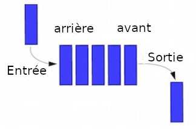

# Listes, piles et files
## Les listes chaînées  
### **Qu'est ce qu'une liste chaînée ?** 

Une liste chaînée est un objet dont chaque élément contient deux éléments : le contenu et l'adresse de l'élément suivant.

	

  
Une liste chaînée est différente d'un tableau dans le sens où les éléments de votre liste sont répartis dans la mémoire et reliés entre eux par des pointeurs. 
Vous pouvez ajouter et enlever des éléments d'une liste chaînée à n'importe quel endroit, à n'importe quel instant, sans devoir recréer la liste entière.

### **Insérer ou supprimer un élément dans une liste**  

	

Pour insérer ou supprimer un élément dans une liste chaînée il suffit de modifier le pointeur des éléments autour.

Quelques opérations que l'on peut faire avec les listes chaînées :  

- Ajouter/retirer un élément au début, à la fin, à l'intérieur
- Concaténer de deux listes
- Scinder une liste en deux
- Accéder au n-ième élément
- Rechercher la présence d'un élément

On les implémentera en python en utilisant des dictionnaires plus tard.

!!! question "Question"

     A votre avis de quelle nature sont les listes en python.

    === "Choisir la bonne réponse"
        - [ ] `des tableaux`
        - [ ] `des listes chaînées`

    === "Solution"
        - ✅ `des tableaux`
        - ❌ `des listes chaînées`

??? warning "attention"
    Ne pas confondre la notion abstraite de liste chaînée en programmation et la liste en phyton.   
    En python quand on insère un élément dans uns liste, il faut décaler les index de tous les autres éléments.

## Les piles 
>Définition :

>La structure de pile est un cas particulier de liste chaînée dans lequel on accède uniquement au premier élément de la liste : celui que l'on nomme le sommet de la pile. On représente en général cette structure sous forme verticale.

>On peut prendre pour exemple une pile d'assiettes : La dernière assiette rangée sera la première que l'on ressortira. On parle parfois de pile LIFO (Last In First Out : dernier entré, premier sorti). 

	

  

!!! Example "exemples d'utilisation courantes"
		Les piles sont extrêmement utiles en informatique et vous les utilisez quotidiennement, parfois même sans vous en rendre compte : 

		- La fonction annuler (Ctrl-Z) de votre traitement de textes par exemple est une pile : Quand vous tapez Ctrl-Z, vous annulez la dernière opération effectuée. Quand vous faites une nouvelle opération, celle-ci est mémorisée au sommet de la pile. Vous ne pouvez pas annuler l'avant dernière opération sauf à annuler la dernière.  
		- Le bouton retour de votre navigateur internet fonctionne également à l'aide d'une pile. Les pages web consultées lors de votre navigation sur une page sont empilées et le bouton retour permet d'accéder à la dernière page présente sur la pile.  
		- Certaines calculatrices fonctionnent à l'aide d’une pile pour stocker les arguments des opérations : c'est le cas de beaucoup de calculatrices de la marque HP, dont la première calculatrice scientifique ayant jamais été produite : la HP 35 de 1972.  

### La calculatrice scientifiique  
Le mode de calcul avec une pile s'appelle RPN (Reverse Polish Notation ou notation polonaise inverse). Dans cette logique postfixée, on saisit d'abord les arguments de l'opération puis en dernier, l'opération à réaliser.  

Exemple : Pour faire 2+3 on empilera 2, puis 3 et enfin on invoquera la fonction +. Cette logique est extrêmement efficace et rapide, en particulier dans les enchaînements d'opérations car elle ne nécessite pas de saisir des parenthèses. elle permet aussi de faire moins d'erreurs de calcul car on est obligé de réfléchir aux priorités des opérations au moment de la saisie.  

Voici une illustration en vidéo de l'utilisation de la calculatrice HP-45 (1974) qui est l'une des toutes premières calculatrices scientifiques.  

<iframe width="560" height="315" src="https://www.youtube.com/embed/rXRMFTRtA4A" title="YouTube video player" frameborder="0" allow="accelerometer; autoplay; clipboard-write; encrypted-media; gyroscope; picture-in-picture" allowfullscreen></iframe>

!!! question " Quel calcul est saisi?"

    === "Question"
    	Quel calcul est effectué si je rentre la séquence :
        12 ENTER 4 ENTER 3 x + et quel est le résultat de la séquence?

    === "correction"
        4*3+12 = 24

??? question "Pourquoi?"
	Le chiffre 3 est dans le registre x, 4 dans le Y et 12 dans le Z.
	Le premier signe multiplie les registres X et Y et range le résultat dans X (=3x4) 12 est alors redescendu dans le registre Y.
	Le deuxième signe a pour but d'additionner les registre X et Y.   

!!! question "Quelle séquence saisir? "

    === "Question"
    	On souhaite effectuer le calculer (12-4)*3. Quelle séquence faudra-t-il écrire ?"
        
    === "correction"
        3 ENTER 4 ENTER 12 - *

??? question "Pourquoi?"
	*Il faut empiler les nombres de façon à ce que les nombres prioritaires soient dans les registres X et Y. 
	On fait en 1er l'opération 12-4 donc 4 doit être dans Y et 12 dans X. On commence donc par empiler le nombre 3 puis 4 puis 12.  
	Une fois la première opération effectuée, 8 se trouve dans le registre X et 3 est descendu dans Y.*  

Les méthodes `append()` et `pop()` des listes en python permettent respectivement d'empiler et de dépiler un élément.

## Les files  
>Définition :

>Dans une file, les éléments sont placés les uns à cotés des autres comme dans une pile, à la différence que seul l'on sort les éléments du plus ancien vers le plus récent. Cela correspond à ce qui se passe dans une file d'attente. 

	

 
    

!!! Example "Exemple"

		Dans le domaine informatique, on retrouve par exemple les files dans les files d'impression où le premier document envoyé à l'imprimante sera le premier document à être imprimé.

### Opérations possibles :

Sur une file, on peut :  

- ajouter un élément à la fin de la liste (enfiler)
- supprimer/consulter le premier élément (défiler)
- savoir si la liste est vide
- connaitre le nombre d'éléments qu'elle contient

!!! tip "acronyme pour les files"

		=== "Question"
			En comparant avec l'acronyme FILO utilisé pour les piles, quel serait celui concernant les piles ?
		
		=== "Correction"
			FIFO First in First Out.   

---
