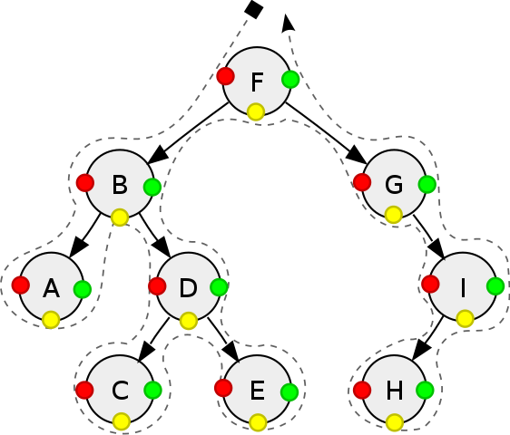
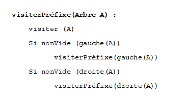
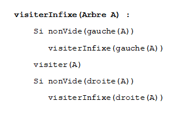
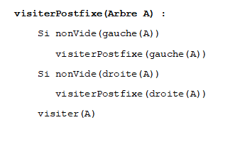
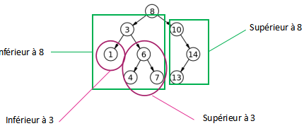
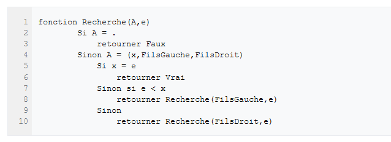
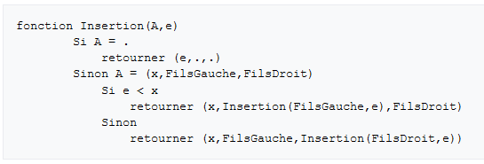

# Arbres binaires de recherche
## Parcours d'un arbre
On peut parcourir un arbre binaire de plusieurs façons. Dans le parcourt **préfixe**, on cite le noeud la première fois que l'on rencontre le noeud (lorsque l'on passe sur le point rouge).  

Ce qui donne pour le parcourt de l'arbre : F - B - A - D - C - E - G - I - H 
Dans le parcourt **infixe** (jaune), on visite l'arbre gauche avant de citer le noeud puis visiter l'arbre droit.
Parcourt infixe : A - B - C - D - E - F - G - H - I  

Dans le parcourt postfixe on viste d'abords les deux sous arbres et on ne cite le noeud que la dernière fois qu'on le rencontre (vert).  
Parcourt postfixe : A - C - E - D - B - H - I - G - F  

!!! note "Remarque"
	Tous ces parcourts sont appelés en profondeur d'abord. On peut aussi parcourir en largeur, à savoir:
	F - B - G - A - D - I - C - E - H

## Arbre binaire de recherche
Un arbre binaire de recherche (ABR) est un abre binaire dont les données du sous arbre droit contient des données supérieures ou égale à la racine et le sous-arbre gauche contient des données inférieures à la racine.  

!!! note "Remarque"
	Le parcours infixe renvoie les valeurs dans l'ordre croissant.  

## Opérations utiles sur un ABR
Les ABR permettent de ranger des données que l'on peut ensuite retrouver facilement en minimisant la coomplexité de la recherche. En effet, il est inutile de parourir tout l'arbre pour rechercher un nombre si l'on sait déjà s'il est plus petit que la racine. Il suffira de parcourir le sous-arbre gauche.  

Algorithme de recherche d'une clé :

Algorithme d'insertion de clé :
