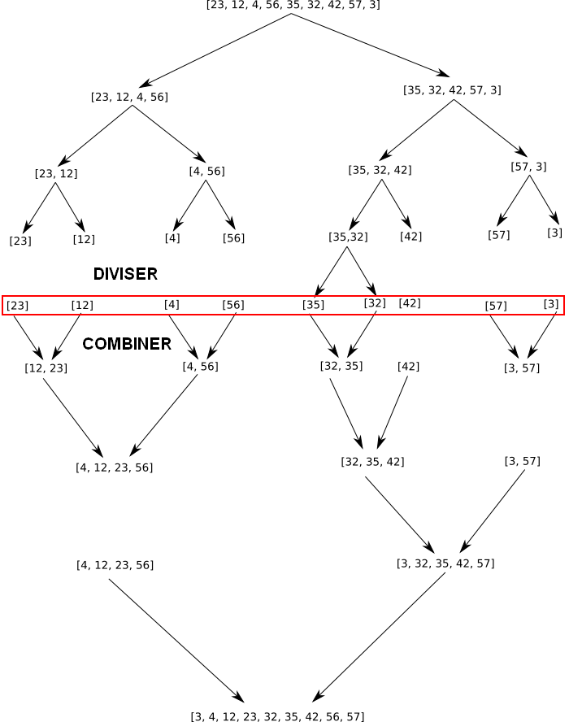
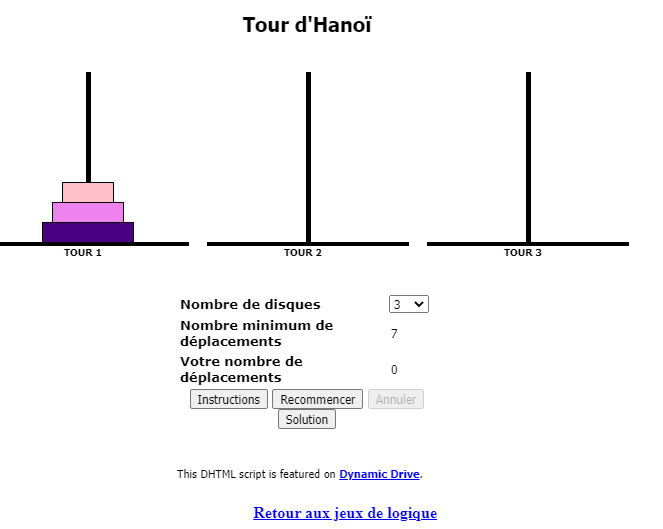
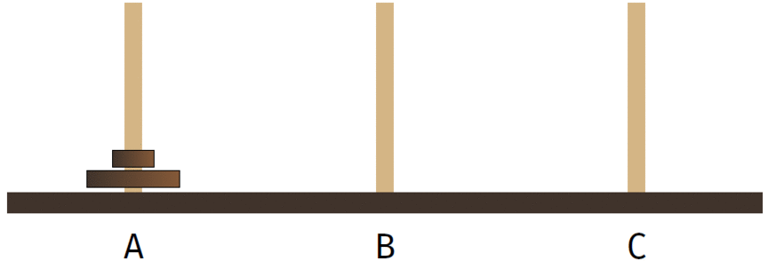
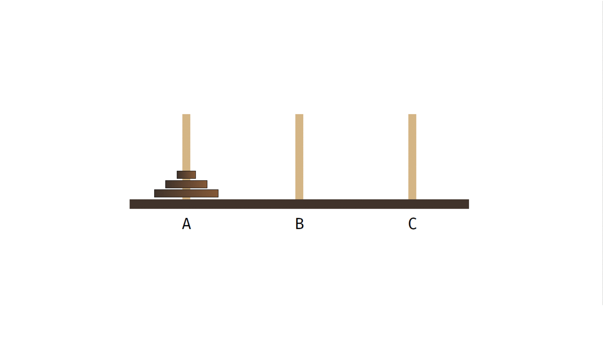
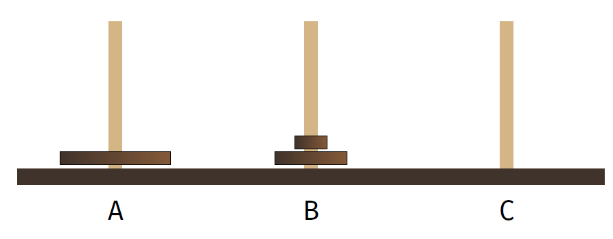
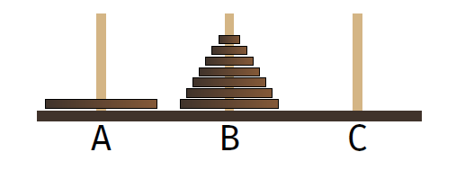
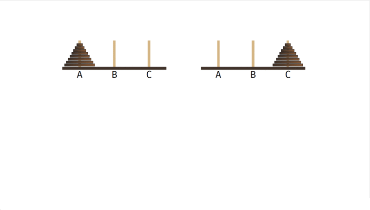
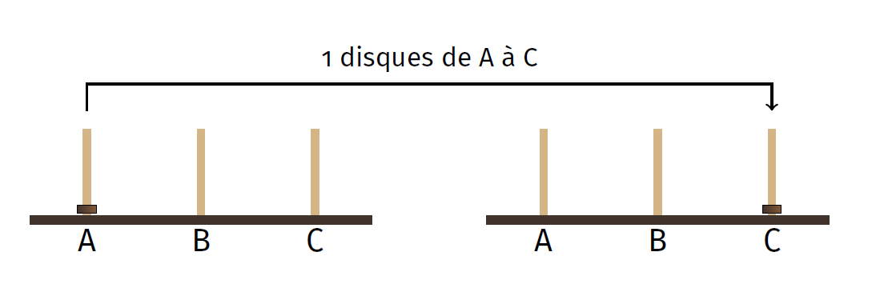

# Diviser pour régner
En informatique, on applique souvent cette méthode algorithmique qui constitue à diviser un problème en problèmes plus petits, donc plus facile à résoudre puis de l'étendre au problème plus grand.  
Il faudra pour cela résoudre trois étapes :

- **divisier** : découper le problème en problèmes plus petits
- **régner** : résoudre ces problèmes plus petits, déterminer coment on passe de ce problème à un problème un tout petit peu plus grand et définir les cas d'arrêt (on utilisera souvent la récursivité).
- **combiner** : recombiner les solutions des sous-problèmes pour obtenir la solution générale du problème de départ.


Nous allons pour illustrer cette méthode, utiliser deux exemples classiques : le tri-fusion et les tour de hanoï.

## Le tri fusion
Le tri fusion est un tri de tableau comme il a déjà été vu en première avec le tri par insertion et le tri par sélection.

Le principe du tri fusion est de diviser le tableau en tableau plus petits jusqu'à ce que l'on ait plus que des tableaux de 1 élément. C'est la partie **diviser**.  
Chaque petit tableau est très facile à trier; c'est la partie **régner**. 
On combine les tableaux deux à deux en comparant le premier élément de chaque tableau et de prendre le plus petit, puis l'autre. Une fois que l'on obtient des tableaux de 2 éléments, on utilise la même méthode pour combiner en tableau de 4 éléménts, ... ; c'est la partie **combiner**.

!!! example "exemple de résolution"
	Pour illustrer le fonctionnement, nous allons prendre un exemple de la fusion de deux tableaux `[32,42]` et `[3,57]`.  
	On regarde le premier élément de chaque tableau, à savoir 32 et 3. 3 est plus petit que 32 donc on place 3 dans le tableau final et on le supprime du tableau de droite.  
	On continue avec la meme méthode en regardant le premier élément de chaque tableau `[32,42]` et `[57]` (puisqu'on a enlevé le 3). Entre 32 et 57, 32 est plus petit et sera donc placé dans le tableau final et supprimé du tableau de gauche. On obtient les tableaux `[42]` et `[57]`, 42 est plus petit que 57, on place 42 dans le tableau final et on se retourve avec un des deux tableaux vides. On ajoute alors au tableau final tout le reste du tableau de droite.   
	Une fois les deux tableaux vides, on obtient un tableau avec les contenus des tableaux `[32,42]` et `[3,57]` fusionnés et triés `[3,32,42,57]`.  
	En pseudocode, cela pourrait donner pour la fusion :
	```pseudocode
	A-> tableau
	B-> tableau
	T-> tableau vide
	TANT QUE les tableaux A et B ne sont pas vides :
		SI A est vide:
			ajouter B à T
		SINON SI B est vide :
			ajouter A à T
		SINON :
			SI A[0]<B[0] :
				ajouter A[0] à T
			SINON SI A[0]>B[0]:
				ajouter B[0] à T
			SINON :
				ajouter B[0] et A[0] à T
			Fin SI
		FIN SI
	FIN TANT QUE
	``` 


!!! question "A vous de jouer"
	Ecrire en pseudo code la division en sous-tableaux de 1 élément.


!!! note "implémentation"
	Nous ferons l'implémentation du tri_fusion en TP.

## Les tours de Hanoi
Le jeu des tours de Hanoï est un jeu pour enfants, qui généralement finissent par jeter les pièces à travers leur chambre (ou à la figure de leur parents) sans se soucier d'appliquer les règles du jeu, à savoir :  
- les disques sont empilés dans l'ordre décroissant de taille sur la première tige (celle de gauche).  
- le but est de les retrouver empilés de la même façon sur la tige d'arrivée (celle de droite).   
- on ne peut déplacer que un disque à la fois  
- on ne peut poser un disque que sur un disque plus grand ou sur une tige vide. 

Vous pouvez tester [le jeu](http://championmath.free.fr/tourhanoi.htm) avec plus ou moins de disques.  
[](http://championmath.free.fr/tourhanoi.htm)


Pour un seul disque le problème est assez simple, il suffit de déplacer le disque de la tige de départ à la tige d'arrivée.  
Pour deux disques, on déplace le plus petit, sur la tige intermédiaire, puis le grand sur la tige d'arrivée et enfin le petit sur le grand. Jusqu'ici, tout va bien.

Pour trois disques, la méthode est donnée ci-dessous.

Si on regarde le problème un peu plus en détail, on peut résoudre le problème en considérant que cette situation est en fait une combinaison du problème à un seul disque (le plus grand qui va aller directement de la tige A à la tige C) et du problème à deux disques (mais la tige B comme tie de départ au lieu de la A et la C comme arrivée). On sait résoudre les situations à 1 disques et 2 disques, donc on peut résoudre celui-la.



De façon plus générale, avec un grand nombre de disque, si on arrive à cette situtation :

on saura résoudre le problème :


!!! warning "les étapes algorithmiques"

	- Tous les disques sont sur A
	- transférer les n-1 diques sur B (se fera par récursivité en allant jusqu'au cas d'arrêt ou n=1)
	- déplacer le grand disque sur C
	- transférer les n-1 disques sur C (se fera par récursivité en allant jusqu'au cas d'arrêt ou n=1)

Le cas de base étant celui a 1 disque :


!!! success "code"

	Voici ce que cela donne en python

	=== "code"
		```python
		def hanoi(n,depart,arrivee,intermediaire):
	    if n==1:
	        #si un seul disque on le déplace de la tige de départ à celle d'arrivée
	        print("Disque",n,":",depart," ->",arrivee)
	    elif n>=2:
	        #si plusieurs disques on transfère la pile de n-1 disques sur la tige itermédiaire
	        hanoi(n-1,depart,intermediaire,arrivee)
	        #on déplace le grand disque sur la tige d'arrivée
	        print("Disque",n,":",depart," ->",arrivee)
	        #on transfère le tout sur l'arrivée
	        hanoi(n-1,intermediaire,arrivee,depart)
		hanoi(3,"A","C","B")
		```

	=== "résultat"
		```python
		>>> # script executed     
		Disque 1 : A  -> C
		Disque 2 : A  -> B
		Disque 1 : C  -> B
		Disque 3 : A  -> C
		Disque 1 : B  -> A
		Disque 2 : B  -> C
		Disque 1 : A  -> C
		>>>  
		```


!!! questions "A faire"
	Dérouler le code à la main pour 3 puis 4 disques.  
	Tester ce code avec plusieurs disques en utilisant l'animation pour vérifier la démarche.  

On sait résoudre les problèmes à deux et un disques, on peut, grâce à la récursivité résoudre le problème avec un nombre quelconque de disques. C'est un peu magique non?!
