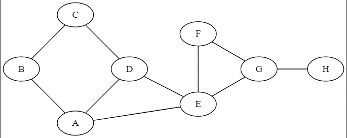

# Algorithmes de parcours de Graphes
On pourra utiliser un éditeur de graphes pour se simplifier la représentation en utilisant l'outil en ligne [Graphviz Editor](http://magjac.com/graphviz-visual-editor/)  

## Parcours en largeur d'abord (Breadth First Search - BFS)
Le principe du parcoursen largeur d'abord est de choisir un sommet et de parcourir les noeuds en listant les noeuds de même profondeur par rapport au noeud de départ.


- On démarre au noeud B. On explore ses fils, puis les fils de ses fils, sans revenir sur les noeuds déjà traités. ce qui donne sur l'animation ci-dessus : B, A, C, D, E, F, G, H.  

!!! note "Remarque"
	Le "premier" ou "deuxieme" fils sera déterminé par la façon dont le graphe a été implémenté. En effet, on pour déterminer le parcours comme B, C, A, D, F, G, F et H.

!!! faq "à partir d'autres noeuds"
	Développer l'algorithme en partant des noeuds H puis D.

!!! caution "Etapes de la procédure"
	On crée une file vide

	1. On enfile le nœud de départ.  
	2. On enfile les nœuds adjacents s'ils ne sont pas déjà présents dans la file et qu'ils n'ont pas déjà été visités (on créera une liste pour y stocker les noeuds visités)  
	3. On défile (c'est-à-dire on supprime la tête de file).  
	4. Tant que la file n'est pas vide, on ré-itère les points 2 et 3.  
	5. On affiche la liste des noeuds visités  


!!! example "Procédure détaillée"
	- On place les fils A et C en file d'attente.  
	`file_attente=[A,C]` puis on considère que le noeud B a été traité, on le mémorise `noeuds_traités=[B]`.  
	- On prend le premier élément en file d'attente (A) et on l'explore, c'est-à-dire que l'on met ses fils en file d'attente et que l'on mémorise le noeud comme traité. Il sort donc de la file d'attente : 
	`file_attente=[C,D,E]` et `noeuds_traités=[B,A]`.  
	- Même procédure avec le noeud C qui est le suivant dans la file d'attente, on traite C il sort de la file et entre dans les noeuds traités et son fils est placé en file d'attente :  le seul fils de C est déjà en file d'attente donc on ne l'ajoute pas : `file_attente=[D,E]` et `noeuds_traités=[B,A,C]`.  
	- On traite le noeud D : E est déjà en file d'attente: `file_attente=[E]` et `noeuds_traités=[B,A,C,D]`.  
	- Les fils du noeuds E sont placés en fils d'attente et E est déplacé de la file d'attente à la liste des noeuds traités : `file_attente=[F,G]` et `noeuds_traités=[B,A,C,D,E]`.  
	- Noeud F : ses fils sont soit déjà traité soit en fils d'attente `file_attente=[G]` et `noeuds_traités=[B,A,C,D,E,F]`.  
	- Noeud G : `file_attente=[H]` et `noeuds_traités=[B,A,C,D,E,F,G]`.
	- Noeud H :   `file_attente=[]` et `noeuds_traités=[B,A,C,D,E,F,G,H]`   
	Tous les noeuds ont été créés (on peut tester la taille de la liste avec une assertion pour être sûr) et la file d'attente est vide, le parcours s'arrête.


!!! faq "à partir d'autres noeuds"
	Développer l'algorithme en partant des noeuds H puis D.

L'algorithme en pseudocode :
```pseudocode
VARIABLE
G : un graphe
s : noeud (origine)
u : noeud
v : noeud
f : file (initialement vide)

//On part du principe que pour tout sommet u du graphe G, u.couleur = blanc à l'origine
DEBUT
s.couleur ← noir
enfiler (s,f)
tant que f non vide :
    u ← defiler(f)
    pour chaque sommet v adjacent au sommet u :
        si v.couleur n'est pas noir :
            v.couleur ← noir
            enfiler(v,f)
        fin si
    fin pour
fin tant que
FIN
```

## Parcours en profondeur d'abord (Deep First Search - DFS)
Pour ce parcours, on explore les voisins du noeuds de départ un par un et on explore les voisins du premier voisin, puis ceux du deuxième, ... 


On démarre au noeud B, on explore son premier fils (A) et on met les autres en attente (C). On explore le premier fils de A (E) et on met l'autre (D) en attente. Le premier fils de E (G) est exploré alors que G est en mis en attente. Puis, on explore H. Une fois arrivé à un noeud qui n'a plus de fils non traités ou mis en attente, on remonte visiter les noeuds mis en attente. Ce qui donne : B, A, E, G, H, F, D, C. 

!!! note "Remarque" 
	Le "premier" ou "deuxieme" fils sera déterminé par la façon dont le graphe a été implémenté. Le résultat du parcours peut être différent.

!!! caution "Etapes de la procédure"

	1. On part d'un sommet que l'on empile;  
	2. On dépile et on marque le sommet dépilé comme traité (il faudrait créer une liste pour les sommets déjà traités)  
	3. On empile chacun des voisins du sommet dépilé qui ne sont pas déjà dans la pile et qui n'ont pas été déjà été traités;  
	4. On recommence à partir du point 2 tant que la pile n'est pas vide.  

!!! example "Détails de la procédure"
	Ici, la file d'attente est une pile et non une file. Donc c'est le dernier élément mis en attente qui sera traité en premier.  
	- Le noeud B est visité en premier `noeuds_traités=[B]`. On viste A `noeuds_traités=[B,A]` et on place C en pile d'attente : `pile_attente=[C]`.  
	- On visite E et on met D en attente : `noeuds_traités=[B,A,E]` et `pile_attente=[C,D]`.  
	- On viste G et on met F en attente : `noeuds_traités=[B,A,E,G]` et `pile_attente=[C,D,F]`.  
	- On viste H qui n'a pas de fils non traité et non en attente : `noeuds_traités=[B,A,E,G,H]` et `pile_attente=[C,D,F]`.  
	- On dépile la pile d'attente et on visite F `noeuds_traités=[B,A,E,G,H,F]` et `pile_attente=[C,D]`.   
	- puis D `noeuds_traités=[B,A,E,G,H,F,D]` et `pile_attente=[C]`.  
	- et enfin C : `noeuds_traités=[B,A,E,G,H,F,D,C`] et `pile_attente=[]`.  
	- la pile d'attente est vide et on a visité tous les noeuds.


!!! faq "à partir d'autres noeuds"
	Développer l'algorithme en partant des noeuds H puis D.


L'algorithme itéraif en pseudocode

On peut utiliser la coloration des noeuds : blanc pour non visité et noir pour visité. Mais on peut également mettre les éléments visités dans une liste.
```pseudocode
VARIABLE
s : noeud (origine)
G : un graphe
u : noeud
v : noeud
p : pile (pile vide au départ)
//On part du principe que pour tout sommet u du graphe G, u.couleur = blanc à l'origine
DEBUT
s.couleur ← noir
piler(s,p)
tant que p n'est pas vide :
u ← depiler(p)
pour chaque sommet v adjacent au sommet u :
    si v.couleur n'est pas noir :
        v.couleur ← noir
        piler(v,p)
    fin si
fin pour
fin tant que
FIN
```

L'algorithme récursif en pseudocode
```pseudocode
VARIABLE
G : un graphe
u : noeud
v : noeud
//On part du principe que pour tout sommet u du graphe G, u.couleur = blanc à l'origine
DEBUT
PARCOURS-PROFONDEUR(G,u) :
  u.couleur ← noir
  pour chaque sommet v adjacent au sommet u :
    si v.couleur n'est pas noir :
      PARCOURS-PROFONDEUR(G,v)
    fin si
  fin pour
FIN
```

## Chercher son chemin
Chercher son chemin dans un graphe c'est parcourir le graphe en mémorisant les noeuds par lesquels on passe, en s'arrêtant dès que l'on a rencontré le noeud d'arrivée.

!!! hint "algorithme"
	```pseudocode
	Fonction cherche_chemin(graphe,depart,arrivee)  
	    P ← pile vide  
	    empiler le couple (depart,[depart]) dans P  
	    chemin ← liste vide  
	    Tant que P n'est pas vide faire  
	        (sommet,chemin) ← on dépile P  
	        listes_nouveaux_sommets_voisins ← liste des sommets   adjacents à sommet qui ne sont pas dans chemin (liste réinitialisée à chaque tour)  
	        Pour un_sommet dans listes_nouveaux_sommets_voisins  
	            Si un_sommet = arrivee alors  
	                retourner chemin + [un_sommet]  
	            sinon  
	                empiler (un_sommet,chemin + [un_sommet])  
	            FinSi  
	        FinPour  
	    FinTantQue  
	FinFonction
	```

## Chercher tous les chemins
Le principe est le même que précédemment mais on ne s'arrête pas dès que le noeud est rencontré. On mémorise le chemin et on continue de parcourir le graphe de façon à rencontrer encore le noeud d'arrivée.
On place les chemins trouvés dans une liste et on retourne cette liste.


!!! hint "algorithme"
	```pseudocode
	Fonction cherche_chemin(graphe,depart,arrivee)  
	    P ← pile vide  
	    L ← liste vide
	    empiler le couple (depart,[depart]) dans P  
	    chemin ← liste vide  
	    Tant que P n'est pas vide faire  
	        (sommet,chemin) ← on dépile P  
	        listes_nouveaux_sommets_voisins ← liste des sommets   adjacents à sommet qui ne sont pas dans chemin (liste réinitialisée à chaque tour)  
	        Pour un_sommet dans listes_nouveaux_sommets_voisins  
	            Si un_sommet = arrivee alors  
	                ajouter chemin + [un_sommet]  à L
	            sinon  
	                empiler (un_sommet,chemin + [un_sommet])  
	            FinSi  
	        FinPour  
	    FinTantQue  
	    Retourner L
	FinFonction
	```

!!! note "Remarque"
	Le chemin le plus court sera celui contenant le moins de noeuds rencontrés.

## Détection de cycle
Un cycle dans un graphe est un chemin dont le neoud de départ et le noeud d'arrivée sont identique. le principe étant de ne JAMAIS faire demi tour donc de ne pas revenir sur des noeuds déjà visités.

Si on veut chercher tous les cycles à partir d'un sommet on applique l'algorithme de recherche de tous les chemins. Et si on veut tous les ycles du graphe, on appique ce dernier à tous les sommets.

!!! hint "algorithme"
	```pseudocode
	Fonction rechercher_cycle(graphe,sommet):
	    cycle<-liste vide
	    Pour tous les voisins de sommet
	        chercher tous les chemins entre sommet et voisin
	    FIN Pour
	    Pour chaque chemin trouvé :
	        ajouter à cycle (chemin+sommet)  
	    FIN POUR
	    Revoyer cycle
	FIN FONCTION
	```