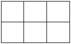
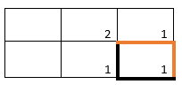
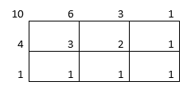
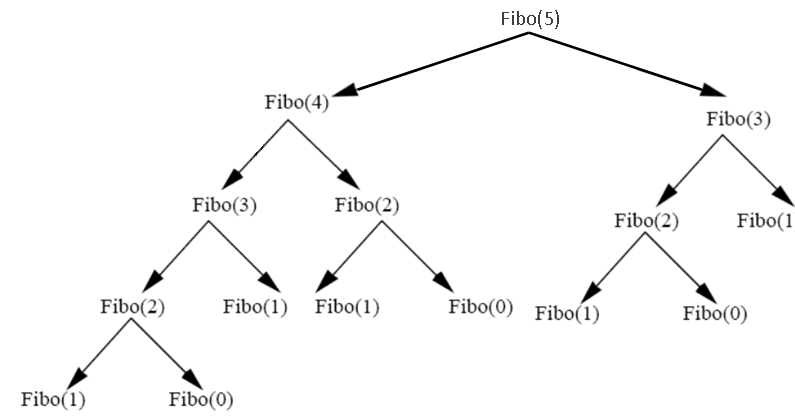

# Programmation dynamique
## Le principe
Le principe de la programmation dynamique est de mémoriser des résultats intermédiaires pour ne pas avoir à les reclaculer.   

##  Le problème
On dispose de la grille 2×3
ci-dessous.

Question : Combien de chemins mènent du coin inférieur droit au coin supérieur gauche, en se déplaçant uniquement le long des **traits horizontaux** vers la droite et le long des **traits verticaux** vers le bas ? Et pour une grille 10×10 ?

Une méthode consiste à inscrire près de l'intersection le nobre de chemin y menant. ainsi on pas besoin de recompter à chaque fois que l'on veut repartir de ce coin. On montre aisément que pour aller du coin inférieur droit au coin de la case immédiatement situé dans sa diagonale, on peut emprunter deux chemins, le orange et le noir. On inscrit alors "2" à l'intersection concernée.  
    
Une méthode consiste à inscrire près de l'intersection le nobre de chemin y menant. ainsi on pas besoin de recompter à chaque fois que l'on veut repartir de ce coin. On montre aisément que pour aller du coin inférieur droit au coin de la case immédiatement situé dans sa diagonale, on peut emprunter deux chemins, le orange et le noir. On inscrit alors "2" à l'intersection concernée.  
  

!!! faq "pour un carré de 5 par 5"
	A la main, évaluer le nombre de chemins pour un carré de 5 par 5.  
	Et pour un carré de 10 par 10.  

## La suite de Fibonacci
Les calculs des éléments de la suite de Fibonacci en récursif donne :  
```python
def fibonacci(n):
    if n < 2:
        return 1
    else:
        return fibonacci(n - 1) + fibonacci(n - 2)
print(fibonacci(30))

```

!!! note "Remarque"
	La méthode récursive pour calculer les membres de la suite de fibonacci n'est pas idéale. Elle est utilisée ici pour illustrer l'exemple.


Si on affiche l'arbre d'exécution on obtient :

On peut voir ici que certains éléments sont calculés plusieurs fois : fibo(2) par exemple est calculé 4 fois. Nous allons donc stocké le résultat de Fibo(2) dans une liste, puis à chaque fois que l'on en aura besoin on ia chercher le résultat dans la liste au lieu de le recalculer.  


