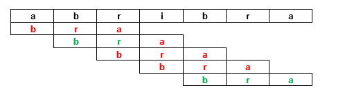
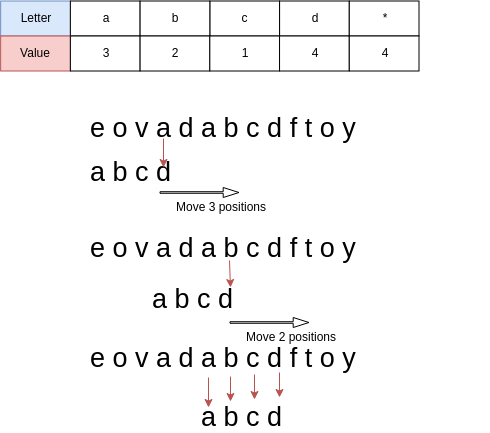
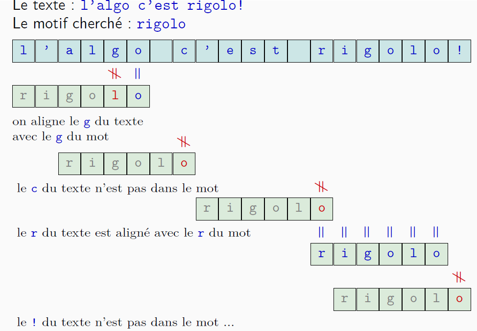

# Recherche textuelle
La recherche de motif dans un texte est fréquemment utilisée pour rechercher un mot ou une portion de phrase dans un document texte ou une page web.  
C'est en fait ce que fait la fonction RECHERCHE ou F3 de votre navigateur.

## Algorithme naïf
Ce que l'on appelle algorithme naïf est la procédure à laquelle on pense en premier, à savoir comparer le motif à partir du début du texte, mémoriser la position s'il y a correspondance puis décaler le motif de un rang et refaire la comparaison.

Ici, on cherche à partir de la premiere lettre, dès la première cela ne correspond pas, on décale le motif de une case. La premiere et la deuxième correspndent mais pas la troisième, on décale de motif de une case, ... jusqu'à ce qu'il y ait une correspondance pour i=4 (i étant l'index dans la chaine dans laquelle on recherche).    


!!! example "exemple"
	La recherche de 'bra' dans 'abracadabracadabricadabra' doit renvoyer 1, 8 et 22.  
	La recherche de 'bra' dans 'toutouyoutou' doit retourner ` False`.   

## Algorithme de Boyer-Moore-Horspool
Cet algorithme permet de ne pas effectuer toutes les comparaisons et donc de gagner en efficacité. En effet, la plupart du temps si on a eu une correspondance en position 1 il y a peu de chance d'en trouver une en position deux...encore que cela dépend du motif.   
L'algorithme de Boyer-Moore-Horspool va se dérouler de la façon suivante : 
On commence par créer une table appelée la table de décalage qui reprend la première occurrence (à partir de la fin) d'une lettre du motif et qui lui associe sa position dans le motif (à partir de la fin toujours). Cette table ne contient pas la dernière lettre.

On crée une table de décalage :


!!! danger "procédure"
	1. On compare la dernière lettre du motif avec la lettre avec laquelle il est aligné (au départ position N-1 du texte oùN est la longueur du motif)
	2. Si la lettre correspond, on regarde la lettre précédente.
	3. Si la lettre ne correspond pas on décale le motif de façon à aligner la lettre du texte ne correspondant pas à la premiere occurrence de cette meme lettre du motif (ci-dessus, le a ne correspond pas au d, on aligne le premier a du motif sur le a du texte (soit un décalage de 3 comme indiqué dans la table))
	4. Si la non correspondance se fait sur une lettre autre que la premiere il faudra tenir compte de l'endroit où l'on est dans  le motif. (décalage reel=decalage de la table - position dans le motif en partant de la fin).


!!! example "un exemple complet"
	Table de décalage : 

	|lettre du texte ne correspondant pas|	nombre de décalage|
	|:-----------------:|:--------------------:|
	|g	|3|
	|l	|1|
	|o	|2|
	|i	|4|
	|r	|5|
	|toute autre lettre|6 (longueur du motif)|

	

	On compare la dernière lettre du motif, "o", on trouve une correspondance donc on continue.   
	On compare "g" du texte à "l" du motif, il n'y a pas de correspondance, donc on décale. La table de décalage donne 3 pour le "g", on décale de 3-1=2 car on a déjà eu une correspondance.    
	On recommence la comparaison avec le "o" du motif et le "c" du texte, il n'y a pas de correspondance, donc on décale de 6 car "c" n'est pas dans la table de décalage.  
	On compare le "o" du motif avec le  "r" du texte, et on décale de 5.  
	On compare le "o" du motif avec le "o" du texte, il y a correspondance, on compare alors la lettre précédente.... jusqu'au "r". Il y a une correspondance complète, on mémorise la position du début du motif dans le texte : on a décalé de 2+ 6 + 5 =  13 jusqu'ici donc on mémorise la position 13.  
	Puis on redécale de 1...  

## Pseudocode
### table de décalage
```pseudocode
table de decalage (motif)
  m = longueur du motif
  créer un dictionnaire associant chaque lettre à m
  pour i allant de 0 à m-2,
      dictionnaire [ motif[i] ] = m - 1 - i
  fin du pour
  retourner le dictionnaire

```


### Recherche
```pseudocode
Algorithme Boyer-Moore-Horspool(x, t):
  '''
  x : motif, t : texte, m : longueur motif, n : celle du texte
  d : tableau des dernières occurrences du motif
  '''
  tant que j <= n - m,
    i = m - 1
    tant que i >= 0 et t[j + i] = x[i]:
      i = i-1
    fin tant que
    si i = -1 alors
      j est une occurrence de x
      j = j + 1
    sinon
      j = j + d[ t[j + i] ]
    fin du si
  fin du tant que
```