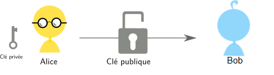
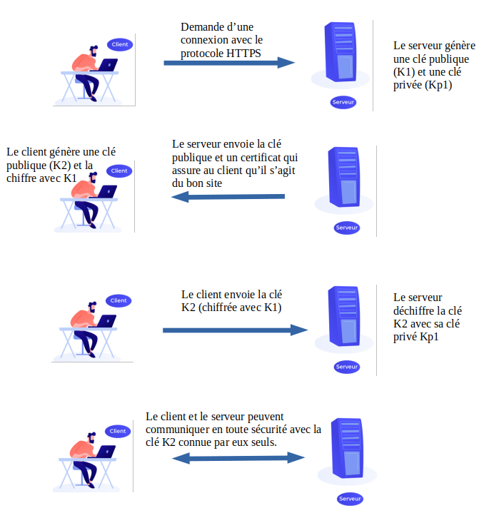

# Comment crypter ses données?

Comment faire en sorte que deux personnes (Alice et Bob) s'échangent des informations sans que Eve puisse les lire. On ne peut pas l'empêcher d'intercepter le message mais si les données sont cryptées, elles seront inexploitables.

## Chiffrement symétrique
>*La cryptographie symétrique, également dite à clé secrète (par opposition à la cryptographie asymétrique), est la plus ancienne forme de chiffrement. Elle permet à la fois de chiffrer et de déchiffrer des messages à l'aide d'un même mot clé. On a des traces de son utilisation par les Égyptiens vers 2000 av. J.-C. (wikipedia)*

Alice envoie des données chiffrées à Bob en utilisant une clé de chiffrement secrète. Cette clé sécrète est la même que celle utilisée par Bob pour déchiffrer le message. Il est donc nécessaire de se mettre d'accord sur la clé avant transmission des données.

### Exemple 1 : chiffremet par substitution
On remplace une lettre par une autre de l'alphabet (mais pas dans l'ordre), on a donc 26! ≈ 4×10<sup>26</sup>clés possibles.  
Avec la clé suivante :  
ABCDEFGHIJKLMNOPQRSTUVWXYZ alphabet  
AZERTYUIOPQSDFGHJKLMWXCVBN clé de substitution.    
le message SUBSTITUTION devient LWZLMOMWMOGF


### Exemple 2: Chiffrement de Verman (ou chiffrement XOR)
{align=left}
Il s'agit d'un système parfaitement sûr, le mathématicien C.Shannon a montré que si on respecte bien les 3 règles de Verman, ce système est inviolable.  

- La clé doit être une suite de caractères au moins aussi longue que le message à chiffrer.
- Les caractères composant la clé doivent être choisis de façon totalement aléatoire.
- Chaque clé, ou « masque », ne doit être utilisée qu'une seule fois (d'où le nom de masque jetable).

Une méthode particulièrement efficace pour traiter le chiffrement et le déchiffrement de messages à partir de la clé est d'utiliser la fonction logique XOR, le ou exclusif qui a une particularité très intéressante dans notre cas.  

Principe :  

-	On choisit une clé (ici 'toto') que l'on traduit en binaire   
(01110100011011110111010001101111)
-	On choisit un message à coder : 'Bonjour' que l'on traduit en binaire  
 (01000010011011110110111001101010011011110111010101110010)
-	On applique la fonction XOR bit à bit entre le message et la clé  qu'il faudra reproduire pour avoir le même nombre de bits.  

01000010011011110110111001101010011011110111010101110010  
⊕	
01110100011011110111010001101111011101000110111101110100  
________________________________________________________  
00110110000000000001101000000101000110110001101000000110     

C=M⊕S  où M est le message et S la clé.  

Pour déchiffrer, on fait l'opération inverse : (M⊕S)⊕S=M

!!! faq "Questions"
	1.Dans quel domaine pouvait-on utiliser la cryptographie dans l'antiquité ?  
	2.Quel peut être le risque dans le cas d'une interception de communication si on utilise le chiffrement symétrique ?   
	Si Eve intercepte tous les messages elle peut aussi intercepter la clé qui est forcément transmise en clair.  
	3.Dans le cas des deux systèmes proposés, quel est la clé secrète ?   
	4.Coder votre prénom grâce au code de Verman avec comme clé 'nsi'.  
	  
	[un peu plus rapide](https://www.rapidtables.com/convert/number/ascii-to-binary.html)


## Chiffrement asymétrique
Le principe du chiffrement asymétrique c'est que la clé de chiffrement n'est pas la même que la clé de déchiffrement. La personne qui crypte le message et l'envoie, ne connait pas la clé de déchiffrement.  
Elle fut inventée par Whitfield Diffie et Martin Hellman en 1976, qui reçurent le prix Turing de 2015 pour cette découverte.  

{align=left} 
En cryptographie **asymétrique** on a 2 clés:

- **la clé publique**: Celle-ci, tout le monde peut la posséder, il n'y a aucun risque, vous pouvez la transmettre à n'importe qui. Elle sert à chiffrer le message.
- **la clé privée**: que seul le récepteur possède, en l'occurrence vous. Elle servira à déchiffrer le message chiffré avec la clé publique. 

On peut simplifier la situtation en utilisant l'analogie du cadenas. Alice envoie un coffre à Bob avec  un cadenas ouvert. Bob y range son message et ferme  le cadenas (il ne possède pas la clé). Il envoie le tout à Alice qui est la seule à pouvoir l'ouvrir.

 

### Exemple : Puzzle de Merkle
Alice crée un fichier contenant un grand nombre de lignes (par exemple 100 000) du type :  
```pseudocode
…
Identifiant :  129378, clé : abAZda9h!snasjda
Identifiant : 821012, clé : sladljl32#QSdsal
Identifiant : 321091, clé : 9Sakns281alSA@31
…

```

Elle va ensuite chiffrer chaque ligne avec un algorithme de chiffrement symétrique et une clé de faible longueur, différente pour chaque ligne, de façon à être facilement décryptée par une attaque de force brute.  
Alice envoie le fichier contenant les lignes à Bob qui choisit une ligne au hasard et la décrypte par force brute.
Il envoie ensuite son identifiant (en clair) à Alice accompagné du message crypté grâce à la clé appelé clé de session (valable pour toute la session de communication).  
Alice n'a plus qu'à regarder dans son fichier quelle clé elle doit utiliser pour décrypter le message.   
Une personne qui intercepterait la communication ne saurait pas quelle ligne a été résolue et aurait tout à résoudre pour trouver la clé, ce qui donne beaucoup plus de travail mais n'est pas impossible.  


!!! faq "Questions"
	5.Quelle est la clé publique de ce système ?  
	6.En quoi, le puzzle de Merkle est à la limite du chiffrement asymétrique.   


## Protocole HTTPS
Pour qu’un message entre deux machines dans un réseau informatique ne puisse pas être compréhensible s’il est intercepté, il faut qu’il soit chiffré.
Il y a deux manières principales pour le faire :  
-	Par un chiffrement symétrique qui utilise une clé unique, connue seulement de l’émetteur et du récepteur. L’émetteur chiffre le message avec la clé et le récepteur le déchiffre avec la même clé.  
-	Par un chiffrement asymétrique qui utilise un couple de clé, l’une publique connue de tout le monde, l’autre privée connue uniquement par le récepteur. L’émetteur chiffre le message avec la clé publique. Le récepteur le déchiffre avec la clé privée.  
Ces deux méthodes de chiffrement sont utilisées lorsqu’un navigateur demande une page web avec le protocole HTTPS.  
Dans le schéma ci-dessous, on a représenté les échanges de communications entre un client et un serveur avec le protocole HTTPS.  
Les échanges entre client et serveur se font avec un chiffrement symétrique (clé K2) après que celle-ci ait été échangée avec un chiffrement asymétrique.  
  
 
## Certificat
Pour éviter le problème du "Man in the middle" qui pourrait intercepter les messages entre Bob et Alice, on peut utiliser le principe des certificats pour certifier que les clés publiques appartiennent bien à la personne à laquelle elle semble appartenir.
Ce certificat est un fichier contenant la clé publique, des informations sur la personne et une signature numérique que seule la personne à qui appartient la clé publique peut créer car elle est chiffrée à l'aide de la clé privée.


!!! faq "Questions"
	7.Faites quelques recherches pour résumer en quelques phases (éventuellement avec un schéma) le principe du "Man in the middle".  
	8.Dans quels cas utilise-t-on les certificats ?   


!!! info "Compléments"
	<iframe width="560" height="315" src="https://www.youtube.com/embed/ymez1h_tn7I" title="YouTube video player" frameborder="0" allow="accelerometer; autoplay; clipboard-write; encrypted-media; gyroscope; picture-in-picture" allowfullscreen></iframe>
	<iframe width="560" height="315" src="https://www.youtube.com/embed/7W7WPMX7arI" title="YouTube video player" frameborder="0" allow="accelerometer; autoplay; clipboard-write; encrypted-media; gyroscope; picture-in-picture" allowfullscreen></iframe>