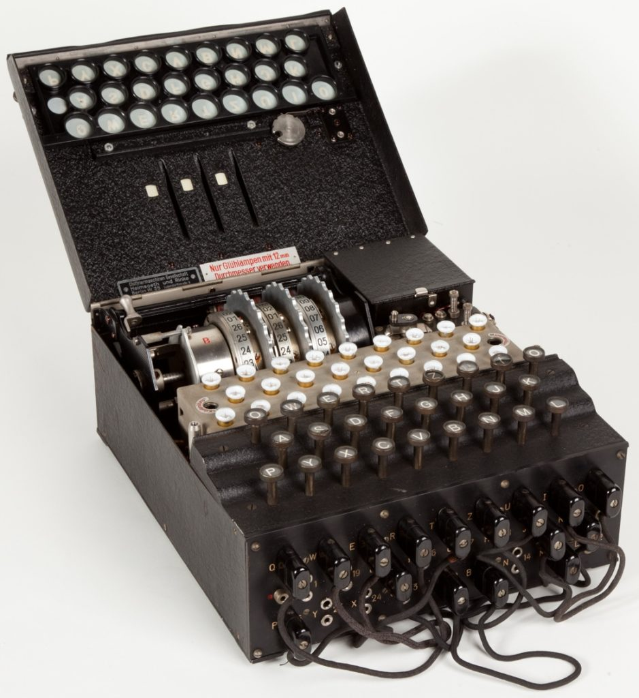
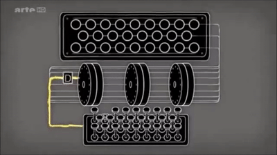
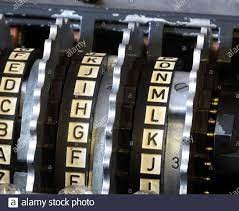
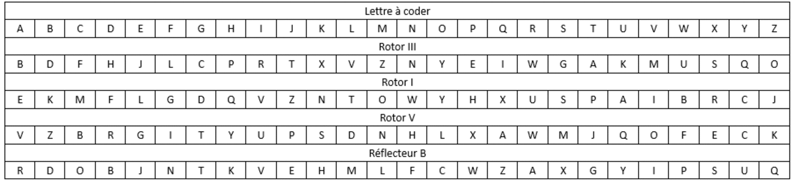
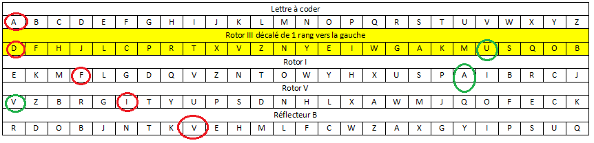
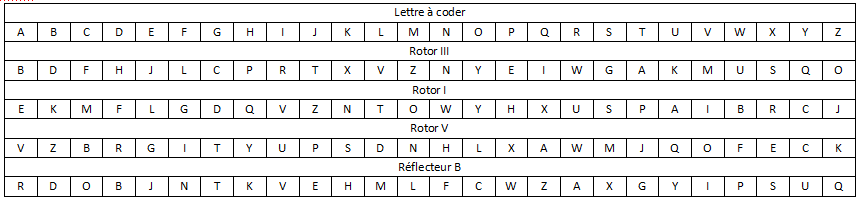
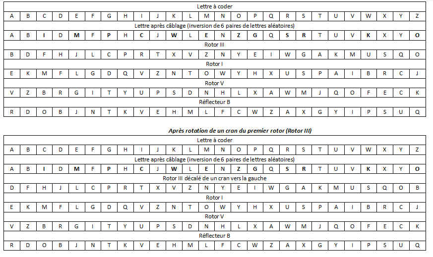

# Et si on codait Enigma?
{align=right width=30%}
## Qu’est-ce que Enigma ?

Enigma a été inventée et utilisée par les NAZIS lors de la deuxième guerre mondiale pour transmettre des messages aux troupes sans que personne ne puisse les comprendre. La machine permettait de crypter les messages en utilisant une clé qui changeait chaque jour. 
Le décryptage se faisait par la même machine à condition qu’elle soit configurée de la même façon.  


</br>
## Comment fonctionne-t-elle ?
{align=left}
Un clavier permettait à l’utilisateur de saisir une lettre, qui en passant dans un réseau de câblage pouvait être modifiée. Chaque jour 6 paires de lettres étaient inversée (soit 12 lettres modifiées) mais pas les autres.  
Ensuite, le signal électrique passait dans un premier rotor qui modifiait la lettre à l’aide d’une connexion électrique. Le signal passe ensuite dans deux autres rotors qui modifient chacun la lettre, puis dans un réflecteur, qui en plus de modifier la lettre renvoie le signal dans les rotors en sens inverse. 
La lettre de départ est alors modifiée 9 fois. La lettre en sortie s’allume sur un panneau lumineux.  
La fréquence d’apparition des lettres dans une langue pourrait permettre de trouver rapidement la lettre de remplacement, c’est pourquoi la machine permettait de ne pas coder deux fois la même lettre de la même façon. Pour cela, à chaque appui sur le clavier, le premier rotor tourne d’un cran. Quand il a fait un tour, le second rotor tourne d’un cran.  

## Quels sont les réglages ?
{align=left}
{align=right}
Les rotors contiennent les lettres de l’alphabet dans le désordre et sont tous différents. Les réglages nécessitent de choisir 3 rotors parmi 5, d’en déterminer l’ordre et le réglage de départ, c’est-à-dire la lettre qui correspondra au « A » lors de la première frappe. 
On fait de même en sélectionnant un réflecteur parmi deux. Ici le positionnement sera fixe.  
Le dernier réglage consiste à choisir 6 paires de lettres dans l’alphabet et de les inverser par câblage électrique.  
**Comment décrypter ?**   
Si le réglage initial est le même il suffit de saisir au clavier la lettre à décoder et sur le panneau lumineux s’affiche la lettre en clair.


## Comment a été craqué Enigma ?
[Un petit tour par ici](https://interstices.info/turing-a-lassaut-denigma/)

## Qu’allons nous faire ? 
Nous allons créer un programme permettant de configurer la machine avec des réglages donnés et crypter et décrypter des messages.  
Nous allons simplifier l’utilisation en n’utilisant que les 26 lettres en majuscules de l’alphabet. Pas de minuscules, pas d’espaces et pas de caractères spéciaux. Nous n’utiliserons que 3 rotors, mais les dernières versions en utilisaient davantage.  

## Mise en place du problème
###  Le principe de base
Nous allons prendre un exmple avec le schéma ci-dessous :   

La lettre A en passant par le rotor III devient B. Le B devient K en passant par le rotor I et le D devient S en passant par le rotor V.
A ce stade, la lettre a déjà  changé 3 fois et on en est même pas à la moitié.
En passant par le réflecteur, le S devient X et on repart dans le rotor V.  
**Attention, ici le raisonnement se fait dans l'autre sens.**  
En repassant par le rotor V, la lettre X se transforme en P. Il faut chercher X dans la liste du rotor V et voir à quelle lettre de l'alphabet à coder cela correspond.  
En cherchant P dans le rotor I, on voit qu'il devient T et T devient J dans le rotor III.

La lettre A est alors codée en J.  

Une fois la première lettre codée, le premier rotor (le III) tourne d'un cran :

Si on cherche à recoder la lettre 'A' on trouve alors un 'V'.  
A va devenir D dans le premier rotor puis D deviendra F en passant par le second rotor, F devient  I dans le troisième rotor puis V dans le réflecteur. V va devenir A, A deviendra U et U deviendra V.  



### Décryptage du message
Le génie de cette machine réside dans la simplificité d'utilisation. En effet, si les réglages sont identiques le décryptage du message se fait de la même façon que le cryptage. Ainsi, quelqu'un qui reçoit les lettres 'JV' en les entrant dans la machine doit pouvoir lire le message en clair de départ à savoir 'AA'.  

!!! question "Faites le test"
	En utilisant le tableau donné, vérifier le décrryptage.
	{align=left}


### Câblages
Pour augmenter le brouillage, avant même de rentrer dans les rotors, 6 paires de lettres étaient inversées.
Le principe est le même que le cryptage précédent mais avant même de passer par les rotors, certaines lettre sont transformées en une autre. Dans l'exemple ci-dessous vous pouvez voir que pour A cela ne change rien puisqu'elle ne fait pas partie des lettres inversées.

!!! question "avec le cablâge"
	A l'aide du nouveau tableau contenant le cablâge,  essayer de crypter deux fois de suite la lettre C.
	{align=left}

??? danger "Faites le avant pour être sur d'avoir compris"
    Premier C : I dans le cablage, devient R par le premier rotor, R devient U par le deuxieme rotor, U devient Q par le 3e rotor, et Q devient Z dans le réflecteur.  
    Le Z du réflecteur devient un B dans le rotor V, puis le B devient W, le W devient R et le R par l'inversion du câblage devient un S.  
    Le premier rotor tourne d'un cran et le O passe en 1er et tout se décale vers la droite.  
    Deuxième C : I dans le cablage, devient T par le premier rotor (attention le rotor a tourné), T devient P par le deuxieme rotor, P devient X par le 3e rotor, et X devient S dans le réflecteur.  
    Le S du réflecteur devient un K dans le rotor V, puis le K devient B, le B devient Z (le rotor a tourné) et le Z par l'inversion du câblage devient un O.  


### Implémentation des rotors et des réflecteurs
Les rotors que nous utiliserons seront ceux d'origine. Pour cela nous aurons une variable globale `rotors` qui sera un tuple contenant les chaînes de 26 caractères, dans l'ordre dans lequel elles apparaissaient sur les rotors d'Enigma.
Même chose pour les réflecteurs. Voici les variables globales utilisées dans le programme :  
```python
alphabet='ABCDEFGHIJKLMNOPQRSTUVWXYZ'
rotors=('EKMFLGDQVZNTOWYHXUSPAIBRCJ',
        'AJDKSIRUXBLHWTMCQGZNPYFVOE',
        'BDFHJLCPRTXVZNYEIWGAKMUSQO',
        'ESOVPZJAYQUIRHXLNFTGKDCMWB',
        'VZBRGITYUPSDNHLXAWMJQOFECK')
REFLECTEURS = ('YRUHQSLDPXNGOKMIEBFZCWVJAT', 'RDOBJNTKVEHMLFCWZAXGYIPSUQ')
```


## Choix du niveau du projet
Vous allez pouvoir choisir le niveau du projet que vous allez traiter. Le but est de rendre un programme qui crypte les messages à la manière d'Enigma même si toutes les particularités de la machine ne sont pas respectées. Bien sûr plus le niveau choisi sera élevé plus la note sera élevée mais la note sera meilleure avec un projet de niveau 2 qui fonctionne qu'avec un projet de niveau trois qui ne fonctionne pas.  
Il sera plus facile de passer en cours de route d'un niveau plus faible à un niveau plus élevé que l'inverse.  

**Niveau 1** : Pas de rotation des rotors et pas de câblage (note maximale 12/20 avec le Bonus)  
**Niveau 2** : Rotation des rotors mais pas de câblage (note maximale 16/20)  
**Niveau 3** : Programmation complète avec rotation des rotors et cablâge (note maximale 20/20)  
**Bonus** : On pourra prévoir de faire entrer les valeurs de régalges par l'utilisateur et de gérer les entrées éronnées avec des blocs `try ... except...`.  

### Implémentation de la machine
On créera une classe `enigma` qui créera une machine avec les réglages donnés par votre Furher. 
Cette classe permettra de calculer la lettre sortant d'un rotor, des cablâges et du reflecteur et fera tourner les rotors après avoir crypter une lettre.  
Cette classe prendra en paramètres les trois rotors choisis par le Furher dans l'ordre, les réglages initiaux de chacun des trois rotors, le choix du réflecteur et dans le cas du niveau 3, la liste de lettres à inverser par câblage.  
**Niveau 1 et 2**:  
La création de l'objet `machine`de la classe `enigma` doit se faire de cette façon:  
```python
machine=enigma(premier_rotor,deuxieme_rotor,troisieme_rotor,reglage_premier_rotor,reglage_deuxieme_rotor,
               reglage_troisieme_rotor,choix_reflecteur)
```
!!! caution "Type des paramètres"
	`premier_rotor`,`deuxieme_rotor` , `troisieme_rotor` et `choix_reflecteur` sont des chaînes de 26 caractères contenant les lettres du rotor. Il faudra utiliser la variable globale `rotors` pour les récupérer.  
	`reglage_premier_rotor`,`reglage_deuxieme_rotor` et `reglage_troisieme_rotor`  sont des chaînes de 1 caractère. il s'agit de la lettre apparaissant en premier.  

**Niveau 3** :   
La création de l'objet `machine`de la classe `enigma` doit se faire de cette façon:  
```python
machine=enigma(premier_rotor,deuxieme_rotor,troisieme_rotor,reglage_premier_rotor,reglage_deuxieme_rotor,
               reglage_troisieme_rotor,choix_reflecteur,suite_cablage)
```
!!! caution "Type des paramètres"
	`premier_rotor`,`deuxieme_rotor` , `troisieme_rotor` et `choix_reflecteur` sont des chaînes de 26 caractères contenant les lettres du rotor. Il faudra utiliser la variable globale `rotors` pour les récupérer.  
	`reglage_premier_rotor`,`reglage_deuxieme_rotor` , `reglage_troisieme_rotor` et` reglage_reflecteur` sont des chaînes de 1 caractère. il s'agit de la lettre apparaissant en premier.  
	`suite_cablage` est une chaîne de 6 paires caractères à inverser.

### Fonctions

```python
#variables globales
alphabet='ABCDEFGHIJKLMNOPQRSTUVWXYZ'
rotors=('EKMFLGDQVZNTOWYHXUSPAIBRCJ',
        'AJDKSIRUXBLHWTMCQGZNPYFVOE',
        'BDFHJLCPRTXVZNYEIWGAKMUSQO',
        'ESOVPZJAYQUIRHXLNFTGKDCMWB',
        'VZBRGITYUPSDNHLXAWMJQOFECK')
REFLECTEURS = ('YRUHQSLDPXNGOKMIEBFZCWVJAT', 'RDOBJNTKVEHMLFCWZAXGYIPSUQ')


class enigma:
    def __init__(self,...):
        '''initilisation de la classe en utilisant les paramètres donnés dans le détail du projet'''
        self.rotor1=... #str contenant 26 caractères
        self.rotor2=...
        self.rotor3=...
        self.reflecteur=...
        self.cablage=...  #str contenant les lettres à inverser dans l'ordre
        self.alphabet_cable=''  #str de 26 lettres contenant l'aphabet cablé
        self.pos_rotor1=... #premiere lettre du rotor dans la position initiale
        self.pos_rotor2=...
        self.pos_rotor3=...
        
        
    def inversion(self):#niveau 3 uniquement
        '''cette fonction renvoi les lettre de l'alphabet dont l'ordre
        est modifié par la chaine de cablage.
        avec un cablage ='ABCDEFGHIJKL'
        la fonction doit renvoyer 'BADCFEHGJILKMNOPQRSTUVWXYZ'''
        
        
    def positionner_rotors(self):#tous les niveaux
        '''cette fonction ne retourne aucune valeur mais modifie les chaines de caracteres représentant les rotors.
        par exemple un rotor 'ABCDEFGHIJKLMNOPQRSTUVWXYZ' avec un réglage de 'L' devrait etre
        modifié par la fonction en 'LMNOPQRSTUVWXYZABCDEFGHIJK'
        '''    
        
    def configuration(self):#tous les niveaux
        '''cette fonction ne renvoie rien mais execute la configuration de la
        machine, à savoir la modification du cablage de l'alphabet, le positionnement des rotors
        et mémorise dans de nouveaux attribut la derniere lettre de chaque rotor avec que
        lors de la rotation on puisse savoir si on est à la fin du tour'''

        
    def tourner_rotor(self,rotor):#niveaux 2 et 3
        '''cette fonction renvoie le rotor une fois sa position modifiée de un cran'''
    
    def rotation_rotors(self):#niveaux 2 et 3
        '''cette fonction programme la rotation des rotors. Elle ne renvoie rien mais permet
        la rotation de un cran en tenant compte du fait que lorsque le premier a fait un tour le deuxieme tourne d'un cran et ainsi de suite.
        On modifie les attributs liés au rotor en appliquant la fonction de rotation et on vérifie si on a atteint la fin du tour
        avec les attributs lié à la lettre de fin créé dans la fonction de configuration'''
       
    
    def passage_rotor(self,lettre, rotor):#tous niveaux
        '''prend en paramètre une lettre et un rotor dans une certaine position
        et renvoie la lettre transformée par le passage dans le rotor'''


    def passage_inverse_rotor(self,lettre,rotor):#tous niveaux
        '''Prend en paramètre une lettre et un rotor dans une certaine position
        et renvoie la lettre transformée par le passage en SENS INVERSE dans le
        rotor'''


    def passage_reflecteur(self,lettre):#tous niveaux
        '''Prend en paramètre une lettre  
        et renvoie la lettre transformée par le reflecteur'''
        
    
    def passage_cablage(self,lettre):#niveau 3
        '''Prend en paramètre une lettre  
        et renvoie la lettre transformée par le cablage'''
    
    def passage_cablage_inverse(self,lettre):#niveau 3
        '''Prend en paramètre une lettre  
        et renvoie la lettre transformée par le passage en sens inverse par le câblage
        '''
    
    def crypter_lettre(self,lettre):#tous niveaux
        '''Prend en paramètre une lettre à coder etrenvoie la lettre après avoir
        subi toute les étapes de traitement cablage, 3 rotors, reflecteur,
        3 rotors en sens inverse'''
        ...
        return lettre
        
        
#niveau 2 et 3 vous penserez à caser quelque part la rotation des rotors mais je vous laisse réfléchir à l'endroit

class message:
    '''cette classe va prendre en argument un message et une
    instance de la classe enigma pour traiter le message'''
    def __init__(self,message,machine):
        '''initialisation de la classe'''
        self.message=...
        self.machine=...
    
    def crypter(self):
        '''cette fonction va appliquer les reglages de la machine créée par la classe
        Enigma à une chaine de caracteres correspondant au message. Chaque lettre
        du message devra être cryptée'''
        ...
        return msg_crypte

####### programme principal ##############
if __name__=='__main__':

    ##choix des réglages
    #choix des rotors das l'ordre que l'on veut parmi les 5
    premier_rotor=...
    deuxieme_rotor=...
    troisieme_rotor=...
    #choix du réflecteur entre le premier et le deuxieme
    choix_reflecteur=...
    #choix de la lettre placée en premiere position pour chaque rotor
    reglage_premier_rotor=...
    reglage_deuxieme_rotor=...
    reglage_troisieme_rotor=...

    #niveaux 1 et 2
    machine=enigma(premier_rotor,deuxieme_rotor,troisieme_rotor,reglage_premier_rotor,reglage_deuxieme_rotor,
                   reglage_troisieme_rotor,choix_reflecteur)
    machine.configuration()

    #niveau 3
    #suite de lettres à inverser deux à deux (on inverse la premiere et la deuxieme, la troisieme et la quatrième ...
    suite_cablage=...
    machine=enigma(premier_rotor,deuxieme_rotor,troisieme_rotor,reglage_premier_rotor,reglage_deuxieme_rotor,
                   reglage_troisieme_rotor,choix_reflecteur,suite_cablage)
    machine.configuration()

    #vous completerez le programe de façon à afficher un message crypté et à tester son
    #décryptage
    msg=message(...)
```

!!! faq "Décrypter ceci"
	Pour tester votre machine votre Furher vous demande d'utiliser les réglages suivants :  
	rotors dans l'ordre, IV (réglage D), II (réglage A) et III (réglage C)
	rélecteur A  et câblage 'ENIGMATURING'.
	Décrypter le message  
	**Niveau 1** : XITDETNCISCDTYERRI.  
	**Niveau 2** : XQAXREIANLYOWWANWV.  
	**Niveau 3** : SFLSXGGNNQPLUJDYZF.  