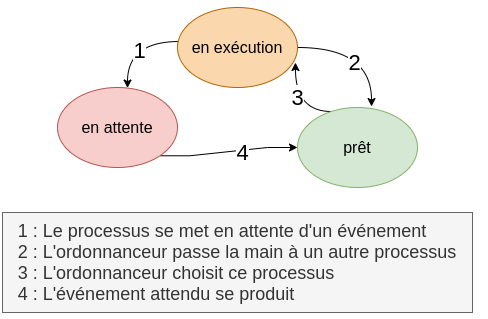
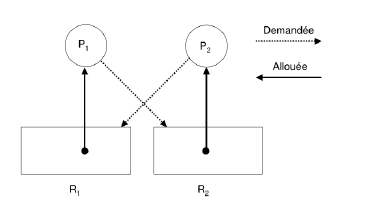

#Gestion des processus
##Qu'est-ce qu'un processus?
Un programme écrit à l'aide d'un langage de haut de niveau (on parle de "code source") est, comme nous l'avons vu l'année dernière, transformé en langage machine afin de pouvoir être exécuté par un ordinateur.  

On appelle processus un programme en cours d'exécution. 

!!! caution "Attention"
	Il ne faut pas confondre le code source du programme et un processus, qui lui correspond à l'exécution de ce programme par un ordinateur. Pour prendre une image assez classique, si une recette de cuisine correspond au code source du programme, le cuisinier en train de préparer cette recette dans sa cuisine correspond à un processus.   

##Etats d'un processus
Tous les systèmes d'exploitation "modernes" (Linux, Windows, macOS, Android, iOS...) sont capables de gérer l'exécution de plusieurs processus en même temps. Mais pour être précis, cela n'est pas en véritable "en même temps", mais plutôt un "chacun son tour". Pour gérer ce "chacun son tour", les systèmes d'exploitation attribuent des "états" au processus.

**Voici les différents états :**

{align=left}
- Lors du démarrage d'un programme ou de l'ouverture d'un nouvel onglet par exemple, un processus est créé, il estdans l'état **nouveau**.
- Lorsqu'un processus est en train de s'exécuter (qu'il utilise le microprocesseur), on dit que le processus est dans l'état **en exéution**.
- Un processus qui se trouve dans l'état en exéution peut demander à accéder à une ressource pas forcément disponible instantanément (par exemple lire une donnée sur le disque dur). Le processus ne peut pas poursuivre son exécution tant qu'il n'a pas obtenu cette ressource. En attendant de recevoir cette ressource, il passe de l'état "en exéution" à l'état **en attente**.  

Lorsque le processus finit par obtenir la ressource attendue, celui-ci peut potentiellement reprendre son exécution. Mais comme nous l'avons vu ci-dessus, les systèmes d'exploitation permettent de gérer plusieurs processus "en même temps", mais un seul processus peut se trouver dans un état "en exéution" (le microprocesseur ne peut "s'occuper" que d'un seul processus à la fois). Quand un processus passe d'un état "en exéution" à un état "en attente", un autre processus peut alors "prendre sa place" et passer dans l'état "en exéution". Le processus qui vient de recevoir la ressource attendue ne va donc pas forcément pouvoir reprendre son exécution tout de suite, car pendant qu'il était dans un état "en attente" un autre processus a "pris sa place". Un processus qui quitte l'état en attente ne repasse pas forcément à l'état "en exéution", il peut, en attendant que "la place se libère" passer dans l'état **prêt** (sous entendu "j'ai obtenu ce que j'attendais, je suis prêt à reprendre mon exécution dès que la "place sera libérée"").

- une fois le processus terminé il passe dans l'état **arrêté**.

Le passage de l'état "prêt" vers l'état "en exéution" constitue l'opération "d'élection". Le passage de l'état en exéution vers l'état en attente est l'opération de "blocage". Un processus est toujours créé dans l'état "prêt". Pour se terminer, un processus doit obligatoirement se trouver dans l'état "en exéution". 

##Evolution des processus
Dans un système monotâche (processeur simple coeur pour simplifier) une seule tâche peut être exécutée à la fois.

!!! example "Un exemple concret"
	=== "Etapes de mes recettes"
		Imaginons que je doive préparer seule le repas comprenant des boulettes de viande en plat et un gâteau en dessert Je pourrai choisir de faire l'un d'abord et l'autre ensuite, mais il y aura des temps de latence qui me ferai perdre mon temps. Par exemple pendant que le beurre fond j'attends au lieu de faire autre chose.  
		Voici les étapes de la préparation de mes boulettes :

		1. émincer l'oignon (nécessite le mixeur)
		2. peler mes tomates (nécessite le microonde)
		3. mélanger la viande, les tomates et l'oignon (nécessite le mixeur)
		4. Façonner les boulettes (nécessite mes mains)
		5. Cuire les boulettes (nécessite le four)

		Et les étapes de la préparation de mon gateau :

		1. Mélanger les ingrédients secs (mains)
		2. faire fondre le beurre (microonde)
		3. faire fondre le chocolat (microonde)
		4. mélanger le tout (mains)
		5. cuire (four)

		Certaines ressources vont devoir être partagées et certaines étapes vont devoir attendre que la ressource se libère. Je ne ferai pas fondre le chocolat en meme temps que le beurre (mon microonde est extrèmement petit).

	=== "Ordre de réalisation"
		Je vais donc choisir de faire les choses dans cet ordre :

		1. émincer l'oignon (nécessite le mixeur)
		2. Mélanger les ingrédients secs (mains)
		3. peler mes tomates (nécessite le microonde)
		4. faire fondre le beurre (microonde) *il va falloir attendre la fin de l'étape 3 avat de passer à la 4*
		5. mélanger la viande, les tomates et l'oignon (nécessite le mixeur) *RAS le mixeur est libre*
		6. faire fondre le chocolat (microonde) *RAS le beurre a fini de fondre*
		7. Façonner les boulettes (nécessite mes mains) *les boulettes sont prêtes à cuire le four est libre et le gateau n'est pas fini*
		8. Cuire les boulettes (nécessite le four)
		9. mélanger le tout (mains) *pendant que les boulettes cuisent je finis le gâteau
		10. cuire (four)

!!! caution "vocabulaire"
	Chaque étape de ma recette est une étape de processus est appelée **thread**. Le **processus** est alors la recette entière.  

Les différentes tâches (thread) d'un ordinateur sont réalisées de cette façon lorsque plusieurs applications sont ouvertes en même temps. Chaque programme attend son tour et la disponibilité de la ressource.

!!! note "Comment aurais-je pu aller plus vite?"
	En demandant de l'aide à quelqu'un, j'aurai pu réaliser les préparation réellement en **parallèle** alors qu'ici je les ai réaliser en **concurrence**.
	C'est le principe du processeur multicoeur. Chaque coeur fera une chose à la fois mais les différents coeurs trvaiallent en parallèle.

**Arrêt d'un processus**
S'il a fini d'être exécuté le processus s'arrête.  
Si une tâche fait "planter" le processeur (on verra plus tard pour quelle raison) on peut "tuer" le processus à l'aide d'une commande `kill`ou le fâmeux `fin de tâche``de Windows.`

 {align=right}

 Un processus peut créer un ou plusieurs processus à l'aide d'une commande système . Imaginons un processus A qui crée un processus B. On dira que A est le père de B et que B est le fils de A. B peut, à son tour créé un processus C (B sera le père de C et C le fils de B). On peut modéliser ces relations père/fils par une structure arborescente.

Le tout premier processus s'appelle `ìnit` et il est créé à partir de rien. 
PID et PPID

Chaque processus possède un identifiant appelé PID (Process Identification), ce PID est un nombre. Le premier processus créé au démarrage du système à pour PID 0, le second 1, le troisième 2... Le système d'exploitation utilise un compteur qui est incrémenté de 1 à chaque création de processus, le système utilise ce compteur pour attribuer les PID aux processus.

Chaque processus possède aussi un PPID (Parent Process Identification). Ce PPID permet de connaitre le processus parent d'un processus (par exemple le processus "init" vu ci-dessus à un PID de 1 et un PPID de 0). À noter que le processus 0 ne possède pas de PPID (c'est le seul dans cette situation). 

!!! faq "Mais qui décide?"
	Il va donc falloir partager le temps de processeur disponible entre tous les processus : c’est le travail de l’ordonnanceur (ou scheduler en anglais).
	Ce dernier a pour tâche de sélectionner	le processus suivant à exécuter parmi ceux qui sont prêts.  

##L'ordonnanceur

###L'interruption
Pour éviter qu'une tâche ne monopolise une ressource ou un processeur de façon trop longue, un programme apelé `gestionnaire d'interruption`interrompt le processus toutes les 100ns (à la création du premier processeur INTEL c'était toutes les 55ms). Le processeur reprend alors la main et décide si la tâche peut continuer ou si on passe à une autre.  
Les interruptions peuvent aussiavoir lieu lorsqu'une tâche change d'état (par exemple une attente d'entrée au clavier) ou lorsqu'elle est terminée.
Les processus peuvent être plus ou moins priroritaires. En effet, si votre document met une demi seconde de plus à s'enregistrer vous ne verrez pas la différence. En revanche si votre musique s'interrompt une demie seconde il y a de forte chance pour que vous vous en rendiez compte.  
Sous Linux, on peut passer des consignes à l’ordonnanceur en fixant des priorités aux processus dont on est propriétaire.
Cette priorité est un nombre entre -20 (plus prioritaire) et +20 (moins prioritaire).

!!! summary "liste des commandes linux sur les processus"
	| commande | Description                                                  | Exemple                                                  |
	| :------: |:------------------------------------------------------------:| :-------------------------------------------------------:|
	| ps       |   Affiche l’état des processus en cours                      |  `ps -a` : affiche les processus de tous les utilisateurs|
	| pstree   | Affiche un arbre des processus                               |  `pstree -a` désactive le compactage des branches        |
	| top      | Affiche une vue dynamique des processus en cours d’exécution | `top -H` affiche les threads en plus des processus       |
	| kill     | termine le processus                                         | `kill 42` termine le processus de PID 42                 |
	| renice   | redefinit la priorité du processus                           | `renice +10 42` redefinit à 10 la priorité du PID 42     |

## Interbloquage (ou deadlock)
{align=left}
Les interblocages sont des situations de la vie quotidienne. Un exemple est celui du carrefour avec priorité à droite où chaque véhicule est bloqué car il doit laisser le passage au véhicule à sa droite.  

En informatique également, l'interblocage peut se produire lorsque des processus concurrents s'attendent mutuellement. Les processus bloqués dans cet état le sont définitivement. Ce scénario catastrophe peut se produire dans un environnement où des ressources sont partagées entre plusieurs processus et l'un d'entre eux détient indéfiniement une ressource nécessaire pour l'autre.

Cette situation d'interblocage a été théorisée par l'informatitien Edward Coffman (1934-) qui a énoncé quatre conditions (appelées conditions de coffman) menant à l'interblocage :

- Exclusion mutuelle : au moins une des ressources du système doit être en accès exclusif.
- Rétention des ressources : un processus détient au moins une ressource et requiert une autre ressource détenue par un autre processus
- Non préemption : Seul le détenteur d'une ressource peut la libérer.
- Attente circulaire : Chaque processus attend une ressource détenue par un autre processus. P_1 attend une ressource détenue par P_2 qui à son tour attend une ressource détenue par P_3 etc... qui attend une ressource détenue par P_1 ce qui clos la boucle.

!!! example "Exemple"
	Accès aux périphériques. Supposons que deux processus A et B veulent imprimer, en utilisant la même imprimante, un fichier stocké sur une bande magnétique. La taille de ce fichier est supérieure à la capacité du disque.
	Chaque processus a besoin d’un accès exclusif au dérouleur et à l’imprimante. On a une situation d’interblocage si :

	- Le processus A utilise l’imprimante et demande l’accès au dérouleur.
	- Le processus B détient le dérouleur de bande et demande l’imprimante.
	

##Questions 

1. Donner les cinq états possible d'un processus.
2. Compléter le schéma sivat ainsi que la légende correspondant au changemet d'état.

3. En vous basant sur le schéma d'arborescence, donnez le PID (en partant du principe qu'il est créé juste après init) et le PPID du processus "getty". 
4. Identifiez et explicitez sur l'exemple du carrefour à priorité à droite les 4 conditions de Coffman menant à l'interblocage.  
5. Dans l'exmple donné ci-dessus, Montrer que les conditions d’interlocage de Coffman sont réunies
6. Imaginez des situations de la vie quotidienne - comme l'exemple du carrefour - où un interblocage peut survenir.
7. Supposons deux processus A et B qui demandent des accès exclusifs aux enregistrements d’une base de données E1 et E2. Imaginez un interblocage dans cette situation. 

##Fiche de cours
Faites une fiche résumé ou une carte mentale reprenant, la définition d'un processus, l'odonnancement de plusiurs processus et le principe de l'interblocage