# Protocole de routage
Dans un réseau, les routeurs jouent un rôle essentiel dans la transmission des paquets sur Internet : les paquets sont routés individuellement par des algorithmes. Les pertes logiques peuvent être compensées par des protocoles reposant sur des accusés de réception ou des demandes de renvoi, comme TCP. 

## Quelques rappels de 1ère avant de commencer … 
Revoir si nécessaire l’activité sur [les réseaux](https://mbachelier1.github.io/site_1NSI/archi/reseaux/reseau.html) de la partie «Architectures matérielles et OS » du programme de 1ère spécialité NSI. 
 
## Adressage IP d’une machine 
Chaque « objet IP » est identifié par une adresse IP qui contient :   
- l’adresse du réseau IP local (extraite grâce au « netmask » ou « masque de sous réseau ») ;   
- le numéro de la machine dans le réseau IP local.  
Une adresse IPv4 est un identifiant numérique à 32 bits (4 octets).   
Chaque « objet IP » est physiquement connecté à un réseau local de niveau 2 par ethernet, wifi ou bluetooth.   
La communication avec d’autres « objets IP » appartenant au même réseau se fait directement via le réseau local de niveau 2 par l’intermédiaire d’un « switch » ou « commutateur ».   
La communication avec d’autres « objets IP » d’autres réseaux IP distants se fait via des passerelles de niveau 3 ou routeurs.   

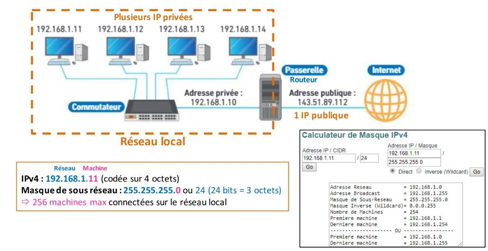

!!! note "Remarques"
	Grâce à des adresses de 128 bits au lieu de 32 bits, IPv6 dispose d'un espace d'adressage bien plus important qu'IPv4 (près de 7,9 × 1028 de fois plus) et résout donc le problème de pénurie d’adresses IPv4 publiques liée à la multiplication des objets connectés dans la vie quotidienne. 
	Les commutateurs (« switchs » en anglais) construisent une table d’adresses MAC des machines IP connectées à eux. Ils se basent sur les adresses MAC pour commuter les trames. Contrairement aux commutateurs, le routeur se basent quant à eux sur les adresses IP pour transporter les données. 
	La forme de l’adresse MAC ne permet pas de localiser le destinataire distant c’est la raison pour laquelle elle est utilisée seulement dans les réseaux locaux, contrairement à l’adresse IP dont la partie réseau et la partie Hôte permettent de localiser l’ordinateur d’une façon précise quel que soit son emplacement dans le monde. 

## Principe du routage
Si l'hôte de destination se trouve sur le même réseau que l'hôte source, les paquets de données sont acheminés entre les deux hôtes sur le support local de niveau 2 via des commutateurs (« switchs ») sans nécessiter la présence d’un routeur. Les commutateurs (« switchs ») construisent une table d’adresses MAC des machines IP connectées à eux. Ils se basent sur ces adresses MAC enregistrées pour commuter les trames.    
Cependant, si l'hôte de destination et l'hôte source ne se trouvent pas sur le même réseau, le réseau local achemine le paquet de la source vers son routeur de passerelle de niveau 3. Le routeur examine la partie réseau de l'adresse de destination du paquet et achemine le paquet à l'interface appropriée. Si le réseau de destination est connecté directement à ce routeur, le paquet est transféré directement vers cet hôte. Si le réseau de destination n'est pas connecté directement, le paquet est acheminé vers un second routeur qui constitue le routeur de tronçon suivant.    
Le transfert du paquet devient alors la responsabilité de ce second routeur. De nombreux routeurs ou sauts tout au long du chemin peuvent traiter le paquet avant qu'il n'atteigne sa destination. Contrairement aux commutateurs (« switchs »), les routeurs se basent quant à eux sur les adresses IP pour transporter les données.   
 
Aucun paquet ne peut être acheminé sans route. Que le paquet provienne d'un hôte ou qu'il soit acheminé par un routeur intermédiaire, le routeur a besoin d'une route pour savoir où l'acheminer. S'il n'existe aucune route vers un réseau de destination, le paquet ne peut pas être transféré. Les routeurs utilisent des tables de routage qui contiennent les routes qu'ils connaissent. Ces tables peuvent être construites manuellement (routage statique) ou automatiquement (routage dynamique). Dans ce cas, les routeurs s'appuient sur des protocoles spécifiques comme le protocole RIP (Routing Information Protocol) ou OSPF (Open Shortest Path First) par exemple.   
  
Le réseau de destination peut être éloigné de la passerelle par un certain nombre de routeurs ou de sauts. La route vers ce réseau n'indique que le routeur de tronçon suivant vers lequel le paquet doit être transféré, et non le routeur final. Le processus de routage utilise une route de la table de routage pour « mapper » l'adresse du réseau de destination au tronçon suivant, puis transfère le paquet à cette adresse de tronçon suivant.   

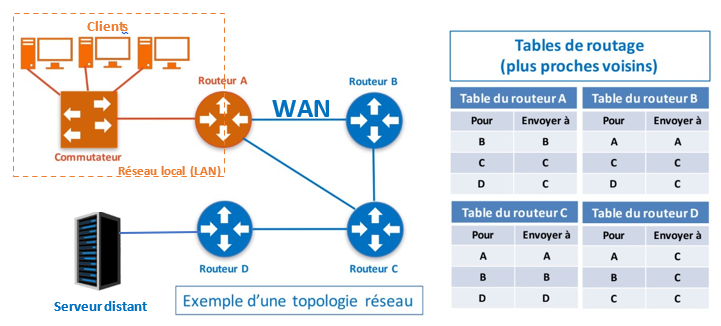

## Analyse simplifiée d'un réseau

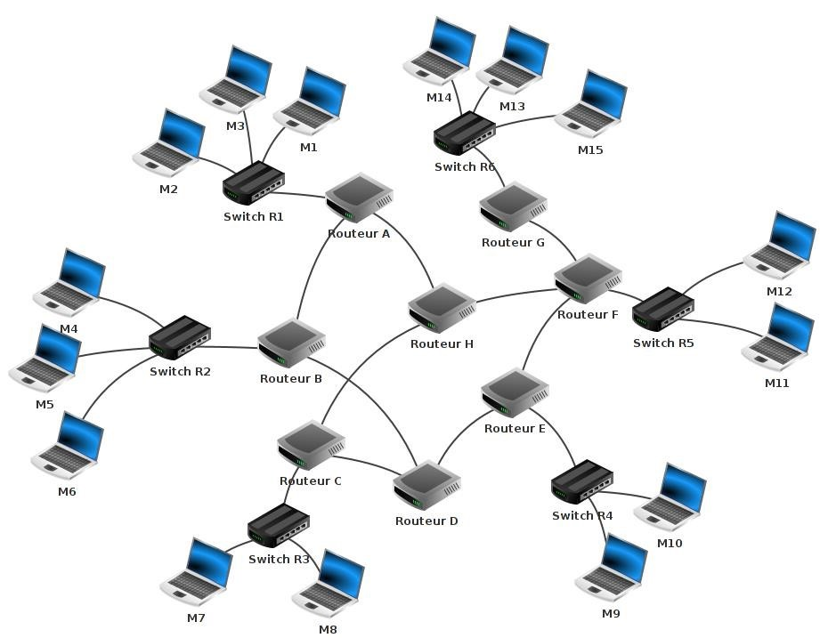

!!! question "Questions"
	1.Identifier les 3 grandes familles d’éléments interconnectés constituant ce réseau. Donner la composition de chacune d’entre elle.   
	2.Rappeler les symboles normalisés d’un commutateur et d’un routeur (voir schéma).    
	3.Quel est le rôle d’un commutateur (ou switch) ?  
	4.Quel est le rôle d’un routeur ?   
	5.A minima, combien d’interfaces réseau doit comporter un routeur ?  
	6.Identifier les réseaux qualifiés de locaux.   

**Quelques exemples de communication entre machine de ce réseau sont donnés ci-après.**
 **Cas n° 1 : M1 veut communiquer avec M3**  
Le paquet est envoyé de M1 vers le switch R1, R1 "constate" que M3 se trouve bien dans le réseau local 1, le paquet est donc envoyé directement vers M3. On peut résumer le trajet du paquet par :   
M1→R1→M3 
 
**Cas n° 2 : M1 veut communiquer avec M6**  
Le paquet est envoyé de M1 vers le switch R1, R1 « constate » que M6 n’est pas sur le réseau local 1, R1 envoie donc le paquet vers le routeur A. Le routeur A n'est pas connecté directement au réseau local R2 (réseau local de la machine M6), mais il "sait" que le routeur B est connecté au réseau local 2. Le routeur A envoie le paquet vers le routeur B. Le routeur B est connecté au réseau local 2, il envoie le paquet au Switch R2. Le Switch R2 envoie le paquet à la machine M6.   
M1 → R1 → Routeur A → Routeur B → R2 → M6 
 
**Cas n° 3 : M1 veut communiquer avec M9** 
Il existe souvent plusieurs chemins possibles pour relier 2 ordinateurs :   
M1 → R1 → Routeur A → Routeur B → Routeur D → Routeur E → R4 → M9 OU   
M1 → R1 → Routeur A → Routeur H → Routeur F → Routeur E → R4 → M9   
 
**Cas n°4 : M13 veut communiquer avec M9**  
M13 → R6 → Routeur G → Routeur F → Routeur E → R4 → M9   
OU   
M13 → R6 → Routeur G → Routeur F → Routeur H → Routeur C → Routeur D → Routeur E → R4 → M9   

Le chemin n° 1  "Routeur F → Routeur E" est vraisemblablement plus rapide et donc préférable au chemin n° 2 "Routeur F → Routeur H". Cependant s’il y avait un problème technique entre le Routeur F et le Routeur E, l’existence du chemin "Routeur F → Routeur H" permettrait tout de même d’établir une communication entre M13 et M9. C’est l’existence de très nombreuses interconnexions et donc de routes possibles entre les différentes infrastructures qui rendent internet particulièrement peu sensible à des pannes localisées.   

!!! question "Questions"
	7.Déterminer un chemin possible permettant d’établir une connexion entre la machine M4 et M14. Existe-t-il plusieurs chemins possibles ? 

## Notion de tables de routage 
 
Comment les commutateurs ou les routeurs procèdent-ils pour amener les paquets de données à bon port ? Vous savez déjà que 2 machines appartenant au même réseau local doivent avoir la même adresse réseau. Dans le schéma du paragraphe précédent, les machines M1 et M4 n'ont pas la même adresse réseau car elles n'appartiennent pas au même réseau local. Si M1 cherche à entrer en communication avec M4 alors le switch R1 va constater que M4 n'appartient pas au réseau local (grâce à son adresse IP) et R1 va donc envoyer le paquet de données vers le routeur A. Cela sera donc au routeur A de gérer le "problème" : comment atteindre M4 ?   
Chaque routeur possède une table de routage. Une table de routage peut être vue comme un tableau qui va contenir des informations permettant au routeur d'envoyer le paquet de données dans la "bonne direction".   

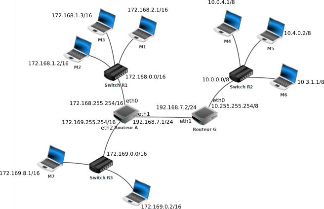

!!! question "Question"
	8.Identifier les adresses IP réseau des routeurs de l’infrastructure ci-dessus. 

La table de routage du routeur A doit contenir les informations suivantes :   
• le routeur A est directement relié au réseau 172.168.0.0/16 par l'intermédiaire de son interface eth0   
• le routeur A est directement relié au réseau 172.169.0.0/16 par l'intermédiaire de son interface eth2   
• le routeur A est directement relié au réseau 192.168.7.0/24 par l'intermédiaire de son interface eth1 (le réseau 192.168.7.0/24 est un peu particulier car il est uniquement composé des routeurs A et G)     
• le routeur A n'est pas directement relié au réseau 10.0.0.0/8 mais par contre il "sait" que les paquets à destination de ce réseau doivent être envoyé à la machine d'adresse IP 192.168.7.2/24 (c'est à dire le routeur G qui lui est directement relié au réseau 10.0.0.0/8)  
 
On peut résumer les informations précédentes dans la table de routage simplifiée de A : 
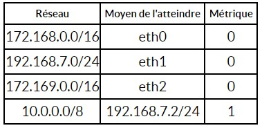{align=left}

!!! note "remarque"
	Dans un protocole de routage, la métrique est une mesure de la « distance » qui sépare un routeur d'un réseau de destination. En première approche on l’assimilera au nombre de sauts IP nécessaires pour atteindre le réseau destination. Ainsi, un réseau directement lié à un routeur aura une métrique de 0. 

!!! question "Question"
	9.Déterminez la table de routage du routeur G, en précisant pour chaque réseau à atteindre, l'interface du routeur à utiliser (et0,eth1, eth2) la passerelle (IP du routeur suivant) si le chemin n'est pas direct et le nombre de sauts.

Dans des réseaux très complexes, chaque routeur aura une table de routage qui comportera de très nombreuses lignes (plusieurs milliers...). En effet chaque routeur devra savoir vers quelle interface réseau il faudra envoyer un paquet afin qu'il puisse atteindre sa destination. On peut trouver dans une table de routage plusieurs lignes pour une même destination, il peut en effet, à partir d'un routeur donné, exister plusieurs chemins possibles pour atteindre la destination. Dans le cas où il existe plusieurs chemins possibles pour atteindre la même destination, le routeur va choisir le "chemin le plus court". Pour choisir ce chemin le plus court, le routeur va utiliser la métrique : plus la valeur de la métrique est petite, plus le chemin pour atteindre le réseau est "court".   

**Comment un routeur arrive à remplir sa table de routage ?**   
La réponse est simple pour les réseaux qui sont directement reliés au routeur (métrique = 0), mais comment cela se passe-t-il pour les autres réseaux (métrique supérieure à zéro) ?   
Il existe 2 méthodes :   
• le routage statique : chaque ligne doit être renseignée "à la main". Cette solution est seulement envisageable pour des très petits réseaux de réseaux.  
• le routage dynamique : tout se fait "automatiquement", on utilise des protocoles qui vont permettre de "découvrir" les différentes routes automatiquement afin de pouvoir remplir la table de routage tout aussi automatiquement.   

## Les algorithmes de routage
### Principe 
Un réseau de réseaux comportant des routeurs peut être modélisé par un graphe : chaque routeur est un sommet et chaque liaison entre les routeurs ou entre un routeur et un switch est une arête. Les algorithmes utilisés par les protocoles de routages sont donc des algorithmes issus de la théorie de graphes. Un exemple de graphe est donné sur le schéma ci-dessous.   

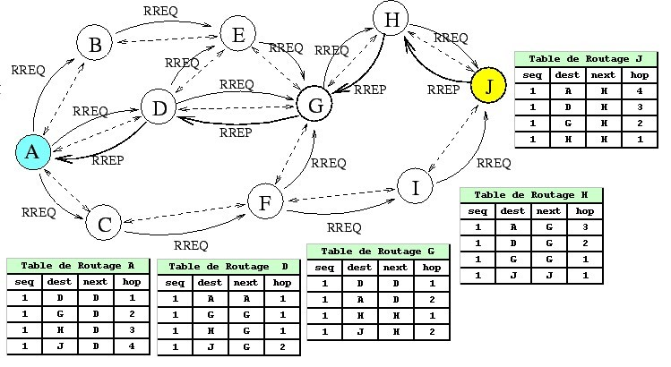

*Dans la table de routage de D on lit que pour atteindre le routeur H il faut passer par G avec un saut de 1.*  
Le but d’un algorithme de routage est de trouver un chemin dans ce graphe qui relie l'émetteur au destinataire. Il existe de nombreux algorithmes pour trouver le chemin le plus court entre deux points d'un graphe. Cependant ceux-ci sont rarement utilisés tels quels par les algorithmes de routage. 
Les algorithmes de routage peuvent aussi tenir compte des performances des différents chemins entre deux routeurs. La mise à jour des tables routage permet alors de trouver des chemins plus courts ou plus rapides pour acheminer une donnée à une IP précise. Il suffit pour cela de tenir compte des temps de transferts entre routeurs. Pour cela il suffit d'associer à chaque arrête, c’est-à-dire à chaque chemin entre deux routeurs, un poids (pondération) qui indique sa rapidité. Plus la vitesse de transfert est faible entre ces deux routeurs, plus ce nombre sera fort. Pour chaque chemin identifié, l'algorithme additionne le temps de transfert de chaque flèche. Le but de l'algorithme est de trouver le chemin qui minimise le temps de transfert total.  

!!! question "Question"
	10.Quel est l’objectif d’un algorithme de routage ?   
	11.Comment modélise-t-on un réseau d’un point de vue mathématique ?   

### Le protocole RIP (Routing Information Protocol)
Le protocole RIP s'appuie sur l'algorithme de [Bellman-Ford](https://fr.wikipedia.org/wiki/Algorithme_de_Bellman-Ford), algorithme permettant de calculer les plus courts chemins dans un graphe.   

 
Lors de son initialisation, la table de routage d’un routeur appliquant le protocole RIP contient uniquement les réseaux qui sont directement reliés à lui.   
Ainsi le routeur A du schéma ci-dessus contient initialement dans sa table de routage uniquement les réseaux suivants:  
• 172.168.0.0/16    
• 172.169.0.0/16   
• 192.168.7.0/24  
et le routeur G :   
• 192.168.7.0/24   
• 10.0.0.0/8   
Chaque routeur du réseau qui applique le protocole RIP envoie périodiquement (toutes les 30 secondes) à tous ses voisins (routeurs adjacents) un message. Ce message contient la liste de tous les réseaux qu'il connait. A chaque échange de messages, les routeurs adjacents mettent à jour leur table de routage :   

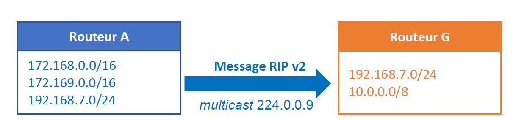
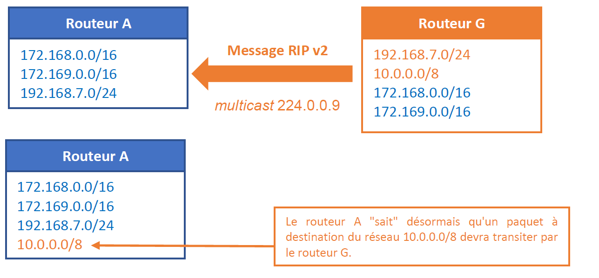

Pour renseigner la colonne "métrique", le protocole utilise le nombre de sauts, autrement dit, le nombre de routeurs qui doivent être traversés pour atteindre le réseau cible (dans la table de routage de A, on aura donc une métrique de 1 pour le réseau 10.0.0.0/8 car depuis A il est nécessaire de traverser le routeur G pour atteindre le réseau 10.0.0.0/8) 

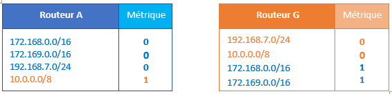

**Notion de protocole à vecteur de distance**   
RIP appartient à la famille des protocoles à vecteur de distance.  Avec ce type de protocole, les routeurs envoient régulièrement l'ensemble de leur table de routage aux routeurs voisins, auxquels il est directement connecté. Ceux-ci mettent alors à jour leur propre table de routage en tenant compte des informations envoyées. Évidemment, cela consomme beaucoup de débit réseau, ce qui est un défaut majeur. C'est la raison principale pour laquelle il ne peuvent pas être utilisés sur des réseaux trop importants : les envois prendraient beaucoup trop de temps avec des grosses tables de routage. De plus, les tables de routage mettent beaucoup de temps avant de se stabiliser, ce qui rend le routage très inefficace au début de l'utilisation du réseau.   

**Message RIP v2**   
Un message RIP comprend un en-tête suivi de 1 à 25 enregistrement(s) de route (24 si un message d'authentification est requis). Un message RIP v2 est envoyé en [multicast](https://www.techno-science.net/definition/3782.html) à l’IP 224.0.0.9.  

**Les limitations du protocole RIP :**  
• Pour éviter les boucles de routage, le nombre de sauts est limité à 15. Au-delà, les paquets sont supprimés. Au-delà de 15 sauts, le protocole RIP affecte une métrique  à la liaison.     
• RIP ne prend en compte que la distance entre deux machines en ce qui concerne le saut, mais il ne considère pas l'état de la liaison afin de choisir la meilleure bande passante possible. Si l'on considère un réseau composé de trois routeurs A, B et C, reliés en triangle, RIP préférera passer par la liaison directe A-B même si la bande passante n'est que de 56 kbit/s alors qu'elle est de 10 Gbit/s entre A et C et C et B.   
De facto, le protocole RIP est aujourd'hui très rarement utilisé dans les grandes infrastructures. En effet, il génère, du fait de l'envoi périodique de message, un trafic réseau important (surtout si les tables de routages contiennent beaucoup d'entrées). On lui préfère donc souvent le protocole OSPF qui corrige les limitations évoquées précédemment.   
[EN SAVOIR PLUS SUR LE PROTOCOLE RIP](https://youtu.be/eRl0an-a3m0)

!!! question "Questions"
	12.Quel est le principe du protocole RIP ?     
	13.Quels sont ses principaux inconvénients ?   
	14.En vous basant sur le protocole RIP (métrique = nombre de sauts), déterminez la table de routage du routeur A appartenant au réseau ci-dessous.   
	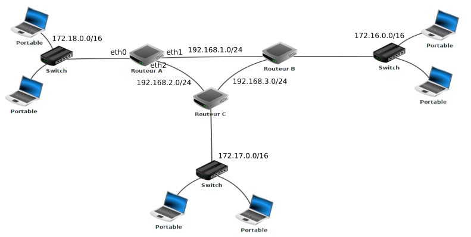  
	15.Quel est, d'après la table de routage construite du routeur A, le chemin qui sera emprunté par un paquet pour aller d'une machine ayant pour adresse IP 172.18.1.1/16 à une machine ayant pour adresse IP 172.16.5.3/16 ? 
 
**Le protocole OSFP (Open Shortest Path First)**
Les routeurs OSPF doivent établir une relation de voisinage avant d’échanger des mises à jour de routage. Les voisins OSPF sont dynamiquement découverts en envoyant des paquets Hello sur chaque interface OSPF sur un routeur. Les paquets Hello sont envoyés à l’adresse IP de multicast 224.0.0.5.   

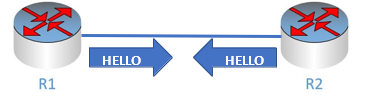  

Chaque routeur OSPF reçoit un identifiant de routeur afin qu’il puisse être reconnu. 
 
**Contenu d’un paquet HELLO**  
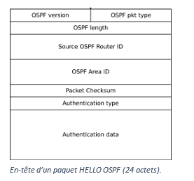{align=right}
Les champs suivants dans les paquets Hello doivent être identiques sur les deux routeurs afin que les routeurs  
deviennent voisins :   
• sous-réseau (subnet)   
• id de zone (area ID)   
• minuteurs d’intervalle morts (dead-interval) et hello   
• authentification   
• drapeau de bout de zone (area stub flag)   
• MTU (Maximum Transmit Unit)   
Par défaut, OSPF envoie des paquets hello toutes les 10 secondes sur un réseau Ethernet (intervalle Hello). Une minuterie morte (dead timer) correspond à quatre fois la valeur de l’intervalle Hello, donc si un routeur sur un réseau Ethernet ne reçoit pas au moins un paquet Hello d’un voisin OSPF pendant 40 secondes, les routeurs déclarent que ce dernier est “non fonctionnel” (down).

 
**Quels sont les états possibles des voisins OSFP ?**  
Avant d’établir une relation de voisinage, les routeurs OSPF doivent passer par plusieurs changements d’état :   
1. État init – un routeur a reçu un message Hello de l’autre routeur OSPF.   
2. État 2-way – le voisin a reçu le message Hello et a répondu avec un message Hello 
3. État Exstart – début de l’échange LSDB (Link-State Database) entre les deux routeurs. Les routeurs commencent à échanger des informations sur l’état des liens.   
4. État Exchange – Les paquets DBD (Database Descriptor) sont échangés. Les DBD contiennent des en-têtes LSA (Link-state Advertisements). Les routeurs utiliseront cette information pour voir quels LSA doivent être échangés.   
5. État Loading – un voisin envoie des LSR (Link State Requests) pour chaque réseau qu’il ne connaît pas. L’autre voisin répond avec les LSU (Link State Updates) qui contiennent des informations sur les réseaux demandés. Après que toutes les informations demandées ont été reçues, l’autre voisin passe par le même processus   
6. État Full – les deux routeurs ont la base de données synchronisée et sont complètement adjacents l’un à l’autre.   
 
 
**En résumé :** chaque routeur communique la liste des réseaux auxquels il est connecté par des messages Link-state advertisements (LSA) propagés de proche en proche à tous les routeurs du réseau. L'ensemble des LSA forme une base de données de l'état des liens Link-State Database (LSDB) pour chaque zone (area), qui est identique pour tous les routeurs de cette zone. Chaque routeur utilise ensuite l'algorithme de Dijkstra, Shortest Path First (SPF) pour déterminer la route la plus rapide vers chacun des réseaux connus dans la LSDB.  
 
 
**Notion de zone / area OSFP**  
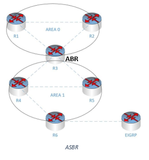{align=left}
OSPF utilise le concept de zone (area). Une zone est un regroupement logique de réseaux et de routeurs contigus. Tous les routeurs dans la même zone ont la même table de topologie, mais ils ne connaissent pas les routeurs dans les autres zones. Le principal avantage de la création de zones est que la taille de la topologie et la table de routage d’un routeur sont réduites, qu’il faut moins de temps pour exécuter l’algorithme OSPF et que les mises à jour de routage sont également réduites. 
Chaque zone (area) du réseau OSPF doit se connecter à la zone de backbone (area 0) : toutes les autres zones y sont connectées. Tous les routeurs à l’intérieur d’une zone doivent avoir le même ID de zone pour devenir des voisins OSPF. Un routeur qui a des interfaces dans plus d’une zone (zone 0 et zone 1, par exemple) s’appelle Area Border Router (ABR). Un routeur qui connecte un réseau OSPF à d’autres domaines de routage (réseau EIGRP, par exemple) s’appelle Autonomous System Border Routers (ASBR). 
Remarque : le rôle d’un routeur ABR consiste à annoncer des résumés de routes aux zones voisines. Le rôle d’un ASBR est de connecter un domaine de routage OSPF à un autre réseau externe (par exemple Internet, EIGRP …). 
 
 
**Messages LSA, LSU et LSR**  

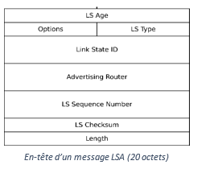{align=left}

Les messages LSA (Link-State Advertisments) sont utilisées par les routeurs OSPF pour échanger des informations de topologie. Chaque LSA contient des informations de routage et de topologie pour décrire une partie d’un réseau OSPF. Lorsque deux voisins décident d’échanger des routes, ils envoient mutuellement une liste de tous les LSA de leur base de données de topologie respective. Chaque routeur vérifie ensuite sa base de données de topologie et envoie un message LSR (Link State Request) demandant tous les LSA introuvables dans sa table de topologie. L’autre routeur répond avec la LSU (Link State Update) qui contient tous les LSA demandés par l’autre voisin.    

 

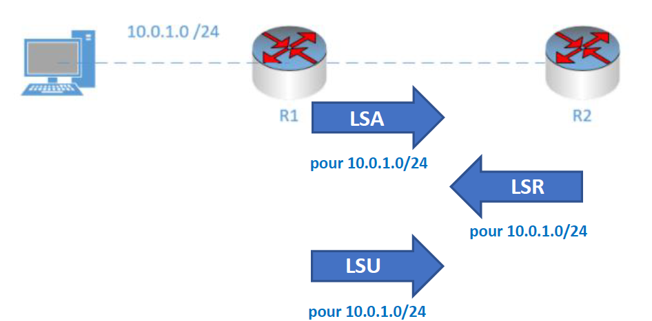{align=right width=50%}

Sur l’exemple ci-contre, après avoir initialisé OSPF sur les deux routeurs, ceux-ci échangent des LSA pour décrire leur base de données de topologie respective.   
1. Le routeur R1 envoie un en-tête LSA pour son réseau directement connecté 10.0.1.0/24.   
2. Le routeur R2 vérifie sa base de données de topologie et détermine qu’il ne dispose pas d’informations sur ce réseau. Le routeur R2 envoie alors un message de demande d’état de liaison LSR demandant des informations supplémentaires sur ce réseau.   
3. Le routeur R1 répond avec Link State Update LSU qui contient des informations sur le sous-réseau 10.0.1.0/24 (adresse hop suivant, coût …).   

**Notion de protocole à état de lien**  
OSFP appartient à la famille des protocoles à état de lien Ces protocoles sont plus efficaces en termes de débit et de stabilisation des tables de routage. Au lieu d'envoyer la table de routage complète, ils envoient des messages courts, qui donnent des indications sur la connectivité du réseau. De manière générale, ces messages sont de simples tests qui vérifient que le voisin est toujours accessible, connecté. Au bout de plusieurs tentatives échouées, le routeur contacté est considéré comme inaccessible et le routeur envoie une indication aux autres voisins comme quoi il ne peut plus communiquer avec lui. En clair, chaque routeur indique quel est l'état des liens qu'il entretient avec les autres routeurs : il dit qu'il est connecté à tel ou tel routeur, que telle connexion a été déconnectée, etc. Avec ces protocoles, le volume de données transmises est plus faible. Pas besoin d'envoyer une table de routage complète, juste quelques messages courts. Outre la forte réduction de débit utilisé, la vitesse de convergence est plus rapide.   
 
**Métrique**    
Le protocole OSPF, contrairement à RIP, n'utilise pas le "nombre nécessaire de sauts" pour établir la métrique, mais la notion de "coût des routes". Dans les messages échangés par les routeurs on trouve le coût de chaque liaison (plus le coût est grand et moins la liaison est intéressante). Quand on parle de "liaison" on parle simplement du câble qui relie un routeur à un autre routeur. Le protocole OSPF permet de connaitre le coût de chaque liaison entre routeurs, et donc, de connaitre le coût d'une route (en ajoutant le coût de chaque liaison traversée). On notera que pour effectuer ces calculs, le protocole OSPF s'appuie sur l'algorithme de Dijkstra.   
La notion de coût est directement liée au débit des liaisons entre les routeurs. Le débit correspond au nombre de bits de données qu'il est possible de faire passer dans un réseau par seconde. Le débit est donc donné en bits par seconde (bps), mais on trouve souvent des kilo bits par seconde (kbps) ou encore des méga bits par seconde (Mbps) => 1 kbps = 1000 bps et 1 M  bps = 1000 kbps. Connaissant le débit d'une liaison, il est possible de calculer le coût d'une liaison à l'aide de la formule suivante : 
  
**Coût (en bits / s)  = 108 / débit (en bps)**
 

Pour obtenir la métrique d'une route, il suffit d'additionner les coûts de chaque liaison (par exemple si pour aller d'un réseau 1 à un réseau 2 on doit traverser une liaison de coût 1, puis une liaison de coût 10 et enfin une liaison de coût 1, la métrique de cette route sera de 1 + 10 + 1 = 12). Comme dans le cas du protocole RIP, les routes ayant les métriques les plus faibles sont privilégiées.   
[EN SAVOIR PLUS SUR LE PROTOCOLE OSFP](https://youtu.be/6FeNi1djwc8)

!!! question "Questions"
	16.Quel est le principe du protocole OSFP ?   
	17.Quel est son principal avantage par rapport au protocole RIP ?   
	18.En vous basant sur le protocole OSPF (métrique = somme des coûts), déterminez la table de routage du routeur A présent dans le réseau de la question 13. On donne les débits suivants :   
	• liaison routeur A - routeur B : 1 Mbps   
	• liaison routeur A - routeur C : 10 Mbps   
	• liaison routeur C - routeur B : 10 Mbps   
	19.Quel est, d'après la table de routage construite ci-dessus, le chemin qui sera emprunté par un paquet pour aller d'une machine ayant pour adresse IP 172.18.1.1/16 à une machine ayant pour adresse IP 172.16.5.3/16 ?     

!!! tip "A retenir"
	Faites vous un résumé de cours sachant que vous devez savoir :  
	Ce qu'est un routeur, ce qu'est une table de routage, comment est remplie cette table, ce qui différencie RIP de OSPF et comment ils fonctionnent.  
	Identifier la route empruntée par un paquet suivant le protocole de routage utilisé (RIP ou OSPF).
	Une fiche, une carte mentale, des schémas, …  
	Vous pouvez vous aider de cette vidéo :
	<iframe width="560" height="315" src="https://www.youtube.com/embed/bslQLLzzxcg" title="YouTube video player" frameborder="0" allow="accelerometer; autoplay; clipboard-write; encrypted-media; gyroscope; picture-in-picture" allowfullscreen></iframe>