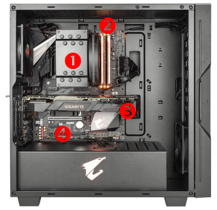
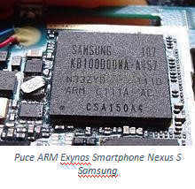
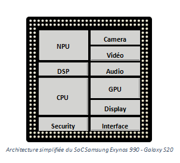
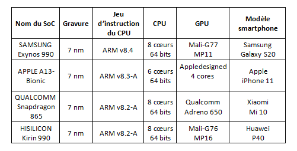
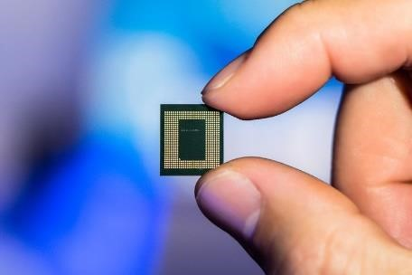
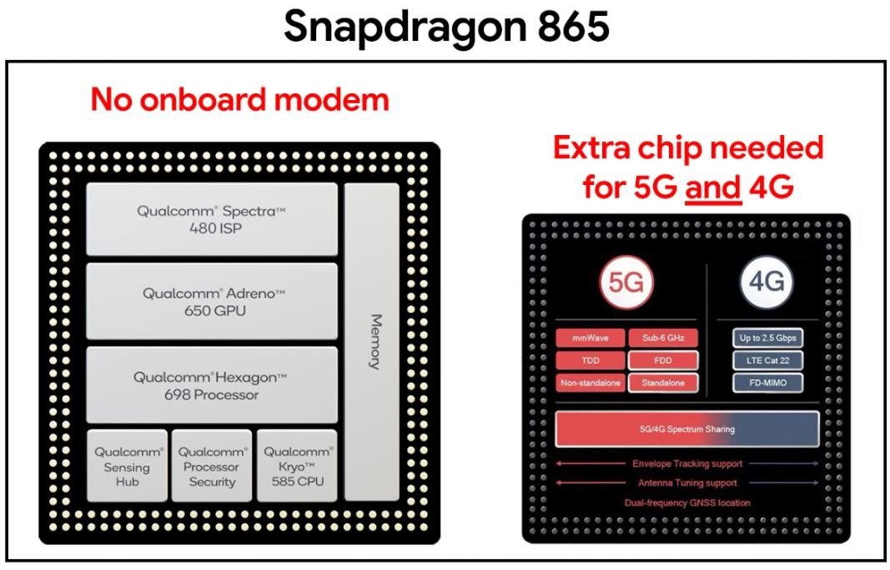
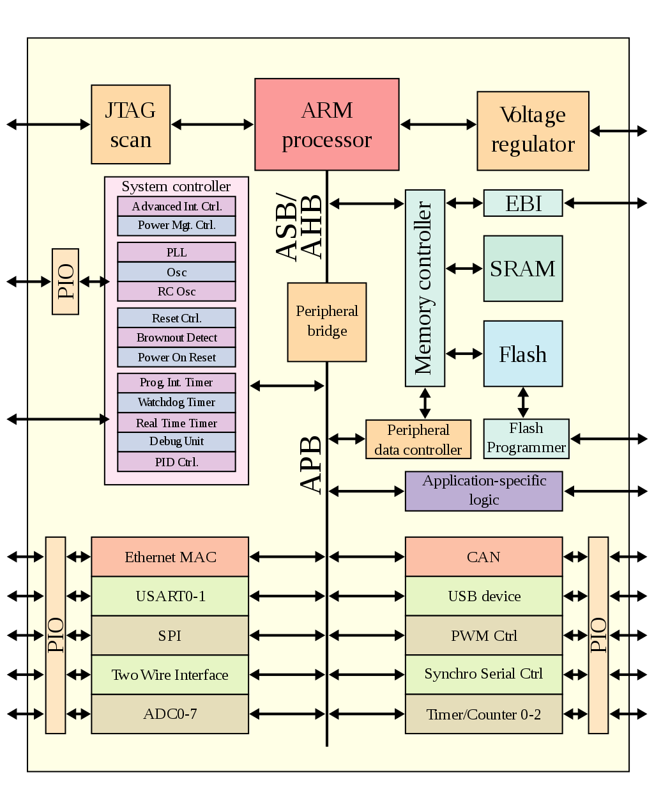
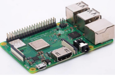
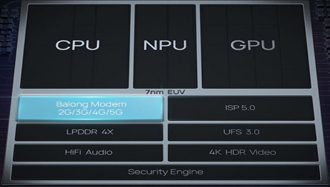

# Système On a Chip (système sur puce)
La réduction de taille des éléments des circuits électroniques a conduit à l’avènement de systèmes sur puce (SoC pour System on a Chip en anglais) qui regroupent dans un seul circuit nombre de fonctions autrefois effectuées par des circuits séparés assemblés sur une carte électronique. Un tel système sur puce est conçu et mis au point de façon logicielle, ses briques électroniques sont accessibles par des API, comme pour les bibliothèques logicielles. 
 
## Système sur puce 
 
De l’ordinateur au smartphone / tablette 
 
Dans un ordinateur “classique” tel qu’un PC de bureau, le « hardware » est organisé autour de 4 éléments principaux :  

- le processeur (CPU – Central Processing Unit) se charge de réaliser les calculs les plus courants, ceux qui permettent par exemple de faire tourner le système d’exploitation ou un navigateur web. 
- la mémoire vive (RAM – Random Access Memory) permet d’enregistrer temporairement les données traitées par le processeur. 
- la carte graphique (ou GPU – Graphics Processing Unit) se charge d’afficher une image, qu’elle soit en 2D ou bien en 3D comme dans les jeux.  
- la carte-mère (Motherboard) permet l’acheminement des données entre les composants (CPU, RAM, GPU, disque dur, SSD, cartes réseau …) via des « BUS ». 

!!! important "Elements d'un ordinateur"
	{align=left}
	1- CPU surmonté d’un  dissipateur thermique (ventirad)   
	2-Barrettes de RAM   
	3- GPU   
	4- Carte mère   

{align=left}
Mais depuis le début de l’ère des smartphones et des tablettes, on assiste à l’émergence de systèmes tout-en-un appelé SoC (System on a Chip) afin d’optimiser la miniaturisation et l’intégration des différents composants. Ces derniers sont alors bien mieux interconnectés les uns aux autres, avec par exemple une fréquence processeur qui varie en fonction de la fréquence de la carte graphique du fait de contraintes thermiques et de consommation. Un Soc présente donc une structure complètement inédite par rapport à un ordinateur classique où chaque composant est plus ou moins indépendant. Un « système sur une puce », souvent désigné dans la littérature scientifique par le terme anglais « system on a chip » (d'où son abréviation SoC), est un système complet embarqué sur une seule puce ("circuit intégré"), pouvant comprendre de la mémoire, un ou plusieurs microprocesseurs, des périphériques d'interface, ou tout autre composant nécessaire à la réalisation de la fonction attendue.
>On peut intégrer de la logique, de la mémoire (statique, dynamique, flash, ROM, PROM, EPROM, EEPROM), des dispositifs (capteurs) mécaniques, opto-électroniques, chimiques ou biologiques ou des circuits radio… 
D’après Wikipédia  

!!! faq "Question"
	1-Qu’est-ce qu’un SoC ?   
	2-Quels sont les appareils à base de SoC ?   
	3-Au niveau hardware, qu’est-ce qui différencie fondamentalement un SoC des composants d’un ordinateur ?   

## Composition d’un SoC 
{align=left}

◼ Le processeur (CPU) 
Le processeur ou « Central Processing Unit » (CPU) est le cœur du SoC. Son fonctionnement est identique à celui d’un ordinateur. On y retrouve donc plusieurs cœurs cadencés à différentes fréquences effectuant des threads et stockant des informations en cache.   
	• 	Les cœurs   
Un processeur compte généralement plusieurs cœurs, on parle couramment dans la littérature technique de dual-core, quad-core ou d’octo-core parfois. Ainsi, ces processeurs se composent respectivement de deux, quatre ou huit cœurs. Ceux-ci permettent de lancer en parallèle plusieurs applications de manière simultanée (multitâche) et permettent l’utilisation d’application lourde comme des jeux.   
	• 	La fréquence   
La fréquence d’un processeur est le nombre de cycles de calculs qu’il peut effectuer chaque seconde. Elle va donc naturellement déterminer la durée d’exécution d’une tâche : plus la fréquence du processeur est élevée, plus l’exécution d’une tâche est rapide. Mesurée en gigahertz (GHz), celle-ci est souvent différente entre chaque cœur.   
	• Les threads   
Les cœurs réalisent ce qu’on appelle un thread, littéralement un fil d’exécution, une tâche qui doit être réalisée par le processeur.   
	• Le cache   
C’est une petite mémoire rapide intégrée au processeur. En effet, celle-ci va permettre de stocker les informations récurrentes au plus près du processeur pour éviter d’avoir à aller les chercher sans arrêt dans la RAM.   

◼ La puce graphique (GPU)   
La puce graphique ou « Graphics Processing Unit » (GPU) est un élément crucial pour les gamers, car c’est lui qui est en charge de calculer les images afin de pouvoir les afficher à l’écran. Celle-ci prend ainsi en charge les images en 2D et en 3D que ce soit une page web, une vidéo ou encore une partie endiablée de votre jeu favori. Une carte graphique doit donc réaliser un nombre élevé de tâches, puisque qu’elle doit par exemple calculer la couleur à afficher sur chaque pixel de l’écran de votre smartphone. Par exemple dans le cas d’une image Full HD (1920×1080), le GPU affiche 2 073 600 pixels différents ou 8 294 400 pixels pour de l’Ultra HD (3840×2160).   
Rappelons également que ce calcul est fait selon la fréquence de rafraichissement de l’écran. Celle-ci peut par exemple varier entre 60 et 120 fois par secondes c’est-à-dire entre 60 Hz et 120 Hz.   
   
◼ La puce neuronale (NPU)   
La puce neuronale ou « Neuronal Processing Unit » (NPU) est une puce en charge de l’intelligence artificielle des smartphones. Les calculs de l’intelligence artificielle ont longtemps été faits par le biais de serveurs dans le cloud (distant). Néanmoins, depuis quelques années pour des raisons de rapidité et de respect de la vie privée, les calculs se font désormais directement sur les smartphones. C’est utile par exemple dans « Google Translate » pour reconnaître des caractères, pour optimiser les photos ou encore l’autonomie.   
◼ Le modem (Interface)     
Les smartphones embarquent  également dans le SoC une unité réseau assurant la prise en charge des différents protocoles de communication. Cette unité est la partie la plus compliquée à développer et à implémenter sur un SoC. Néanmoins, il s’agit d’un élément crucial afin d’assurer le nomadisme d’un smartphone en itinérance. Le modem intégré au SoC gère non seulement le Wifi, le Bluetooth, le NFC ou bien encore les technologies mobiles. C’est-à-dire la 4G, ou plus récemment la 5G mais également de plus vieux réseaux tels que la 3G.   
◼ Le processeur de signal numérique (DSP)   
Le processeur de signal numérique ou « Digital Signal Processor » (DSP) est en charge de traiter les signaux numériques. Ainsi, il va permettre le filtrage, la compression ou encore l’extraction de différents signaux tels que la musique ou encore une vidéo.   
◼ Le processeur de signal d’images (ISP)   
Le processeur d’image ou « Image Signal Processor » (ISP) est une puce prenant en charge la création d’images numériques. En effet de par leurs tailles minuscules, les capteurs photo des smartphones ne sont pas de très bonne qualité d’un point de vue de l’optique pure. La qualité qu’il est actuellement possible d’obtenir va être intimement liée à cette puce qui va compenser logiquement certaines limitations optiques (zoom numérique …).   
◼ Le processeur de sécurité (SPU)   
Le processeur de sécurité ou « Secure Processing Unit » (SPU) est le « bouclier » du smartphone. Son alimentation électrique est indépendante afin de ne pas pouvoir être éteint en cas d’attaque sur celui-ci. Le SPU est d’une importance capitale. En effet celui-ci va stocker les données biométriques, bancaires, la carte SIM ou encore les titres de transport. C’est lui qui contient les clés de chiffrement des données de l’utilisateur. 

!!! faq "Question"
	4-Pourquoi les CPU d’un SoC embarquent-ils plusieurs cœurs ?   
	5-Donner un ordre de grandeur de la fréquence du CPU d’un SoC.    
	6-Sur quel paramètre influe la fréquence du CPU d’un SoC ?   
	7-Qu’est-ce qu’un thread ?   
	8-Qu’est-ce que la mémoire cache d’un CPU ?   
	9-Dans un SoC, à quoi sert le GPU ?    
	10-Dans un SoC, quel élément est chargé du traitement des photos prises par la (les) caméra(s) intégrée(s) au smartphone ?   
	11-Dans un SoC, quel élément permet de lire de l’audio ou de la vidéo ?   
	12-Dans un SoC, à quoi sert le SPU ?   
	13-Quel élément d’un SOC permet à un smartphone de communiquer avec d’autres machines ?   

### Avantages d’un SoC par rapport à système classique 

Outre leur taille miniaturisée bien adaptée aux terminaux nomades (smartphones et tablettes), les SoC offrent d'autres avantages par rapport aux systèmes "classiques" rencontrés dans les ordinateurs : 
 
•les SoC sont conçus pour consommer beaucoup moins d'énergie qu'un système classique à puissance équivalente de calculs ;   
•cette consommation réduite d’énergie permet dans la plupart des cas de s'affranchir de la présence d’un système de refroidissement actif comme les ventilateurs ou de type « watercooling » ; un système équipé de SoC est donc silencieux car il chauffe relativement peu ;   
•étant donné les distances très faibles entre, par exemple, le CPU et la mémoire, les données circulent beaucoup plus vites, ce qui permet d'améliorer grandement les performances ; en effet, dans les systèmes "classiques" les BUS chargés d’acheminer les données  sont souvent des "goulots d'étranglement" en termes de performances à cause de la vitesse limitée de circulation des données.   
 
En revanche, le principal inconvénient d’un SoC est que là ou un ordinateur équipé d'une carte mère permet de faire évoluer les composants individuellement, l'extrême intégration du SoC présente en revanche l'inconvénient de n'autoriser aucune mise à jour possible du matériel.   

!!! faq "Questions"
	14-Quels sont les principaux avantages d’un SoC ?  
	15-Citer le principal inconvénient d’un SoC.  

### Quelques familles de SoC utilisées dans les smartphones 
 
{align=left}
Les nouveaux procédés de gravure des semi-conducteurs CMOS telle que la lithographie extrême ultraviolette, ont permis de réduire significativement la taille des composants électroniques constituants les SoC. Ainsi, on dispose aujourd’hui de la même puissance dans un smartphone que celle embarquée dans un ordinateur il y a quelques années de cela. Ceci s’est cependant fait au prix d’une complexité technologique croissante. L’actuelle génération de SoC est gravée en 7 nm (1 nm = 10-9 m) depuis juillet 2019. Le SoC A13 Bionic d’Apple est par exemple composé de 8,5 milliards de transistors répartis sur une surface de 98,48 mm2 ! La prochaine génération gravée en 5 nm devrait voir le jour à partir de 2021. 
 
Au sein de la génération actuelle de smartphone on trouve une grande variété de SoC en fonction des différents constructeurs : 
 

{align=left width=30%}
{align=right width=30%}
Pour les derniers modèles de smartphones 2019-2020, la principale difficulté technologique est d’intégrer aux SoCs les modems 5G qui sont complexes à fabriquer. Pour l’instant ces derniers sont généralement gravés en 10 nm sur une puce indépendante du SoC. Le prochain défi technologique sera d’intégrer les modems 5G directement dans le SoC gravé en 7 nm puis 5 nm. 

!!! faq "Question"
	16-Pour les modèles 2019-2020 de téléphones portables, quelle est la finesse de gravures des SoC ?   
	17-Quel est l’ordre de grandeur de la surface d’un SoC ?   
	18-Quel est l’ordre de grandeur du nombre de transistors présents sur un SoC ?   
	19-Quel est l’ordre de grandeur de la densité moyenne de transistors par mm2 dans un Soc ?   
	20-Quelle sera la finesse de gravure des SoC pour la prochaine génération de smartphone ?   
	21-Quelle est la principale difficulté technologique rencontrée à l’heure actuelle par les concepteurs de SoC ?   
 
## L’architecture ARM   
Dotés d'une architecture relativement plus simple que d'autres familles de processeurs, et bénéficiant d'une faible consommation électrique, les processeurs ARM (Advanced Risc Machine) sont devenus dominants dans le domaine de l'informatique embarquée, en particulier la téléphonie mobile et les tablettes. Les architectures ARM reposent sur des processeurs à jeux d’instructions réduit RISC (Reduced Instruction Set Computer) 32 bits (ARMv1 à ARMv7) ou 64 bits (ARMv8).   
Aujourd'hui, ARM est surtout connu pour ses systèmes sur puce (SoC), intégrant sur une seule puce : microprocesseur, processeur graphique (GPU), DSP, FPU, SIMD, et contrôleur de périphériques. Ceux-ci sont  présents dans la majorité des smartphones et tablettes. 
ARM propose des architectures qui sont vendues sous licence de propriété intellectuelle aux concepteurs. Ils proposent différentes options dans lesquelles les constructeurs peuvent prendre ce qui les intéresse pour compléter avec leurs options propres ou de concepteurs tiers. ARM propose ainsi pour les SoC les plus récents les microprocesseurs Cortex (Cortex-A pour les dispositifs portables de type smartphones et tablettes, Cortex-M pour le couplage à un microcontrôleur, Cortex-R pour les microprocesseurs temps réel), des processeurs graphiques (Mali), des bus AMBA sous licence libre, ainsi que les divers autres composants nécessaires à la composition du SoC complet. Certains constructeurs, tels que Nvidia, préfèrent produire leur propre processeur graphique, d'autres, comme Samsung, préfèrent prendre dans certains cas un processeur graphique de prestataire tiers ou d'ARM selon les modèles, et d'autres, comme Apple, modifient certains composants du microprocesseur en mélangeant plusieurs architectures processeur ARM. 
>(wikipédia)  

Une particularité des processeurs ARM est leur mode de vente. En effet, ARM Ltd. ne fabrique ni ne vend ses processeurs sous forme de circuits intégrés. La société vend les licences de ses processeurs de manière qu'ils soient gravés dans le silicium par d'autres fabricants. Aujourd'hui, la plupart des grands fondeurs de puces proposent de l'architecture ARM.   

!!! faq "Question"
	22-Quel est l'avantage à ne pas vendre des processeurs directement ?  
	23-Faites quelques recherches sur les problèmes d'approvisionnement des semi-conducteurs  

!!! important "A retenir !!"
	Faites une fiche ou une carte mentale sachant que vous devez savoir ce qu'est un SoC, ce qu'il contient, ses avantages par rapport à un système classique et où est ce qu'on les trouve.

## Exercices
### Exercice n°1 : 
1. Décrire en quelques phrases ce qu'est un SoC.  
2. Schématiser le Soc.  

### Exercice n°2:
A partir de l'article du site [elektormagazine.fr](https://www.elektormagazine.fr/news/un-soc-combine-pour-dynamiser-les-performances-du-raspberry-pi-3-modele-b).  
{align=left}
1. Relevez les différentes caractéristiques du SoC du Raspberry Pi 3 modèle B+.   
2. Les comparez au SoC du Raspberry Pi 4.    
3. Quelles sont les principales évolutions qui contribuent à ce gain? Une copie de l'article disponible.  

### Exercice n°3 :
  
La photo ci-dessus montre le détail d'un SoC Kirin 990.  
Identifier les différentes parties de ce SoC.

### Exercice n°4 :  
{align=left} 
Faire une analogie entre les 2 colonnes (un ordinateur et vous qui êtes installé chez vous à votre bureau).  

### Exercice n°5 :
1. Quel est le nom du SoC de votre smarphone ?  
2. Quelles en sont les fonctionnalitées ?  
3. Quelles sont les caractéristiques du processeur ?    

### Exercice n°6 : 
Depuis le tout premier circuit intégré (le 4004) jusqu'à nos jours, cette loi s'est toujours vérifiée même si on s'en éloigne actuellement. Voici un exemple avec quelques processeurs d'Intel :  
1971 : Intel 4004 : 2 300 transistors  
1978 : Intel 8086 : 29 000 transistors  
1982 : Intel 80286 275 000 transistors  
1989 : Intel 80486 : 1 160 000 transistors  
1993 : Pentium : 3 100 000 transistors  
1995 : Pentium Pro : 5 500 000 transistors  
1997 : Pentium II : 27 000 000 transistors  
2001 : Pentium 4 : 42 000 000 transistors  
2004 : Pentium Extreme Edition : 169 000 000 transistors  
2006 : Core 2 Quad : 582 000 000 transistors  
2010 : Core i7 : 1 170 000 000 transistors  
Le nombre de transistors sur un processeur suit la loi de Moore.  
Faire une recherche sur cette loi.  